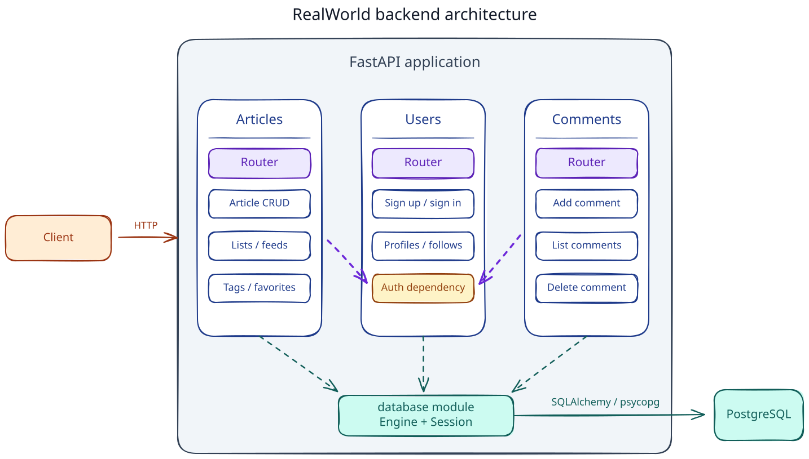

> ### A FastAPI backend implementation of the [RealWorld](https://github.com/gothinkster/realworld) spec and API.

It supports JWT authentication, profiles, articles and comments, follows and favorites, article filtering and pagination, and personalized feeds.

# How it works



- [Tack Stack](docs/architecture/tech-stack.md)
- [Data Model](docs/architecture/data-model.md)
- [Flows](docs/architecture/flows)

# Getting started

## Prerequisites

Install the following tools before setting up the project:

- [Python 3.14](https://www.python.org/downloads/)
- [uv](https://docs.astral.sh/uv/getting-started/installation/)
- [Docker](https://docs.docker.com/get-started/get-docker/) with Docker Compose

## Install dependencies

```bash
uv sync
```

## Configure environment

```text
DATABASE_URL=PostgreSQL connection URL used by the application; the example matches the db service in compose.yaml
TEST_DATABASE_URL=PostgreSQL connection URL used by integration tests; it must target the isolated realworld_test database
JWT_SECRET_KEY=Secret used to sign and verify JWTs; use at least 32 random bytes and never commit the real value
```

- Generate `JWT_SECRET_KEY`: `uv run python -c "import secrets; print(secrets.token_hex(32))"`

## Run the application

**Start PostgreSQL:**

```bash
docker compose up -d --wait db
```

**Apply migrations:**

```bash
uv run alembic upgrade head
```

**Run the API:**

```bash
uv run fastapi dev
```

- The API is available at `http://127.0.0.1:8000`, and the OpenAPI documentation is available at `http://127.0.0.1:8000/docs`.

**Stop the application and environment:**

- API: Press `Ctrl+C` in the terminal.
- PostgreSQL:

  ```bash
  docker compose stop db
  ```

## Frontend

The [Vue RealWorld example app](https://github.com/realworld-apps/vue-realworld-example-app) was used to check this backend in a browser.

# Deployment

See the [Render deployment example](docs/deployment/render.md) for the settings and steps used to deploy this project.

# Testing

## Unit tests

```bash
uv run pytest tests/unit/
```

## Integration tests

**Start the isolated PostgreSQL test database:**

```bash
docker compose --profile test up -d --wait test-db
```

**Run the integration tests:**

```bash
uv run pytest tests/integration
```

- The test setup verifies that `TEST_DATABASE_URL` targets the `realworld_test` database and applies migrations automatically.

**Stop the test database:**

```bash
docker compose --profile test stop test-db
```

## API contract tests

Hurl tests verify the public HTTP API against the fixed RealWorld contract.

See [`tests/api/README.md`](tests/api/README.md) for prerequisites and commands.
