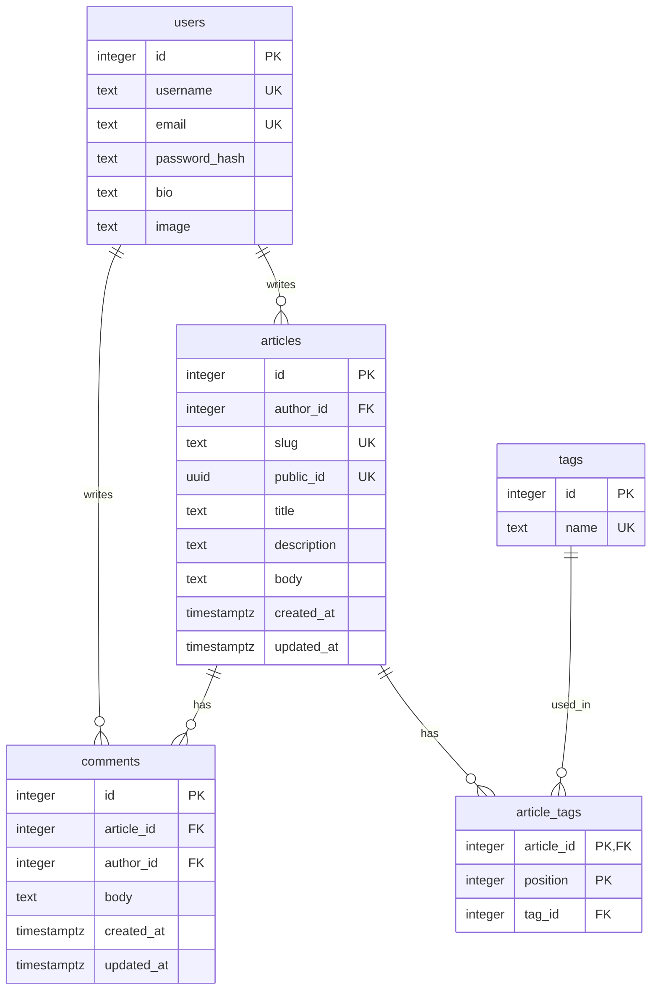

# 데이터 모델

현재 데이터베이스 스키마를 Alembic revision `0004` 기준으로 나타낸다. 

## 관계와 제약

- `articles.author_id`와 `comments.author_id`는 작성자 `users.id`를 참조한다. 댓글은 `comments.article_id`로 게시글에 속한다. 한 사용자 또는 게시글에 연결된 글·댓글이 없을 수도 있다.
- 태그는 사용자별로 나뉘지 않는 공용 `tags` 테이블에 저장된다. 게시글과 태그의 다대다 관계는 `article_tags`가 표현하며, 복합 기본 키 `(article_id, position)`의 `position`으로 게시글 내 태그 순서를 보존한다. 같은 태그를 여러 게시글이 사용할 수 있다.
- `articles.id`는 내부 관계에 쓰는 정수 키다. `public_id`는 게시글마다 고유한 UUID로, 제목을 수정해도 유지된다. 공개 `slug`는 제목 부분과 `public_id`의 32자리 16진수 표현으로 만들며, 제목이 바뀌면 갱신된다. `slug`와 `public_id`에는 각각 고유 제약이 있다.
- 게시글 삭제 시 DB의 `ON DELETE CASCADE`가 해당 `article_tags`와 `comments` 행을 삭제한다. 태그 이름 자체는 연쇄 삭제 대상이 아니다. 현재 게시글 수정·삭제 처리에서는 더 이상 어떤 게시글에도 연결되지 않은 태그를 애플리케이션이 정리한다.
- `users.bio`와 `users.image`만 NULL을 허용한다. `users.username`에는 공백만 있는 값을 막는 검사 제약이 있고, `username`·`email`·`tags.name`에는 각각 고유 제약이 있다. `comments.article_id`에는 조회용 인덱스가 있다.

스키마 정의: [마이그레이션 0001](../../migrations/versions/0001_create_users_table.py), [0002](../../migrations/versions/0002_create_articles_and_tags.py), [0003](../../migrations/versions/0003_add_article_public_id.py), [0004](../../migrations/versions/0004_create_comments.py). 현재 모델: [사용자](../../app/users/models.py), [게시글·태그](../../app/articles/models.py), [댓글](../../app/comments/models.py).
