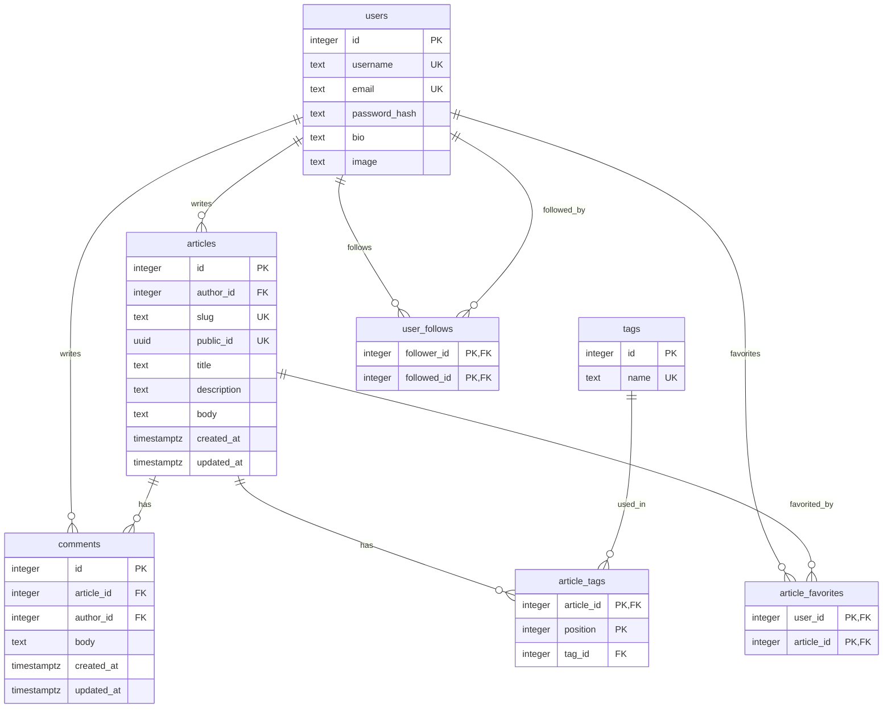

# 데이터 모델

현재 데이터베이스 스키마를 Alembic revision `0006` 기준으로 나타낸다.

```mermaid
erDiagram
    users ||--o{ articles : writes
    users ||--o{ comments : writes
    articles ||--o{ comments : has
    articles ||--o{ article_tags : has
    tags ||--o{ article_tags : used_in
    users ||--o{ user_follows : follows
    users ||--o{ user_follows : followed_by
    users ||--o{ article_favorites : favorites
    articles ||--o{ article_favorites : favorited_by

    users {
        integer id PK
        text username UK
        text email UK
        text password_hash
        text bio
        text image
    }

    articles {
        integer id PK
        integer author_id FK
        text slug UK
        uuid public_id UK
        text title
        text description
        text body
        timestamptz created_at
        timestamptz updated_at
    }

    tags {
        integer id PK
        text name UK
    }

    article_tags {
        integer article_id PK,FK
        integer position PK
        integer tag_id FK
    }

    comments {
        integer id PK
        integer article_id FK
        integer author_id FK
        text body
        timestamptz created_at
        timestamptz updated_at
    }

    user_follows {
        integer follower_id PK,FK
        integer followed_id PK,FK
    }

    article_favorites {
        integer user_id PK,FK
        integer article_id PK,FK
    }
```

## 관계와 제약

- `articles.author_id`와 `comments.author_id`는 작성자 `users.id`를 참조한다. 댓글은 `comments.article_id`로 게시글에 속한다. 한 사용자 또는 게시글에 연결된 글·댓글이 없을 수도 있다.
- `user_follows`는 팔로우하는 사용자와 대상 사용자의 ID를 저장한다. 복합 기본 키 `(follower_id, followed_id)`가 중복을 막고, 두 외래 키가 사용자 존재를 보장하며, 검사 제약이 자기 자신 관계를 막는다. username을 수정해도 ID와 관계는 유지된다. 사용자 삭제 API는 없으며 외래 키의 연쇄 삭제는 도입하지 않았다.
- 공개 프로필·게시글·댓글은 [`is_following(session, viewer_id, author_id)`](../../app/users/follows.py)로 조회자에서 작성자로 향하는 관계를 확인한다. 익명 조회자는 `viewer_id=None`이며 결과는 `false`다. 후속 게시글 목록·피드는 `UserFollow.follower_id`를 조회자 ID로 제한하고 `followed_id`를 게시글의 `author_id`와 연결해 대상을 선택할 수 있다. 여러 작성자의 관계를 한 번에 조회하는 최적화는 해당 작업에서 검토한다.
- `article_favorites`는 사용자와 게시글의 ID를 저장한다. 복합 기본 키 `(user_id, article_id)`가 중복을 막고 두 외래 키가 대상 존재를 보장한다. 게시글 외래 키에는 `ON DELETE CASCADE`를 적용해 게시글 삭제 시 연결된 즐겨찾기를 함께 제거하며 사용자 행은 유지한다. 게시글별 집계용 `article_id` 인덱스가 있다.
- 즐겨찾기 변경 응답과 단건 조회는 [`favorite_state(session, viewer_id, article_id)`](../../app/articles/favorites.py)로 요청자 본인의 관계 존재와 해당 게시글의 전체 관계 수를 한 DB 조회에서 구한다. 익명 요청자의 `favorited`는 `false`이며 `favoritesCount`는 인증 여부와 관계없이 같은 전체 건수다. 건수를 별도 컬럼에 저장하지 않는다.
- 태그는 사용자별로 나뉘지 않는 공용 `tags` 테이블에 저장된다. 게시글과 태그의 다대다 관계는 `article_tags`가 표현하며, 복합 기본 키 `(article_id, position)`의 `position`으로 게시글 내 태그 순서를 보존한다. 같은 태그를 여러 게시글이 사용할 수 있다.
- `articles.id`는 내부 관계에 쓰는 정수 키다. `public_id`는 게시글마다 고유한 UUID로, 제목을 수정해도 유지된다. 공개 `slug`는 제목 부분과 `public_id`의 32자리 16진수 표현으로 만들며, 제목이 바뀌면 갱신된다. `slug`와 `public_id`에는 각각 고유 제약이 있다.
- 게시글 삭제 시 DB의 `ON DELETE CASCADE`가 해당 `article_tags`와 `comments` 행을 삭제한다. 태그 이름 자체는 연쇄 삭제 대상이 아니다. 현재 게시글 수정·삭제 처리에서는 더 이상 어떤 게시글에도 연결되지 않은 태그를 애플리케이션이 정리한다.
- `users.bio`와 `users.image`만 NULL을 허용한다. `users.username`에는 공백만 있는 값을 막는 검사 제약이 있고, `username`·`email`·`tags.name`에는 각각 고유 제약이 있다. `comments.article_id`에는 조회용 인덱스가 있다.

스키마 정의: [마이그레이션 0001](../../migrations/versions/0001_create_users_table.py), [0002](../../migrations/versions/0002_create_articles_and_tags.py), [0003](../../migrations/versions/0003_add_article_public_id.py), [0004](../../migrations/versions/0004_create_comments.py), [0005](../../migrations/versions/0005_create_user_follows.py), [0006](../../migrations/versions/0006_create_article_favorites.py). 현재 모델: [사용자·팔로우](../../app/users/models.py), [게시글·태그·즐겨찾기](../../app/articles/models.py), [댓글](../../app/comments/models.py).
