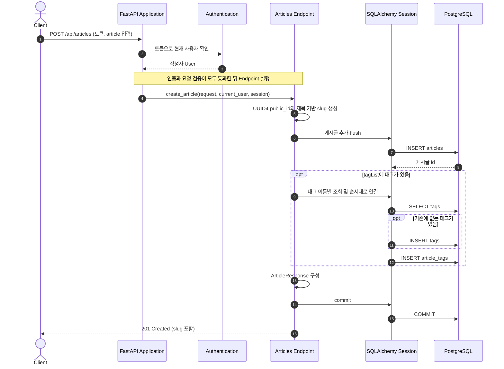
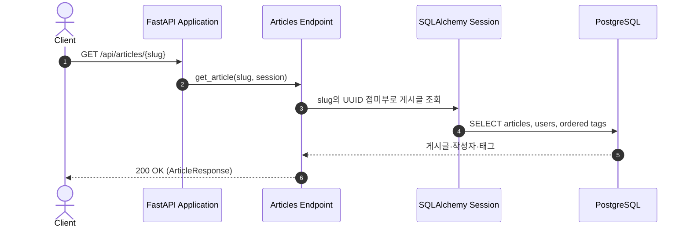

# Article Creation and Retrieval Flow

이 문서는 인증된 사용자가 `POST /api/articles`로 게시글을 만들고, 생성된 `slug`로 누구나 `GET /api/articles/{slug}`를 조회하는 흐름을 설명한다.

## Component Responsibilities

| 컴포넌트            | 책임                                                                          | 코드 위치                                                                                                                  |
| ------------------- | ----------------------------------------------------------------------------- | -------------------------------------------------------------------------------------------------------------------------- |
| FastAPI Application | 게시글 라우터와 오류 처리기를 연결한다.                                       | [`app/main.py`](../../../app/main.py)                                                                                     |
| Authentication      | 작성 요청의 토큰으로 사용자를 식별한다. 조회 요청에는 인증을 요구하지 않는다. | [`app/users/auth.py`](../../../app/users/auth.py)                                                                         |
| API Schemas         | 생성 요청의 필수 필드와 빈 문자열을 검증하고 공개 응답의 형태를 정의한다.     | [`app/articles/schemas.py`](../../../app/articles/schemas.py)                                                             |
| Articles Endpoint   | `slug` 생성, 게시글·태그 저장, 공개 조회와 응답 구성을 조정한다.           | [`app/articles/router.py`](../../../app/articles/router.py), [`app/articles/lookup.py`](../../../app/articles/lookup.py) |
| Persistence         | 게시글과 태그를 저장하고 관계를 조회한다.                                     | [`app/articles/models.py`](../../../app/articles/models.py), [`app/database.py`](../../../app/database.py)               |
| Error Handling      | 인증·입력·조회 오류를 API 오류 응답으로 변환한다.                           | [`app/errors.py`](../../../app/errors.py)                                                                                 |

## Runtime View

### 시나리오: 게시글 생성

- 인증된 사용자의 ID가 작성자로 저장된다. 생성 시 `public_id`로 UUID4를 저장하고, 제목을 가공한 부분에 UUID의 32자리 16진수 표현을 붙여 고유한 `slug`를 만든다.
- `tagList`를 생략하면 빈 목록을 사용한다. 태그 이름은 공용 `tags` 테이블에서 찾아 재사용하거나 새로 만들고, `article_tags.position`에 입력 순서를 기록한다. 생성 응답의 `tagList`도 이 순서를 따른다.
- 게시글과 태그 연결 및 응답 구성이 완료된 뒤 한 번에 커밋한다.

### 시나리오: 게시글 조회

- 조회는 `slug` 끝의 UUID로 게시글을 찾는다. 조회 응답의 `tagList`는 저장된 `article_tags.position` 순서를 따른다.
- 공개 응답의 작성자에는 `username`, `bio`, `image`, `following`만 담기며 이메일과 비밀번호 해시는 포함되지 않는다. 생성 응답도 같은 구조다. 현재 구현은 `following`과 `favorited`를 `false`, `favoritesCount`를 `0`으로 반환한다.
