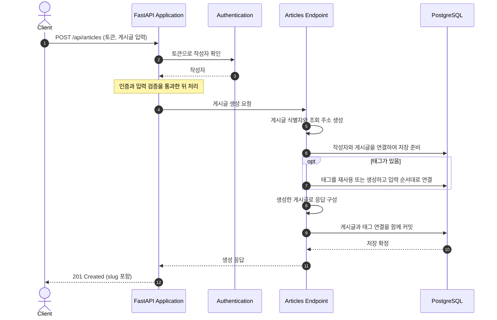
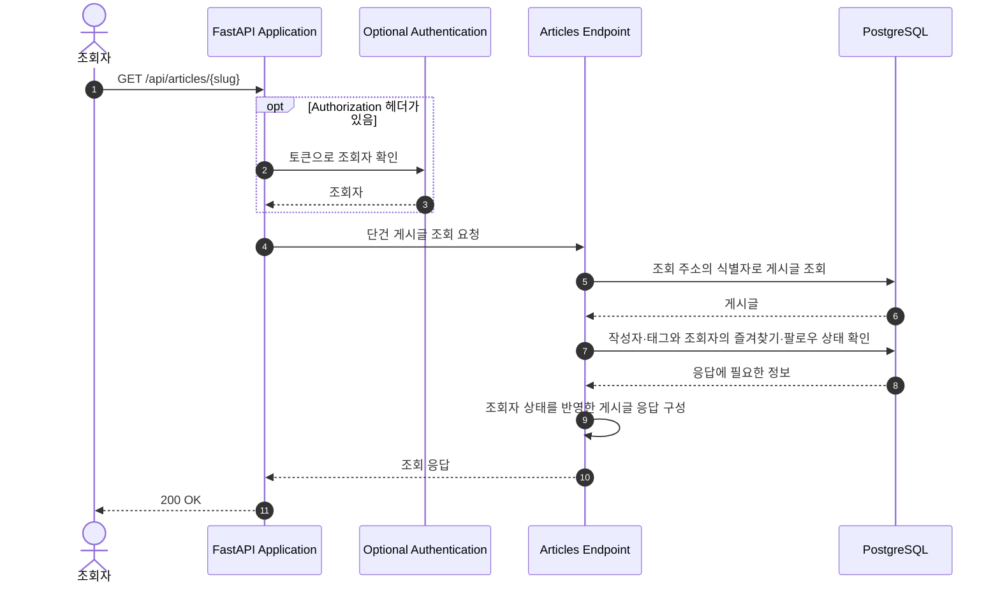

# Article Creation and Retrieval Flow

이 문서는 인증된 사용자가 게시글을 만들고, 누구나 단건 게시글을 조회하는 흐름을 설명한다. 조건에 맞는 목록 조회는 [게시글 목록 조회 흐름](article-list.md), 팔로우한 작성자의 글 조회는 [게시글 피드 조회 흐름](article-feed.md)을 참고한다.

## 컴포넌트와 책임

| 컴포넌트 | 책임 | 코드 위치 |
| --- | --- | --- |
| FastAPI Application | 게시글 라우터와 오류 처리기를 연결한다. | [`app/main.py`](../../../app/main.py) |
| Authentication | 작성 요청은 인증을 요구한다. 조회는 익명으로 허용하고, 헤더가 있으면 토큰을 검증한다. | [`CurrentUserDep, OptionalUserDep`](../../../app/users/auth.py) |
| Favorite Lookup | 조회자의 즐겨찾기 여부와 게시글의 즐겨찾기 사용자 수를 확인한다. | [`favorite_state()`](../../../app/articles/favorites.py) |
| Follow Lookup | 조회자가 작성자를 팔로우하는지 저장된 관계로 확인한다. | [`is_following()`](../../../app/users/follows.py) |
| API Schemas | 생성 요청의 필수 필드와 빈 문자열을 검증하고 공개 응답의 형태를 정의한다. | [`NewArticleRequest, ArticleResponse`](../../../app/articles/schemas.py) |
| Articles Endpoint | `slug` 생성, 게시글·태그 저장, 공개 조회와 응답 구성을 조정한다. | [`create_article(), get_article()`](../../../app/articles/router.py), [`find_article_by_public_slug()`](../../../app/articles/lookup.py) |
| Persistence | 게시글과 태그를 저장하고 관계를 조회한다. | [`app/articles/models.py`](../../../app/articles/models.py), [`app/database.py`](../../../app/database.py) |
| Error Handling | 인증·입력·조회 오류를 API 오류 응답으로 변환한다. | [`app/errors.py`](../../../app/errors.py) |

인증의 상세 흐름은 [본인 정보 조회 흐름](user-retrieval.md)을 참고한다.

## 실행 흐름

다이어그램은 정상 처리의 주요 단계를 보여준다.

### 시나리오: 게시글 생성

```mermaid
sequenceDiagram
    autonumber
    actor Client
    participant App as FastAPI Application
    participant Auth as Authentication
    participant Endpoint as Articles Endpoint
    participant DB as PostgreSQL

    Client->>App: POST /api/articles (토큰, 게시글 입력)
    App->>Auth: 토큰으로 작성자 확인
    Auth-->>App: 작성자
    Note over App: 인증과 입력 검증을 통과한 뒤 처리
    App->>Endpoint: 게시글 생성 요청
    Endpoint->>Endpoint: 게시글 식별자와 조회 주소 생성
    Endpoint->>DB: 작성자와 게시글을 연결하여 저장 준비
    opt 태그가 있음
        Endpoint->>DB: 태그를 재사용 또는 생성하고 입력 순서대로 연결
    end
    Endpoint->>Endpoint: 생성한 게시글로 응답 구성
    Endpoint->>DB: 게시글과 태그 연결을 함께 커밋
    DB-->>Endpoint: 저장 확정
    Endpoint-->>App: 생성 응답
    App-->>Client: 201 Created (slug 포함)
```

- 작성자는 인증으로 확인한 사용자로 결정된다.
- 태그는 게시글 간에 공유하며, 응답에서는 입력한 순서를 유지한다. 태그를 생략하면 빈 목록이다.
- 응답 구성까지 성공한 경우에만 게시글과 태그 연결의 저장을 함께 확정한다.

### 시나리오: 게시글 조회

```mermaid
sequenceDiagram
    autonumber
    actor Client as 조회자
    participant App as FastAPI Application
    participant Auth as Optional Authentication
    participant Endpoint as Articles Endpoint
    participant DB as PostgreSQL

    Client->>App: GET /api/articles/{slug}
    opt Authorization 헤더가 있음
        App->>Auth: 토큰으로 조회자 확인
        Auth-->>App: 조회자
    end
    App->>Endpoint: 단건 게시글 조회 요청
    Endpoint->>DB: 조회 주소의 식별자로 게시글 조회
    DB-->>Endpoint: 게시글
    Endpoint->>DB: 작성자·태그와 조회자의 즐겨찾기·팔로우 상태 확인
    DB-->>Endpoint: 응답에 필요한 정보
    Endpoint->>Endpoint: 조회자 상태를 반영한 게시글 응답 구성
    Endpoint-->>App: 조회 응답
    App-->>Client: 200 OK
```

- 조회 주소에서 변하지 않는 게시글 식별자를 사용하므로, 제목이 바뀌어도 이전 조회 링크가 같은 게시글을 가리킨다.
- 작성자의 공개 정보만 응답에 담고 이메일·비밀번호 해시는 제외한다. `author.following`은 조회자가 작성자를 팔로우하는지 나타내며, 익명이면 `false`다.
- `favorited`는 조회자가 해당 게시글을 즐겨찾기했는지, `favoritesCount`는 해당 게시글을 즐겨찾기한 사용자 수다. 익명의 `favorited`는 `false`다.
- 새 게시글에는 즐겨찾기한 사용자가 없고 요청자가 작성자 자신이다. 따라서 생성 응답의 즐겨찾기 개수는 `0`이며, 즐겨찾기 여부와 작성자 팔로우 여부는 모두 `false`다.
- 조회에 보낸 인증 헤더가 비어 있거나 토큰이 잘못되면 게시글 조회 전에 `401`을 반환한다. 인증 헤더가 없는 익명 조회는 허용한다.

## 관련 문서

- [게시글 목록 조회 흐름](article-list.md)
- [게시글 피드 조회 흐름](article-feed.md)
