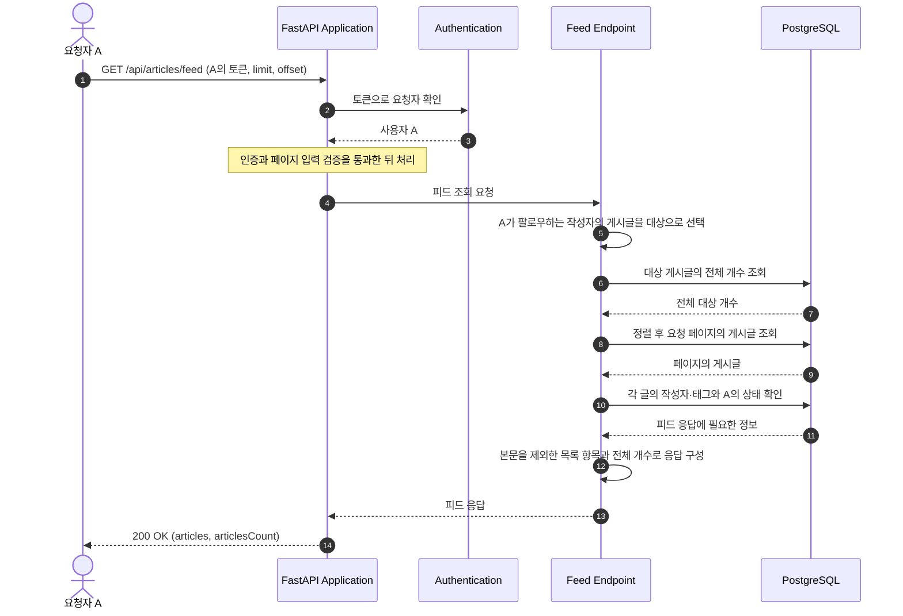

# Article Feed Flow

이 문서는 `GET /api/articles/feed`로 요청자가 팔로우하는 작성자들의 게시글을 조회하는 흐름을 설명한다. 요청자 A를 예로 든다.

## 컴포넌트와 책임

| 컴포넌트 | 책임 | 코드 위치 |
| --- | --- | --- |
| Authentication | 토큰을 검증하고 인증된 요청자 A를 확인한다. | [`CurrentUserDep`](../../../app/users/auth.py) |
| Feed Endpoint | A가 팔로우하는 작성자의 게시글을 조회 대상으로 선택한다. | [`get_article_feed()`](../../../app/articles/router.py) |
| List Response | 대상 게시글의 전체 개수와 요청 페이지를 조회하고 항목별 응답을 구성한다. | [`_article_list_response(), _article_tag_names()`](../../../app/articles/router.py) |
| Viewer State | A의 즐겨찾기 여부·작성자 팔로우 여부와 게시글의 즐겨찾기 사용자 수를 확인한다. | [`favorite_state()`](../../../app/articles/favorites.py), [`is_following()`](../../../app/users/follows.py) |
| API Schemas | 피드 항목과 전체 응답의 필드를 정의한다. | [`ArticleListItem, ArticlesResponse`](../../../app/articles/schemas.py) |
| Persistence | 게시글과 A의 팔로우 관계 등을 조회할 DB 세션과 모델을 제공한다. | [`SessionDep`](../../../app/database.py), [`app/articles/models.py`](../../../app/articles/models.py), [`UserFollow`](../../../app/users/models.py) |

대상 선택은 `get_article_feed()`, 개수·정렬·페이지·응답 처리는 `_article_list_response()`에서 확인한다. 두 함수는 모두 [`app/articles/router.py`](../../../app/articles/router.py)에 있다.

## API 요청과 응답

`GET /api/articles/feed`는 필수 인증을 사용한다. `Authorization: Token <A의 토큰>`으로 요청하며, 헤더가 없거나 잘못되면 `401`로 거부한다. 인증의 상세 흐름은 [본인 정보 조회 흐름](user-retrieval.md)을 참고한다.

성공 응답은 `200`과 `articles`, `articlesCount`다. 피드 항목에는 제목·설명·태그·작성 및 수정 시각·작성자 정보와 A의 상태를 담고, 게시글 본문인 `body`는 포함하지 않는다. 전체 필드는 [`ArticleListItem`](../../../app/articles/schemas.py)에서 확인한다.

## 실행 흐름

다이어그램은 정상 처리의 주요 단계를 보여준다.

### 시나리오: 팔로우한 작성자의 게시글 피드 조회

피드는 A가 작성자를 팔로우하는 방향을 기준으로 한다. 다른 사용자의 팔로우나 작성자가 A를 팔로우하는 반대 방향은 피드 대상에 영향을 주지 않는다.

작성자의 팔로우 이전 게시글도 포함한다. 팔로우·해제 후 다음 피드 요청은 저장된 현재 팔로우 관계를 기준으로 조회한다.

## 정렬·페이지와 응답 상태

- 작성 시각 `created_at`이 최신인 글부터 조회한다. 같은 시각의 글은 DB ID인 `Article.id` 내림차순으로 정렬하여 순서를 결정한다. 수정 시각 `updated_at`은 피드 순서를 결정하지 않는다.
- `limit`은 기본값 20인 1 이상의 정수, `offset`은 기본값 0인 0 이상의 정수다. 잘못된 입력은 기존 필드별 `422` 오류 응답으로 반환한다.
- `favorited`는 A가 해당 글을 즐겨찾기했는지, `author.following`은 A가 작성자를 팔로우하는지 나타낸다. `favoritesCount`는 해당 글을 즐겨찾기한 모든 사용자의 수다.

`articlesCount`는 A가 팔로우한 작성자들의 전체 게시글 수다. 대상 게시글이 없으면 빈 `articles`와 `articlesCount: 0`을 반환한다. 대상 게시글이 있어도 `offset`이 페이지 범위를 벗어나면 `articles`는 빈 목록이 되지만 `articlesCount`는 전체 대상 개수를 유지한다.

## 관련 문서

- [일반 게시글 목록 조회 흐름](article-list.md)
- [게시글 생성·단건 조회 흐름](article-creation-and-retrieval.md)
- [팔로우 추가·해제 흐름](follow.md)
- [데이터 모델](../data-model.md)
- [고정 API 계약](../../api/CONTRACT.md)
