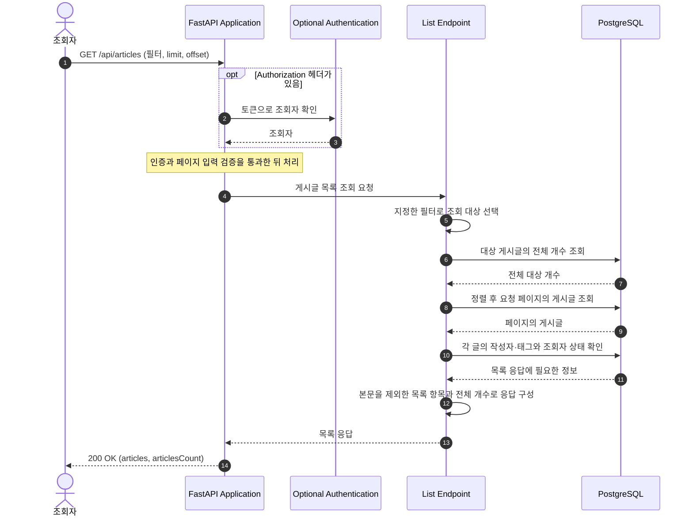

# Article List Flow

이 문서는 `GET /api/articles`로 조건에 맞는 게시글 목록을 조회하는 흐름을 설명한다. 필터가 없으면 모든 게시글이 조회 대상이다.

## 컴포넌트와 책임

| 컴포넌트 | 책임 | 코드 위치 |
| --- | --- | --- |
| Authentication | 인증 헤더가 있으면 조회자를 확인하고, 없으면 익명 조회를 허용한다. | [`OptionalUserDep`](../../../app/users/auth.py) |
| List Endpoint | 태그·작성자·즐겨찾기한 사용자 조건으로 대상 쿼리를 구성한다. | [`list_articles()`](../../../app/articles/router.py) |
| List Response | 대상 게시글의 전체 개수와 요청 페이지를 조회하고 항목별 응답을 구성한다. | [`_article_list_response(), _article_tag_names()`](../../../app/articles/router.py) |
| Viewer State | 조회자의 즐겨찾기 여부·작성자 팔로우 여부와 게시글의 즐겨찾기 사용자 수를 확인한다. | [`favorite_state()`](../../../app/articles/favorites.py), [`is_following()`](../../../app/users/follows.py) |
| API Schemas | 목록 항목과 전체 응답의 필드를 정의한다. | [`ArticleListItem, ArticlesResponse`](../../../app/articles/schemas.py) |
| Persistence | 게시글·태그·사용자 관계를 조회할 DB 세션과 모델을 제공한다. | [`SessionDep`](../../../app/database.py), [`app/articles/models.py`](../../../app/articles/models.py), [`app/users/models.py`](../../../app/users/models.py) |

대상 선택은 `list_articles()`, 개수·정렬·페이지·응답 처리는 `_article_list_response()`에서 확인한다. 두 함수는 모두 [`app/articles/router.py`](../../../app/articles/router.py)에 있다.

## API 요청과 응답

`GET /api/articles`는 선택적 인증을 사용한다. 인증 헤더가 없으면 익명 조회를 허용하고, 헤더가 있으면 토큰을 검증한다. 비어 있거나 잘못된 헤더는 `401`로 거부한다. 인증의 상세 흐름은 [본인 정보 조회 흐름](user-retrieval.md)과 [`app/users/auth.py`](../../../app/users/auth.py)를 참고한다.

성공 응답은 `200`과 `articles`, `articlesCount`다. 목록 항목에는 제목·설명·태그·작성 및 수정 시각·작성자 정보와 조회자의 상태를 담고, 게시글 본문인 `body`는 포함하지 않는다. 전체 필드는 [`ArticleListItem`](../../../app/articles/schemas.py)에서 확인한다.

| 필터 | 선택하는 게시글 |
| --- | --- |
| `tag` | 지정한 이름의 태그가 있는 게시글 |
| `author` | 지정한 사용자 이름의 작성자가 쓴 게시글 |
| `favorited` | 지정한 사용자 이름의 사용자가 즐겨찾기한 게시글 |

필터를 함께 지정하면 모든 조건에 일치하는 게시글을 선택한다(AND). 이름은 저장된 값과 정확히 비교하며, 빈 문자열도 지정한 검색 값으로 취급한다.

## 실행 흐름

다이어그램은 정상 처리의 주요 단계를 보여준다.

### 시나리오: 게시글 목록 조회

목록의 단위는 게시글이다. 태그나 즐겨찾기가 여러 개 있어도 같은 게시글은 중복해서 표시되지 않는다.

`favorited` 필터에 지정한 사용자는 검색 대상이고, 실제 조회자는 인증으로 확인한 사용자다. A가 `favorited=B`로 조회하면 B가 즐겨찾기한 글을 선택하지만, 응답의 `favorited`와 `author.following`은 A를 기준으로 계산한다. B의 즐겨찾기 목록을 익명으로 조회할 수도 있다.

## 정렬·페이지와 응답 상태

- 작성 시각 `created_at`이 최신인 글부터 조회한다. 같은 시각의 글은 DB ID인 `Article.id` 내림차순으로 정렬하여 순서를 결정한다. 수정 시각 `updated_at`은 목록 순서를 결정하지 않는다.
- `limit`은 기본값 20인 1 이상의 정수, `offset`은 기본값 0인 0 이상의 정수다. 잘못된 입력은 기존 필드별 `422` 오류 응답으로 반환한다.
- `favorited`는 조회자가 해당 글을 즐겨찾기했는지, `author.following`은 조회자가 작성자를 팔로우하는지 나타낸다. 익명 조회에서는 둘 다 `false`다. `favoritesCount`는 해당 글을 즐겨찾기한 모든 사용자의 수다.

`articlesCount`는 필터에 일치하는 전체 게시글 수다. 일치하는 대상이 없으면 빈 `articles`와 `articlesCount: 0`을 반환한다. 대상 게시글이 있어도 `offset`이 페이지 범위를 벗어나면 `articles`는 빈 목록이 되지만 `articlesCount`는 전체 대상 개수를 유지한다.

## 관련 문서

- [게시글 피드 조회 흐름](article-feed.md)
- [게시글 생성·단건 조회 흐름](article-creation-and-retrieval.md)
- [즐겨찾기 추가·해제 흐름](favorite.md)
- [데이터 모델](../data-model.md)
- [고정 API 계약](../../api/CONTRACT.md)
