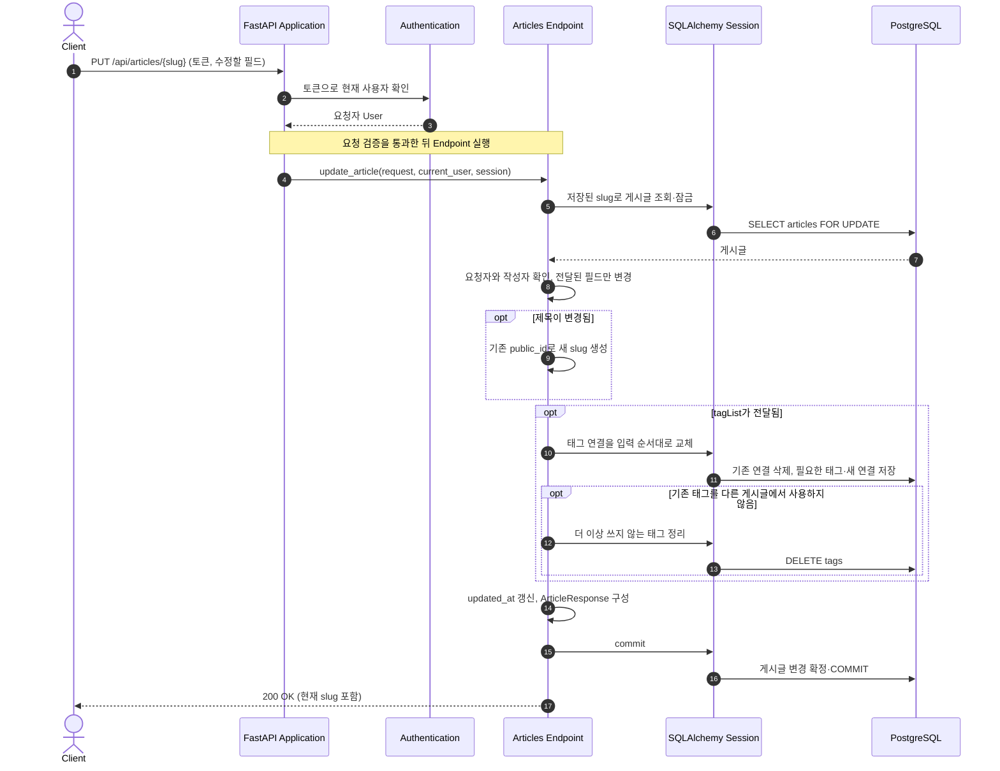
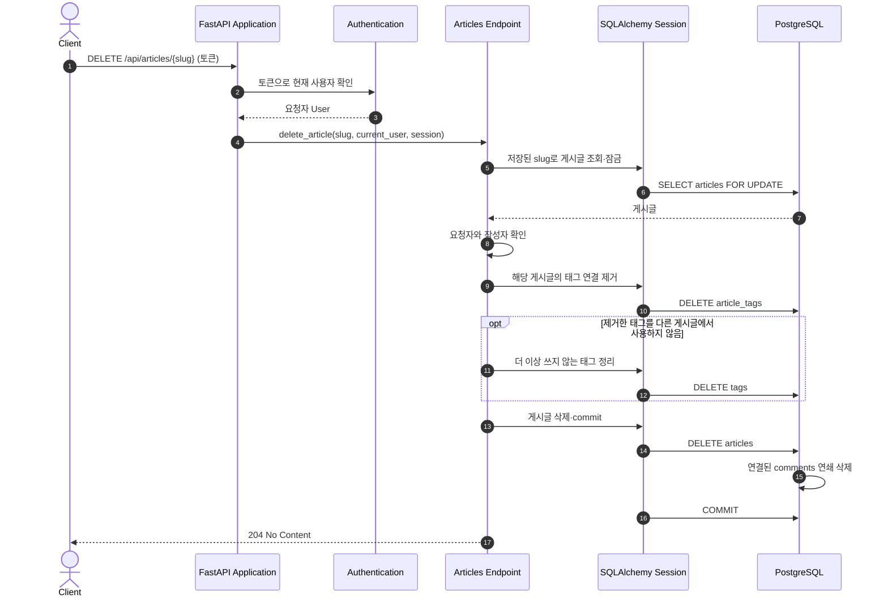

# Article Update and Deletion Flow

인증된 작성자가 `PUT /api/articles/{slug}`로 게시글을 수정하거나 `DELETE /api/articles/{slug}`로 삭제하는 흐름을 설명한다.

## Component Responsibilities

| 컴포넌트            | 책임                                                       | 코드 위치                                                                                                    |
| ------------------- | ---------------------------------------------------------- | ------------------------------------------------------------------------------------------------------------ |
| FastAPI Application | 게시글 라우터를 HTTP 요청에 연결한다.                      | [`app/main.py`](../../../app/main.py)                                                                       |
| Authentication      | 토큰으로 요청자를 식별한다.                                | [`app/users/auth.py`](../../../app/users/auth.py)                                                           |
| API Schemas         | 수정 요청의 필드를 검증하고 공개 응답의 형태를 정한다.     | [`app/articles/schemas.py`](../../../app/articles/schemas.py)                                               |
| Articles Endpoint   | 작성자 권한을 확인하고 수정·삭제 및 태그 정리를 조정한다. | [`app/articles/router.py`](../../../app/articles/router.py)                                                 |
| Persistence         | 게시글·태그 관계를 저장하고 한 트랜잭션으로 확정한다.     | [`app/articles/models.py`](../../../app/articles/models.py), [`app/database.py`](../../../app/database.py) |
| PostgreSQL          | 게시글 삭제 시 연결된 댓글을 연쇄 삭제한다.                | [`0004_create_comments.py`](../../../migrations/versions/0004_create_comments.py)                           |

## Runtime View

### 시나리오: 게시글 수정

- 수정 요청에 없는 `title`, `description`, `body`는 유지된다. `tagList`를 보내지 않으면 기존 태그 연결도 유지하고, 보내면 해당 목록과 순서로 교체한다.
- 제목이 바뀌면 `slug`의 제목 부분을 다시 만들지만 `public_id`는 그대로 둔다. 공개 조회는 이 UUID 접미부로 게시글을 찾으므로 제목 변경 전 링크도 같은 게시글을 조회한다.
- 태그 이름은 게시글 간에 공유한다. 기존 태그 중 다른 게시글에서 계속 쓰는 이름은 남기고, 어느 게시글에서도 쓰지 않는 이름만 삭제한다. 게시글 변경과 태그 정리는 함께 커밋한다.

### 시나리오: 게시글 삭제

- 삭제 전에 해당 게시글의 태그 연결을 제거한다. 공유 중인 태그 이름은 남기고, 마지막 연결이 사라진 태그 이름만 정리한다.
- 게시글 삭제와 함께 해당 댓글은 DB의 `ON DELETE CASCADE`로 삭제된다. 태그 정리와 게시글·댓글 삭제는 같은 트랜잭션에서 확정된다.
