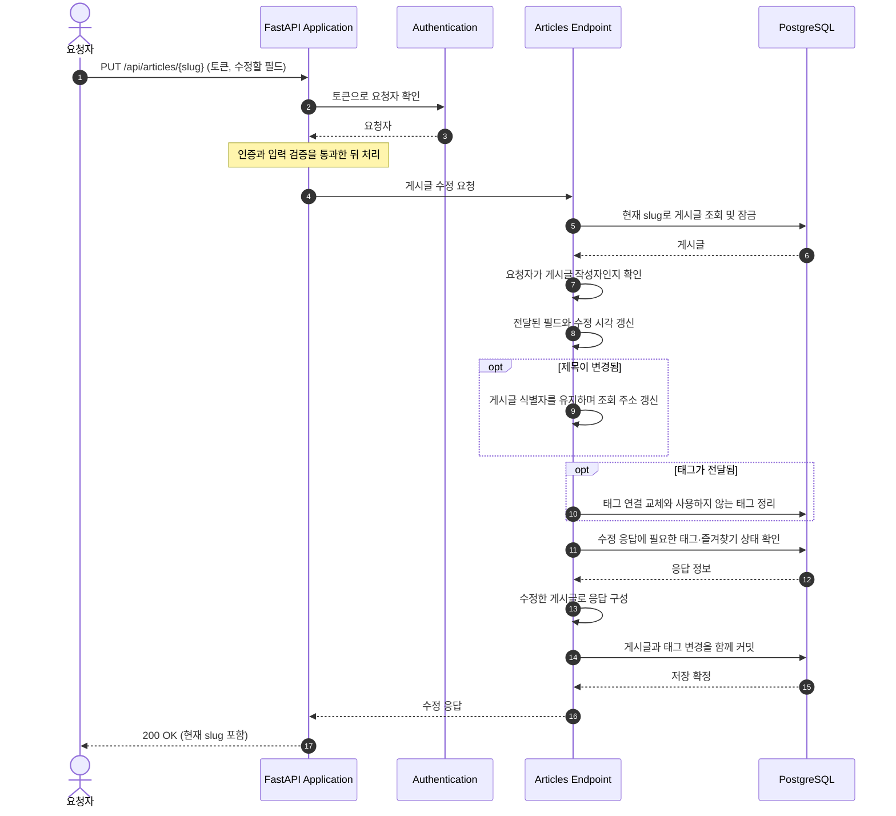
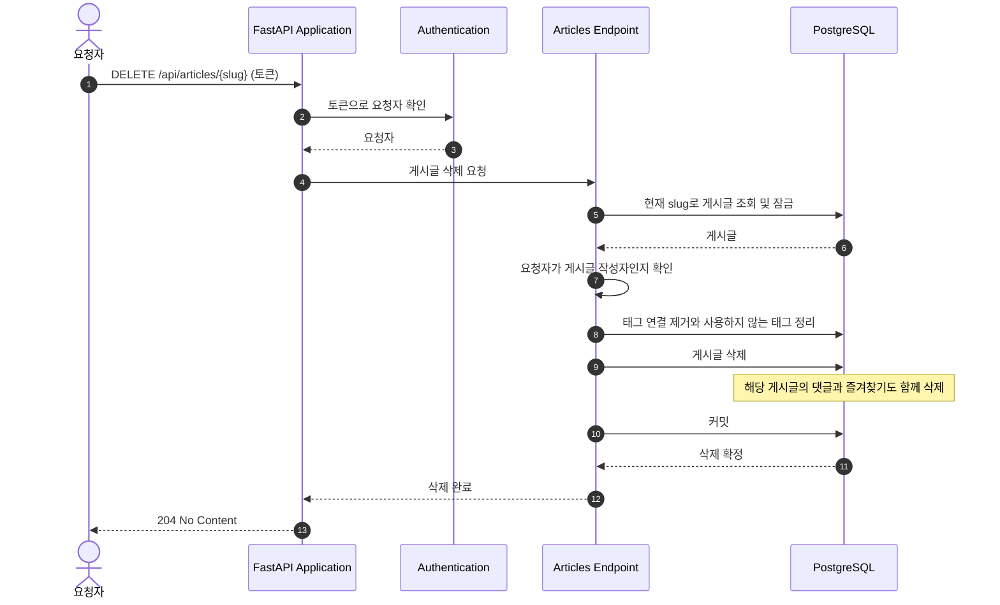

# Article Update and Deletion Flow

인증된 작성자가 `PUT /api/articles/{slug}`로 게시글을 수정하거나 `DELETE /api/articles/{slug}`로 삭제하는 흐름을 설명한다.

## 컴포넌트와 책임

| 컴포넌트 | 책임 | 코드 위치 |
| --- | --- | --- |
| FastAPI Application | 게시글 라우터를 HTTP 요청에 연결한다. | [`app/main.py`](../../../app/main.py) |
| Authentication | 토큰으로 요청자를 식별한다. | [`CurrentUserDep`](../../../app/users/auth.py) |
| API Schemas | 수정 요청의 필드를 검증하고 공개 응답의 형태를 정한다. | [`UpdateArticleRequest, ArticleResponse`](../../../app/articles/schemas.py) |
| Articles Endpoint | 작성자 권한을 확인하고 수정·삭제 및 태그 정리를 조정한다. | [`update_article(), delete_article(), _replace_article_tags()`](../../../app/articles/router.py) |
| Persistence | 게시글·태그 관계를 저장하고 한 트랜잭션으로 확정한다. | [`app/articles/models.py`](../../../app/articles/models.py), [`app/database.py`](../../../app/database.py) |
| Favorite Lookup | 수정 응답에 작성자의 즐겨찾기 여부와 해당 게시글을 즐겨찾기한 사용자 수를 반영한다. | [`favorite_state()`](../../../app/articles/favorites.py) |
| PostgreSQL | 게시글 삭제 시 연결된 댓글과 즐겨찾기를 연쇄 삭제한다. | [`0004_create_comments.py`](../../../migrations/versions/0004_create_comments.py), [`0006_create_article_favorites.py`](../../../migrations/versions/0006_create_article_favorites.py) |

인증의 상세 흐름은 [본인 정보 조회 흐름](user-retrieval.md)을 참고한다.

## 실행 흐름

다이어그램은 정상 처리의 주요 단계를 보여준다.

### 시나리오: 게시글 수정

```mermaid
sequenceDiagram
    autonumber
    actor Client as 요청자
    participant App as FastAPI Application
    participant Auth as Authentication
    participant Endpoint as Articles Endpoint
    participant DB as PostgreSQL

    Client->>App: PUT /api/articles/{slug} (토큰, 수정할 필드)
    App->>Auth: 토큰으로 요청자 확인
    Auth-->>App: 요청자
    Note over App: 인증과 입력 검증을 통과한 뒤 처리
    App->>Endpoint: 게시글 수정 요청
    Endpoint->>DB: 현재 slug로 게시글 조회 및 잠금
    DB-->>Endpoint: 게시글
    Endpoint->>Endpoint: 요청자가 게시글 작성자인지 확인
    Endpoint->>Endpoint: 전달된 필드와 수정 시각 갱신
    opt 제목이 변경됨
        Endpoint->>Endpoint: 게시글 식별자를 유지하며 조회 주소 갱신
    end
    opt 태그가 전달됨
        Endpoint->>DB: 태그 연결 교체와 사용하지 않는 태그 정리
    end
    Endpoint->>DB: 수정 응답에 필요한 태그·즐겨찾기 상태 확인
    DB-->>Endpoint: 응답 정보
    Endpoint->>Endpoint: 수정한 게시글로 응답 구성
    Endpoint->>DB: 게시글과 태그 변경을 함께 커밋
    DB-->>Endpoint: 저장 확정
    Endpoint-->>App: 수정 응답
    App-->>Client: 200 OK (현재 slug 포함)
```

- 수정 요청에 없는 `title`, `description`, `body`는 유지된다. `tagList`를 보내지 않으면 기존 태그 연결도 유지하고, 보내면 해당 목록과 순서로 교체한다.
- 제목이 바뀌어도 게시글 식별자는 유지되어 이전 링크로 같은 게시글을 조회할 수 있다. 수정·삭제 요청은 현재 `slug`를 사용한다.
- 태그 이름은 게시글 간에 공유하므로, 다른 게시글에서 계속 사용하는 이름은 남긴다. 게시글 변경과 태그 정리는 함께 확정된다.
- 요청자가 게시글 작성자가 아니면 수정·삭제를 진행하지 않는다. 수정 응답의 `author.following`은 자기 자신에 대한 팔로우 여부이므로 `false`다.
- 제목이나 내용을 수정해도 같은 게시글에 등록된 즐겨찾기는 유지된다. 수정 응답에도 작성자 자신의 즐겨찾기 여부와 해당 게시글을 즐겨찾기한 사용자 수를 반영한다.

### 시나리오: 게시글 삭제

```mermaid
sequenceDiagram
    autonumber
    actor Client as 요청자
    participant App as FastAPI Application
    participant Auth as Authentication
    participant Endpoint as Articles Endpoint
    participant DB as PostgreSQL

    Client->>App: DELETE /api/articles/{slug} (토큰)
    App->>Auth: 토큰으로 요청자 확인
    Auth-->>App: 요청자
    App->>Endpoint: 게시글 삭제 요청
    Endpoint->>DB: 현재 slug로 게시글 조회 및 잠금
    DB-->>Endpoint: 게시글
    Endpoint->>Endpoint: 요청자가 게시글 작성자인지 확인
    Endpoint->>DB: 태그 연결 제거와 사용하지 않는 태그 정리
    Endpoint->>DB: 게시글 삭제
    Note over DB: 해당 게시글의 댓글과 즐겨찾기도 함께 삭제
    Endpoint->>DB: 커밋
    DB-->>Endpoint: 삭제 확정
    Endpoint-->>App: 삭제 완료
    App-->>Client: 204 No Content
```

- 해당 게시글의 댓글·즐겨찾기와 사용하지 않는 태그까지 함께 정리한다. 다른 게시글의 댓글·즐겨찾기, 공유 중인 태그와 사용자 정보는 유지된다.
- 수정·삭제 저장 중 오류가 발생하면 롤백하여 변경 전 게시글과 관련 데이터를 유지한다.
