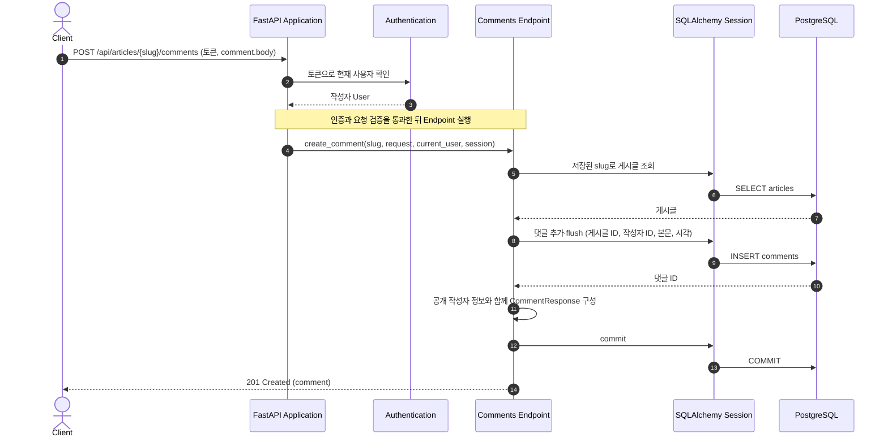
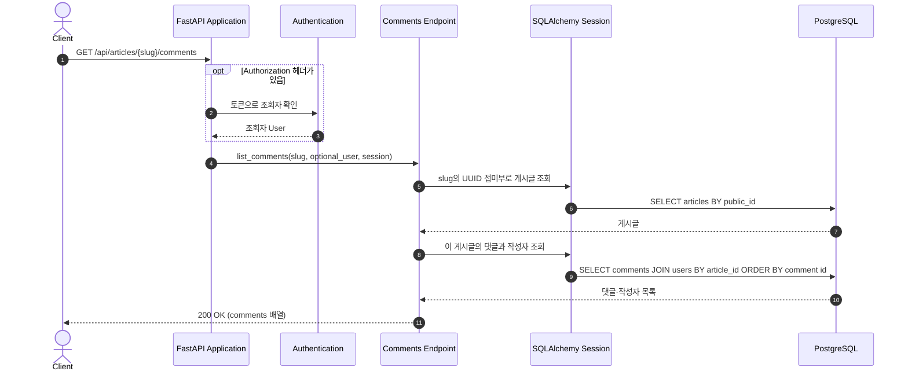
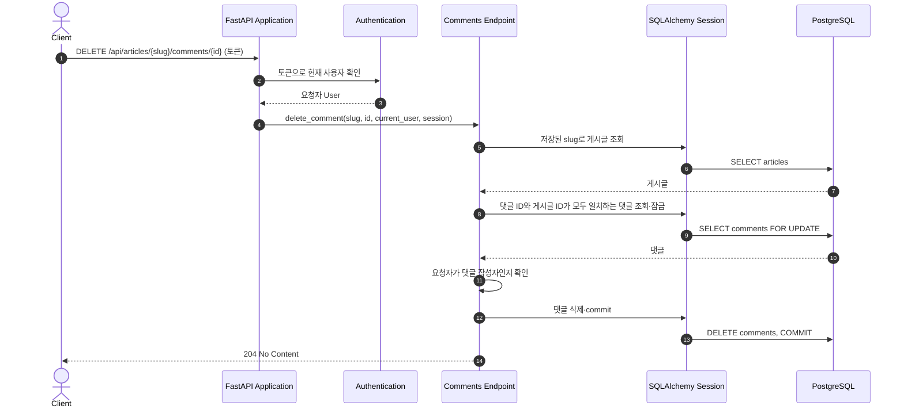

# Comment Creation, Listing, and Deletion Flow

댓글을 작성하고, 게시글에 달린 댓글을 조회하거나 자신의 댓글을 삭제하는 흐름을 설명한다.

## Component Responsibilities

| 컴포넌트            | 책임                                                         | 코드 위치                                                                                                                  |
| ------------------- | ------------------------------------------------------------ | -------------------------------------------------------------------------------------------------------------------------- |
| FastAPI Application | 댓글 라우터를 HTTP 요청에 연결한다.                          | [`app/main.py`](../../../app/main.py)                                                                                     |
| Authentication      | 작성·삭제 요청자를 식별한다. 목록 조회는 익명으로도 받는다. | [`app/users/auth.py`](../../../app/users/auth.py)                                                                         |
| API Schemas         | 댓글 본문을 검증하고 공개 응답의 형태를 정한다.              | [`app/comments/schemas.py`](../../../app/comments/schemas.py)                                                             |
| Comments Endpoint   | 대상 게시글과 댓글을 찾고 작성·목록 조회·삭제를 처리한다.  | [`app/comments/router.py`](../../../app/comments/router.py), [`app/articles/lookup.py`](../../../app/articles/lookup.py) |
| Persistence         | 댓글을 게시글·작성자에 연결해 저장하고 조회한다.            | [`app/comments/models.py`](../../../app/comments/models.py), [`app/database.py`](../../../app/database.py)               |

## Runtime View

### 시나리오: 댓글 작성

- 댓글의 `article_id`는 URL로 찾은 게시글에서, `author_id`는 인증된 사용자에서 가져온다. `createdAt`과 `updatedAt`은 작성 시 같은 시각으로 저장한다.
- 응답의 작성자에는 `username`, `bio`, `image`, `following`만 담긴다. 현재 `following`은 `false`다.

### 시나리오: 게시글의 댓글 목록 조회

- 인증 헤더가 없어도 목록을 조회할 수 있다. 결과에는 URL이 가리키는 게시글에 속한 댓글만 포함되며 댓글 ID 순서로 반환된다. 댓글이 없으면 빈 `comments` 배열이다.
- 각 댓글에는 본문과 작성·수정 시각, 공개 작성자 정보가 포함된다. 조회자가 누구인지에 따라 `following` 값을 계산하는 기능은 아직 없으며 `false`로 반환한다.

### 시나리오: 댓글 삭제

- 삭제 대상은 URL의 댓글 ID뿐 아니라 해당 게시글 ID까지 일치해야 한다. 게시글 작성 여부와 관계없이 댓글을 쓴 사용자만 자신의 댓글을 삭제할 수 있다.
- 삭제가 확정되면 이후 해당 게시글의 댓글 목록에서 그 댓글이 보이지 않는다.
