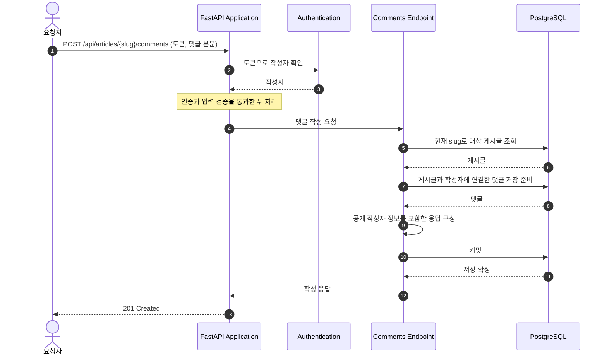
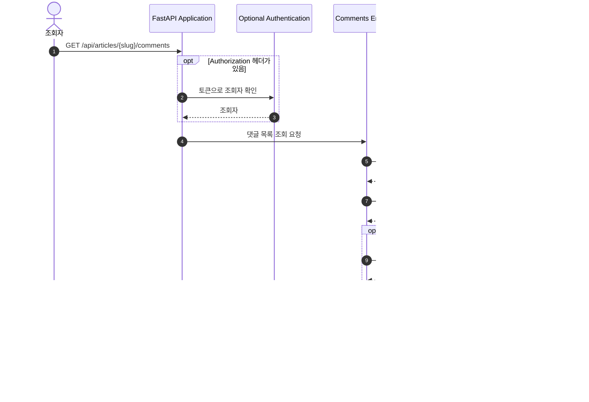
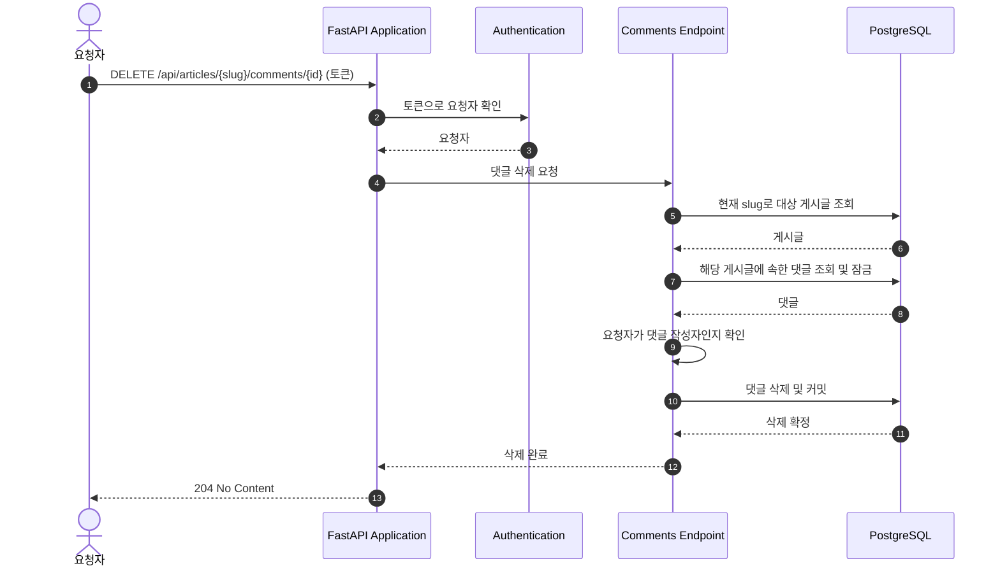

# Comment Creation, Listing, and Deletion Flow

댓글을 작성하고, 게시글에 달린 댓글을 조회하거나 자신의 댓글을 삭제하는 흐름을 설명한다.

## 컴포넌트와 책임

| 컴포넌트 | 책임 | 코드 위치 |
| --- | --- | --- |
| FastAPI Application | 댓글 라우터를 HTTP 요청에 연결한다. | [`app/main.py`](../../../app/main.py) |
| Authentication | 작성·삭제 요청자를 식별한다. 목록 조회는 익명으로도 받는다. | [`CurrentUserDep, OptionalUserDep`](../../../app/users/auth.py) |
| Follow Lookup | 조회자가 각 댓글 작성자를 팔로우하는지 확인한다. | [`is_following()`](../../../app/users/follows.py) |
| API Schemas | 댓글 본문을 검증하고 공개 응답의 형태를 정한다. | [`NewCommentRequest, CommentResponse, CommentsResponse`](../../../app/comments/schemas.py) |
| Comments Endpoint | 대상 게시글과 댓글을 찾고 작성·목록 조회·삭제를 처리한다. | [`create_comment(), list_comments(), delete_comment()`](../../../app/comments/router.py), [`find_article_by_public_slug()`](../../../app/articles/lookup.py) |
| Persistence | 댓글을 게시글·작성자에 연결해 저장하고 조회한다. | [`app/comments/models.py`](../../../app/comments/models.py), [`app/database.py`](../../../app/database.py) |

인증의 상세 흐름은 [본인 정보 조회 흐름](user-retrieval.md)을 참고한다. 댓글 작성·삭제는 현재 `slug`로 대상 게시글을 찾고, 댓글 목록 조회는 제목이 바뀌기 전 조회 링크도 지원한다.

## 실행 흐름

다이어그램은 정상 처리의 주요 단계를 보여준다.

### 시나리오: 댓글 작성

```mermaid
sequenceDiagram
    autonumber
    actor Client as 요청자
    participant App as FastAPI Application
    participant Auth as Authentication
    participant Endpoint as Comments Endpoint
    participant DB as PostgreSQL

    Client->>App: POST /api/articles/{slug}/comments (토큰, 댓글 본문)
    App->>Auth: 토큰으로 작성자 확인
    Auth-->>App: 작성자
    Note over App: 인증과 입력 검증을 통과한 뒤 처리
    App->>Endpoint: 댓글 작성 요청
    Endpoint->>DB: 현재 slug로 대상 게시글 조회
    DB-->>Endpoint: 게시글
    Endpoint->>DB: 게시글과 작성자에 연결한 댓글 저장 준비
    DB-->>Endpoint: 댓글
    Endpoint->>Endpoint: 공개 작성자 정보를 포함한 응답 구성
    Endpoint->>DB: 커밋
    DB-->>Endpoint: 저장 확정
    Endpoint-->>App: 작성 응답
    App-->>Client: 201 Created
```

댓글 작성자는 인증된 사용자로 결정된다. 작성 응답의 `following`은 댓글 작성자 자신에 대한 팔로우 여부이므로 `false`다.

### 시나리오: 게시글의 댓글 목록 조회

```mermaid
sequenceDiagram
    autonumber
    actor Client as 조회자
    participant App as FastAPI Application
    participant Auth as Optional Authentication
    participant Endpoint as Comments Endpoint
    participant DB as PostgreSQL

    Client->>App: GET /api/articles/{slug}/comments
    opt Authorization 헤더가 있음
        App->>Auth: 토큰으로 조회자 확인
        Auth-->>App: 조회자
    end
    App->>Endpoint: 댓글 목록 조회 요청
    Endpoint->>DB: 조회 주소의 식별자로 대상 게시글 조회
    DB-->>Endpoint: 게시글
    Endpoint->>DB: 해당 게시글의 댓글과 댓글 작성자 조회
    DB-->>Endpoint: 댓글·작성자 목록
    opt 인증된 조회자
        Endpoint->>DB: 조회자가 각 댓글 작성자를 팔로우하는지 확인
        DB-->>Endpoint: 작성자별 팔로우 여부
    end
    Endpoint->>Endpoint: 조회자 상태를 반영한 댓글 목록 구성
    Endpoint-->>App: 목록 응답
    App-->>Client: 200 OK (comments)
```

- 댓글은 작성된 순서를 나타내는 댓글 ID 순서로 반환되며, 댓글이 없으면 빈 `comments` 배열이다.
- `following`은 조회자가 각 댓글의 작성자를 팔로우하는지 나타낸다. 게시글 작성자의 팔로우 여부와는 별개이며 익명이면 `false`다.

### 시나리오: 댓글 삭제

```mermaid
sequenceDiagram
    autonumber
    actor Client as 요청자
    participant App as FastAPI Application
    participant Auth as Authentication
    participant Endpoint as Comments Endpoint
    participant DB as PostgreSQL

    Client->>App: DELETE /api/articles/{slug}/comments/{id} (토큰)
    App->>Auth: 토큰으로 요청자 확인
    Auth-->>App: 요청자
    App->>Endpoint: 댓글 삭제 요청
    Endpoint->>DB: 현재 slug로 대상 게시글 조회
    DB-->>Endpoint: 게시글
    Endpoint->>DB: 해당 게시글에 속한 댓글 조회 및 잠금
    DB-->>Endpoint: 댓글
    Endpoint->>Endpoint: 요청자가 댓글 작성자인지 확인
    Endpoint->>DB: 댓글 삭제 및 커밋
    DB-->>Endpoint: 삭제 확정
    Endpoint-->>App: 삭제 완료
    App-->>Client: 204 No Content
```

- 삭제 대상은 URL의 댓글 ID뿐 아니라 해당 게시글 ID까지 일치해야 한다. 게시글 작성 여부와 관계없이 댓글을 쓴 사용자만 자신의 댓글을 삭제할 수 있다.
