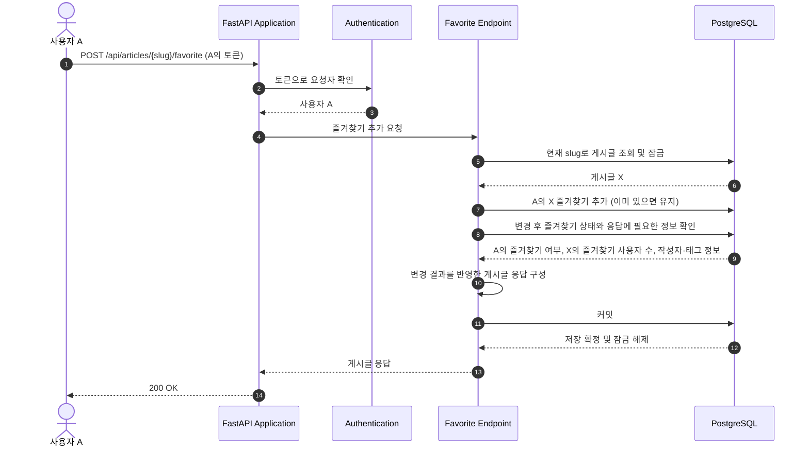
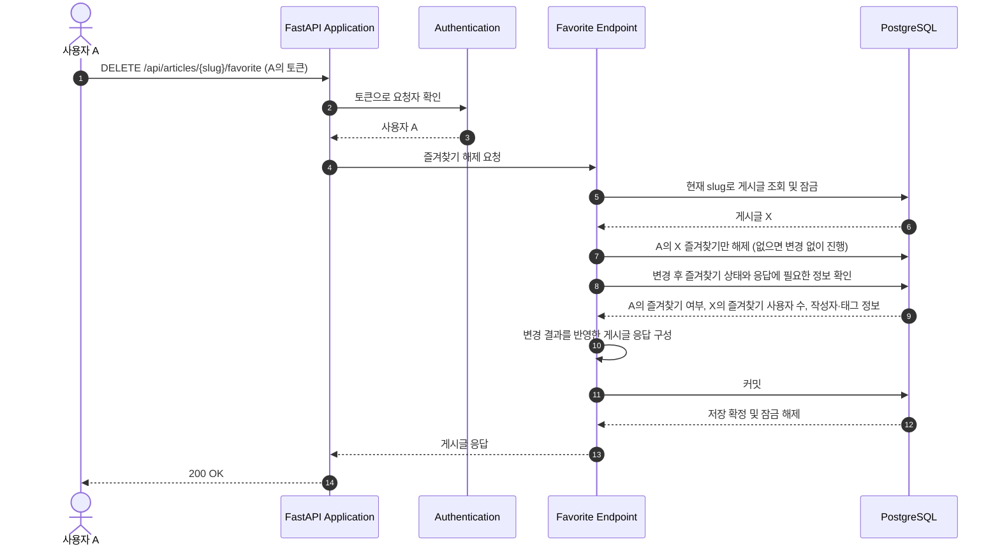

# Article Favorite and Unfavorite Flow

이 문서는 인증된 사용자가 게시글을 즐겨찾기에 추가하거나 해제하는 흐름을 설명한다. 사용자 A가 게시글 X를 대상으로 요청하는 경우를 예로 든다. 자신이 작성한 게시글도 즐겨찾기할 수 있다.

## 컴포넌트와 책임

| 컴포넌트 | 책임 | 코드 위치 |
| --- | --- | --- |
| FastAPI Application | 게시글 라우터와 API 오류 처리기를 연결한다. | [`app/main.py`](../../../app/main.py) |
| Authentication | 요청 토큰을 검증하고 요청자 A를 DB에서 확인한다. | [`authenticate_user(), CurrentUserDep`](../../../app/users/auth.py) |
| Favorite Endpoints | 추가·해제 요청을 공통 처리 함수에 전달한다. | [`favorite_article(), unfavorite_article()`](../../../app/articles/router.py) |
| Favorite Change | 대상 게시글을 잠그고 A의 즐겨찾기를 추가·해제한 뒤 응답을 구성하고 커밋한다. | [`_set_favorited()`](../../../app/articles/router.py) |
| Favorite State | A가 X를 즐겨찾기했는지와 X를 즐겨찾기한 사용자 수를 계산한다. | [`favorite_state()`](../../../app/articles/favorites.py) |
| Article Response | 게시글 정보와 요청자 기준의 즐겨찾기·작성자 팔로우 상태를 응답에 담는다. | [`_article_response(), _article_tag_names()`](../../../app/articles/router.py), [`ArticleResponse, ArticlePayload`](../../../app/articles/schemas.py), [`is_following()`](../../../app/users/follows.py) |
| Persistence | DB 세션을 제공하고 사용자와 게시글 사이의 즐겨찾기를 저장한다. | [`SessionDep`](../../../app/database.py), [`ArticleFavorite`](../../../app/articles/models.py), [migration 0006](../../../migrations/versions/0006_create_article_favorites.py) |
| Error Handling | 인증 실패와 대상 게시글 부재를 API 오류 응답으로 변환한다. | [`api_error_handler()`](../../../app/errors.py) |

## API 요청과 응답

두 요청 모두 `Authorization: Token <A의 토큰>`을 사용한다. 인증의 상세 흐름은 [본인 정보 조회 흐름](user-retrieval.md)을 참고한다.

| 요청 | 성공 응답 |
| --- | --- |
| `POST /api/articles/{slug}/favorite` | `200`, 대상 게시글 정보와 `favorited: true` |
| `DELETE /api/articles/{slug}/favorite` | `200`, 대상 게시글 정보와 `favorited: false` |

응답의 `article.favorited`는 A가 X를 즐겨찾기했는지를 나타낸다. `article.favoritesCount`는 X를 즐겨찾기한 모든 사용자의 수다. 응답에는 본문·태그·작성자 정보를 포함한 게시글 정보도 들어가며, 전체 필드는 [`ArticlePayload`](../../../app/articles/schemas.py)에서 확인한다.

## 즐겨찾기 대상

추가·해제의 대상은 사용자 A가 게시글 X에 등록한 즐겨찾기다. 다른 사용자가 X에 등록한 즐겨찾기와 A가 다른 게시글에 등록한 즐겨찾기는 유지된다.

## 실행 흐름

다이어그램은 정상 처리의 주요 단계를 보여준다.

같은 게시글의 즐겨찾기 처리와 게시글 수정·삭제는 잠금이 풀릴 때까지 기다린다. 일반 조회는 이 잠금 때문에 대기하지 않는다.

### 시나리오: 즐겨찾기 추가

### 시나리오: 즐겨찾기 해제

## 관련 문서

- [게시글 생성·조회 흐름](article-creation-and-retrieval.md)
- [즐겨찾기한 게시글의 목록 조회 흐름](article-list.md)
- [게시글 수정·삭제 흐름](article-update-and-deletion.md)
- [데이터 모델](../data-model.md)
- [고정 API 계약](../../api/CONTRACT.md)
