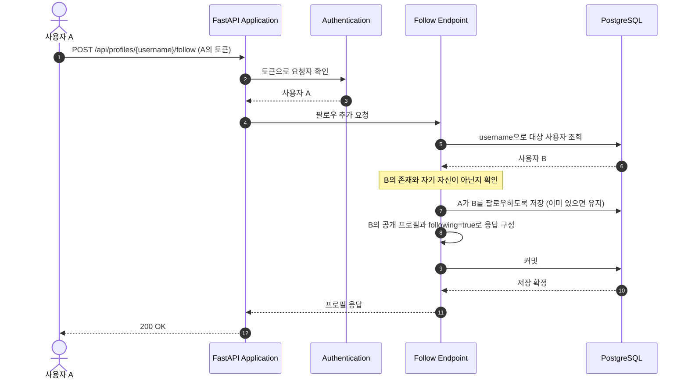
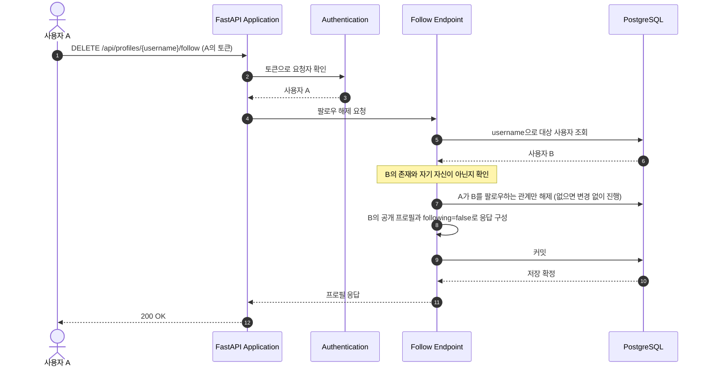

# User Follow and Unfollow Flow

이 문서는 인증된 사용자가 다른 사용자를 팔로우하거나 해제하는 흐름을 설명한다. 사용자 A가 사용자 B를 대상으로 요청하는 경우를 예로 든다.

## 컴포넌트와 책임

| 컴포넌트 | 책임 | 코드 위치 |
| --- | --- | --- |
| FastAPI Application | 사용자 라우터와 API 오류 처리기를 연결한다. | [`app/main.py`](../../../app/main.py) |
| Authentication | 요청 토큰을 검증하고 실제 요청자 A를 DB에서 확인한다. | [`authenticate_user(), CurrentUserDep`](../../../app/users/auth.py), [`decode_access_token()`](../../../app/security.py) |
| Follow Endpoints | 팔로우·해제 요청을 공통 변경 처리에 전달한다. | [`follow_profile(), unfollow_profile()`](../../../app/users/router.py) |
| Follow Change | 대상 B를 확인하고 요청자·대상 쌍의 관계를 변경한 뒤 커밋한다. 저장 실패 시 롤백한다. | [`_find_profile(), _set_following()`](../../../app/users/router.py) |
| Persistence | 요청에 사용할 DB 세션을 제공하고 팔로우 관계와 제약을 정의한다. | [`SessionDep`](../../../app/database.py), [`UserFollow`](../../../app/users/models.py), [migration 0005](../../../migrations/versions/0005_create_user_follows.py) |
| Profile Response | 대상 B의 공개 정보와 요청자의 팔로우 여부를 응답에 담는다. | [`_profile_response()`](../../../app/users/router.py), [`ProfilePayload, ProfileResponse`](../../../app/users/schemas.py) |
| Error Handling | 인증·대상 부재·자기 자신 요청의 ApiError를 HTTP 오류 응답으로 변환한다. | [`api_error_handler()`](../../../app/errors.py) |

## API 요청과 응답

두 요청 모두 `Authorization: Token <A의 토큰>`을 사용한다. 인증의 상세 흐름은 [본인 정보 조회 흐름](user-retrieval.md)을 참고한다.

| 요청 | 성공 응답 |
| --- | --- |
| `POST /api/profiles/{username}/follow` | `200`, 대상 프로필과 `following: true` |
| `DELETE /api/profiles/{username}/follow` | `200`, 대상 프로필과 `following: false` |

## 팔로우 방향

A가 B를 팔로우한다고 해서 B도 A를 팔로우하는 것은 아니다. 추가·해제의 대상은 A에서 B로 향하는 팔로우이며, 다른 사용자의 팔로우와 A가 다른 사용자를 팔로우하는 관계는 유지된다.

## 실행 흐름

다이어그램은 정상 처리의 주요 단계를 보여준다.

### 시나리오: 팔로우 추가

### 시나리오: 팔로우 해제

## 관련 문서

- [공개 프로필 조회](public-profile.md)
- [데이터 모델](../data-model.md)
- [고정 API 계약](../../api/CONTRACT.md)
