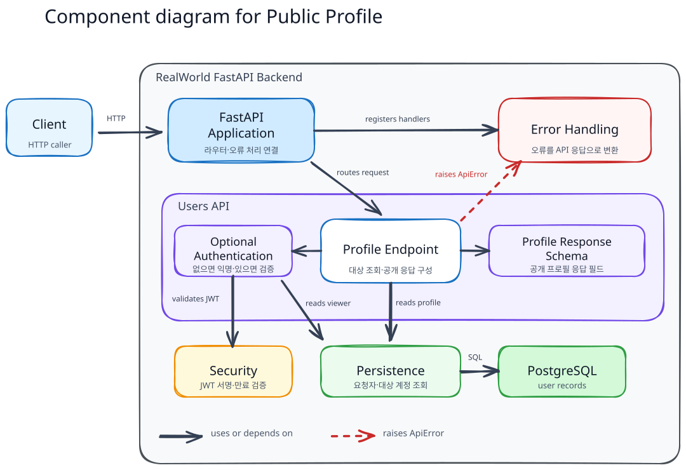
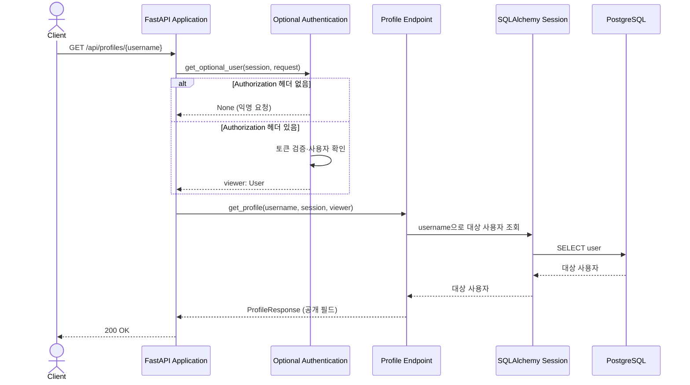
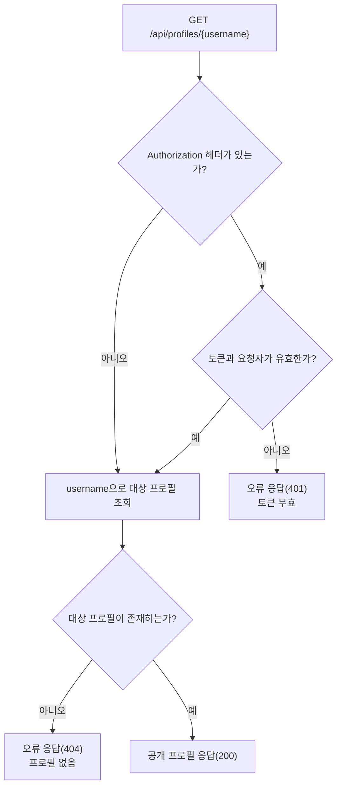

# Public Profile Retrieval Flow

이 문서는 사용자의 공개 프로필을 조회하는 흐름을 설명한다.

## Building Block View

프로필 엔드포인트는 선택적 인증 의존성을 거친 뒤 `username`으로 대상 사용자를 조회한다. 인증은 요청자를 식별할 뿐이며, 대상 프로필의 공개 필드를 결정하는 응답 스키마와 구분된다.

### Component Responsibilities

| 컴포넌트                | 책임                                                                       | 코드 위치                                                                                                                |
| ----------------------- | -------------------------------------------------------------------------- | ------------------------------------------------------------------------------------------------------------------------ |
| FastAPI Application     | 프로필 라우터와 오류 처리기를 연결한다.                                    | [`app/main.py::app`](../../../app/main.py)                                                                              |
| Profile Endpoint        | 경로의`username`으로 대상 사용자를 조회하고 공개 프로필 응답을 구성한다. | [`app/users/router.py::get_profile()`](../../../app/users/router.py)                                                    |
| Optional Authentication | 헤더가 없으면 익명 요청을 허용하고, 있으면 토큰으로 요청자를 식별한다.     | [`app/users/auth.py::get_optional_user(), OptionalUserDep`](../../../app/users/auth.py)                                 |
| Security                | 전달된 JWT의 서명과 만료를 검증한다.                                       | [`app/security.py::decode_access_token()`](../../../app/security.py)                                                    |
| Persistence             | 요청자 인증과 대상 프로필 조회에 필요한 사용자를 DB에서 찾는다.            | [`app/database.py::SessionDep`](../../../app/database.py), [`app/users/models.py::User`](../../../app/users/models.py) |
| Profile Response Schema | `username`, `bio`, `image`, `following`만 응답에 담는다.           | [`app/users/schemas.py::ProfilePayload, ProfileResponse`](../../../app/users/schemas.py)                                |
| Error Handling          | 잘못된 토큰과 없는 프로필을 API 오류 응답으로 변환한다.                    | [`app/errors.py::api_error_handler()`](../../../app/errors.py)                                                          |

## Runtime View

### 시나리오: 공개 프로필 조회

### 실패 흐름

| 실패 조건                                                      | 응답    |
| -------------------------------------------------------------- | ------- |
| 헤더를 보냈지만 형식·JWT·사용자 확인에 실패한 경우           | `401` |
| 인증을 통과했거나 익명 요청이지만 대상`username`이 없는 경우 | `404` |

잘못된 토큰과 없는 프로필이 함께 있는 요청은 토큰 검사에서 먼저 `401`로 거부된다.

## 응답 데이터와 인증 경계

- 응답에는 `username`, `bio`, `image`, `following`만 포함된다. 계정의 email, 비밀번호 해시, JWT는 공개하지 않는다.
- 현재 구현은 팔로우 관계를 조회하지 않아 `following`을 `false`로 반환한다. 이는 현재 구현 상태이며, 공식 계약에서 `following`이 항상 `false`라는 뜻은 아니다.
- 유효한 토큰을 보내도 조회 가능한 프로필 필드는 늘어나지 않는다. 토큰이 없으면 인증 검사를 건너뛰고, 토큰을 보냈다면 유효해야 한다.
