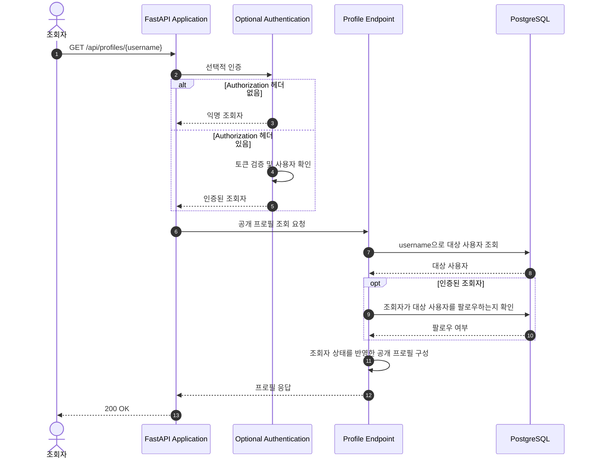

# Public Profile Retrieval Flow

이 문서는 사용자의 공개 프로필을 조회하는 흐름을 설명한다.

## 컴포넌트와 책임

| 컴포넌트 | 책임 | 코드 위치 |
| --- | --- | --- |
| FastAPI Application | 프로필 라우터와 오류 처리기를 연결한다. | [`app`](../../../app/main.py) |
| Profile Endpoint | 경로의 `username`으로 대상 사용자를 조회하고 공개 프로필 응답을 구성한다. | [`get_profile()`](../../../app/users/router.py) |
| Optional Authentication | 헤더가 없으면 익명 요청을 허용하고, 있으면 토큰으로 요청자를 식별한다. | [`get_optional_user(), OptionalUserDep`](../../../app/users/auth.py) |
| Follow Lookup | 조회자가 대상 사용자를 팔로우하는지 저장된 관계로 확인한다. | [`is_following()`](../../../app/users/follows.py) |
| Security | 전달된 JWT의 서명과 만료를 검증한다. | [`decode_access_token()`](../../../app/security.py) |
| Persistence | 요청자 인증과 대상 프로필 조회에 필요한 사용자를 DB에서 찾는다. | [`SessionDep`](../../../app/database.py), [`User`](../../../app/users/models.py) |
| Profile Response Schema | 공개 프로필 응답의 필드를 정의한다. | [`ProfilePayload, ProfileResponse`](../../../app/users/schemas.py) |
| Error Handling | 잘못된 토큰과 없는 프로필을 API 오류 응답으로 변환한다. | [`api_error_handler()`](../../../app/errors.py) |

인증의 상세 흐름은 [본인 정보 조회 흐름](user-retrieval.md)을 참고한다.

## 실행 흐름

다이어그램은 정상 처리의 주요 단계를 보여준다.

### 시나리오: 공개 프로필 조회

```mermaid
sequenceDiagram
    autonumber
    actor Client as 조회자
    participant App as FastAPI Application
    participant Auth as Optional Authentication
    participant Endpoint as Profile Endpoint
    participant DB as PostgreSQL

    Client->>App: GET /api/profiles/{username}
    App->>Auth: 선택적 인증
    alt Authorization 헤더 없음
        Auth-->>App: 익명 조회자
    else Authorization 헤더 있음
        Auth->>Auth: 토큰 검증 및 사용자 확인
        Auth-->>App: 인증된 조회자
    end
    App->>Endpoint: 공개 프로필 조회 요청
    Endpoint->>DB: username으로 대상 사용자 조회
    DB-->>Endpoint: 대상 사용자
    opt 인증된 조회자
        Endpoint->>DB: 조회자가 대상 사용자를 팔로우하는지 확인
        DB-->>Endpoint: 팔로우 여부
    end
    Endpoint->>Endpoint: 조회자 상태를 반영한 공개 프로필 구성
    Endpoint-->>App: 프로필 응답
    App-->>Client: 200 OK
```

`following`은 조회자가 대상 사용자를 팔로우하는지 나타내며, 익명이거나 해당 관계가 없으면 `false`다. 계정의 이메일과 비밀번호 해시는 공개 프로필에 포함하지 않는다.
