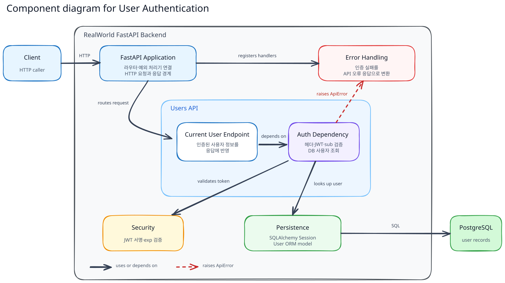
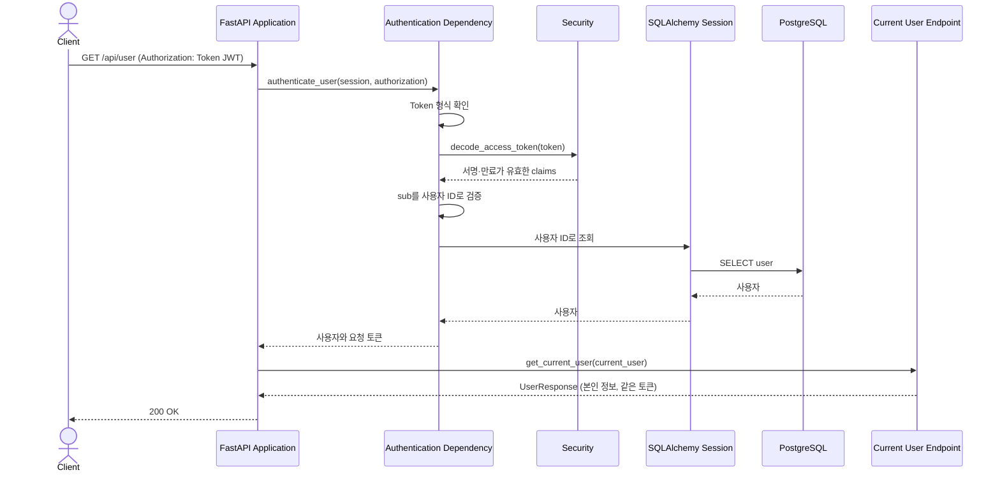
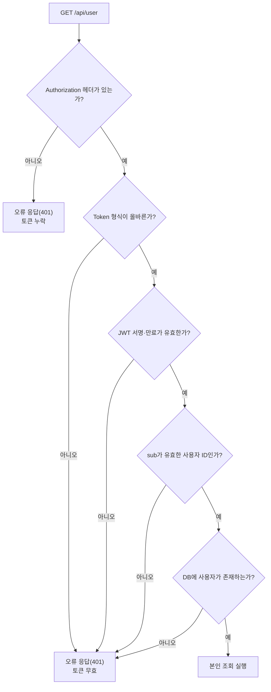

# User Authentication Flow

이 문서는 보호된 요청에서 `Authorization: Token <JWT>`를 검증하고 실제 사용자를 식별하는 공통 인증 흐름을 설명한다. 예시는 `GET /api/user`이며, 같은 필수 인증 의존성을 `PUT /api/user`도 사용한다.

외부에 보장하는 요청·응답 형식은 [`docs/api/CONTRACT.md`](../../api/CONTRACT.md)를 기준으로 한다.

## Building Block View

보호된 엔드포인트는 Authentication Dependency에 의존한다. 이 의존성은 Security로 토큰을 검증하고 Persistence로 실제 사용자를 조회한 뒤 엔드포인트가 실행되도록 한다.

| 컴포넌트                  | 책임                                                             | 코드 위치                                                                                                                |
| ------------------------- | ---------------------------------------------------------------- | ------------------------------------------------------------------------------------------------------------------------ |
| FastAPI Application       | 보호된 엔드포인트와 인증 의존성을 연결하고 HTTP 경계를 제공한다. | [`app/main.py::app`](../../../app/main.py)                                                                              |
| Authentication Dependency | 헤더 형식과 JWT의 사용자 ID를 검사하고 DB에서 사용자를 찾는다.   | [`app/users/auth.py::authenticate_user(), CurrentUserDep`](../../../app/users/auth.py)                                  |
| Security                  | JWT의 서명과 만료를 검증한다.                                    | [`app/security.py::decode_access_token()`](../../../app/security.py)                                                    |
| Persistence               | 토큰의`sub`가 가리키는 사용자 계정을 조회한다.                 | [`app/database.py::SessionDep`](../../../app/database.py), [`app/users/models.py::User`](../../../app/users/models.py) |
| Current User Endpoint     | 인증된 사용자 정보와 요청에 사용한 토큰을 반환한다.              | [`app/users/router.py::get_current_user()`](../../../app/users/router.py)                                               |
| Error Handling            | 인증 실패를 API 오류 응답으로 변환한다.                          | [`app/errors.py::api_error_handler()`](../../../app/errors.py)                                                          |

## Runtime View

### 시나리오: Authentication

인증은 토큰을 발급한 요청이 회원가입인지 로그인인지 구분하지 않는다. 토큰만으로 계정의 현재 존재를 보장할 수 없으므로 DB에서 사용자를 다시 찾는다. `GET /api/user`는 요청 토큰을 그대로 반환하고 새 토큰을 발급하지 않는다.

### 실패 흐름: 인증이 거부되는 지점

| 실패 조건                                                                                               | 응답    | 보호된 엔드포인트 |
| ------------------------------------------------------------------------------------------------------- | ------- | ----------------- |
| `Authorization` 헤더가 없는 경우                                                                      | `401` | 실행되지 않음     |
| `Token` 형식이나 JWT 서명이 잘못되었거나, `exp`가 없거나 만료되었거나, `sub`가 유효하지 않은 경우 | `401` | 실행되지 않음     |
| `sub`의 사용자 ID가 DB에 없는 경우                                                                    | `401` | 실행되지 않음     |

## 데이터와 보안 경계

- `exp`는 만료 시각을 정의하며 인증 시 필수다. `exp`가 없거나 만료된 토큰은 거부한다.
- 본인 조회는 토큰의 만료 시간을 연장하지 않는다. 만료되면 재로그인으로 새 토큰을 발급받을 수 있다.
