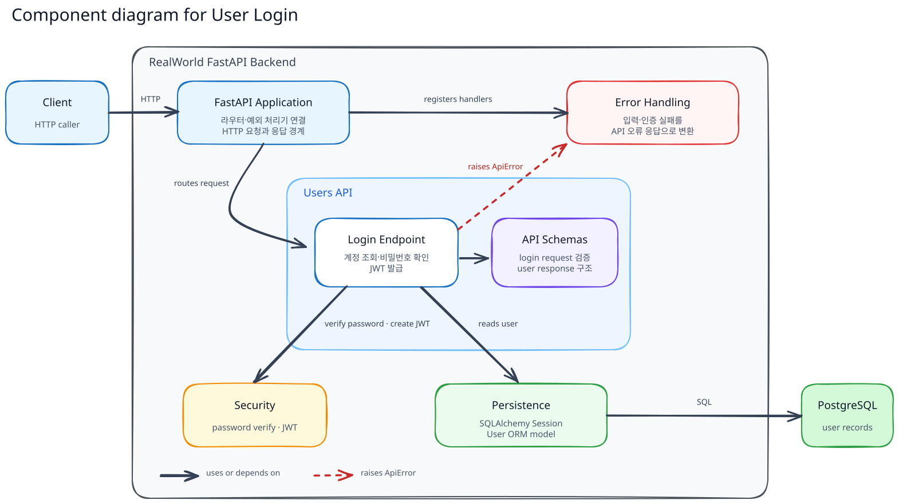
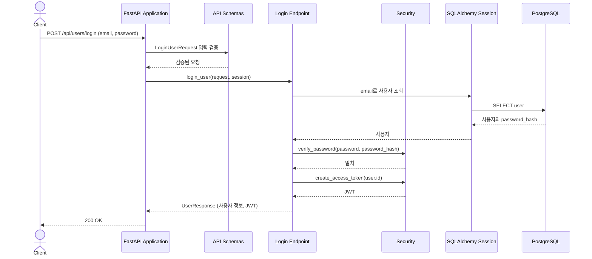
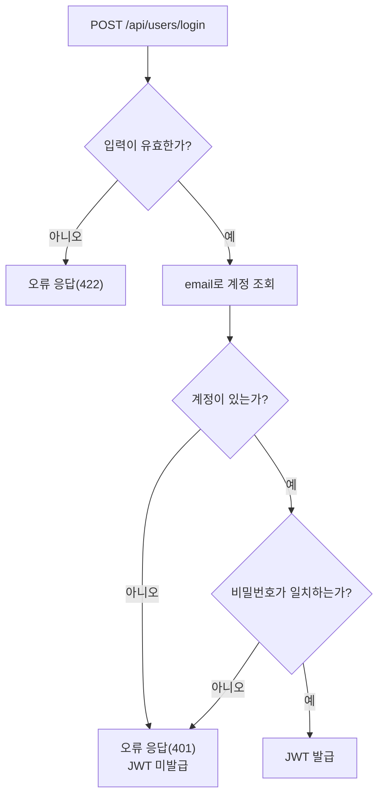

# User Login Flow

이 문서는 기존 사용자가 비밀번호로 로그인하고 JWT를 발급받는 흐름을 설명한다.

외부에 보장하는 요청·응답 형식은 [`docs/api/CONTRACT.md`](../../api/CONTRACT.md)를 기준으로 한다.

## Building Block View

FastAPI Application은 Login Endpoint와 Error Handling을 연결한다. Endpoint는 API Schemas, Security, Persistence를 사용하고, Persistence는 PostgreSQL에서 계정을 조회한다.

| 컴포넌트            | 책임                                                                             | 코드 위치                                                                                                                |
| ------------------- | -------------------------------------------------------------------------------- | ------------------------------------------------------------------------------------------------------------------------ |
| FastAPI Application | 로그인 라우터와 오류 처리기를 연결하고 HTTP 경계를 제공한다.                     | [`app/main.py::app`](../../../app/main.py)                                                                              |
| Login Endpoint      | `POST /api/users/login`에서 계정을 조회하고 비밀번호를 확인해 응답을 구성한다. | [`app/users/router.py::login_user()`](../../../app/users/router.py)                                                     |
| API Schemas         | 로그인 입력을 검증하고 사용자 응답 구조를 정의한다.                              | [`app/users/schemas.py::LoginUserRequest, UserResponse`](../../../app/users/schemas.py)                                 |
| Security            | 저장된 해시와 비밀번호를 대조하고 사용자 ID로 JWT를 발급한다.                    | [`app/security.py::verify_password(), create_access_token()`](../../../app/security.py)                                 |
| Persistence         | 요청 범위 Session으로 email에 해당하는 사용자와 비밀번호 해시를 조회한다.        | [`app/database.py::SessionDep`](../../../app/database.py), [`app/users/models.py::User`](../../../app/users/models.py) |
| Error Handling      | 입력 검증 실패와 잘못된 로그인 정보를 API 오류 응답으로 변환한다.                | [`app/errors.py::validation_error_handler(), api_error_handler()`](../../../app/errors.py)                              |

## Runtime View

### 시나리오: Login

### 실패 흐름: 로그인이 거부되는 지점

| 실패 조건                                                        | 응답    | 계정 정보 |
| ---------------------------------------------------------------- | ------- | --------- |
| 요청 구조가 잘못되었거나 email 또는 password가 누락·공백인 경우 | `422` | 변경 없음 |
| email에 해당하는 계정이 없거나 비밀번호가 일치하지 않는 경우     | `401` | 변경 없음 |

## 데이터와 보안 경계

- 평문 비밀번호는 저장된 해시와 대조하는 데만 사용한다. DB에는 해시가 저장되고 응답이나 JWT에는 비밀번호가 포함되지 않는다.
- 발급 JWT에는 사용자 ID인 `sub`, 발급 시각인 `iat`, 만료 시각인 `exp`가 들어간다. 발급 후 1시간의 만료 시간은 공식 API 계약의 고정값이 아닌 프로젝트 정책이다.
- 회원가입과 비밀번호 변경에 적용되는 최소 길이 제약은 로그인에 적용하지 않는다. 저장된 해시와 일치하는 기존의 짧은 비밀번호로도 로그인할 수 있다.
