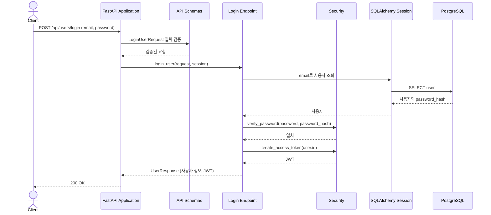

# User Login Flow

이 문서는 기존 사용자가 비밀번호로 로그인하고 JWT를 발급받는 흐름을 설명한다.

## Component Responsibilities

| 컴포넌트            | 책임                                                                             | 코드 위치                                                                                                                |
| ------------------- | -------------------------------------------------------------------------------- | ------------------------------------------------------------------------------------------------------------------------ |
| FastAPI Application | 로그인 라우터와 오류 처리기를 연결하고 HTTP 경계를 제공한다.                     | [`app/main.py::app`](../../../app/main.py)                                                                              |
| Login Endpoint      | `POST /api/users/login`에서 계정을 조회하고 비밀번호를 확인해 응답을 구성한다. | [`app/users/router.py::login_user()`](../../../app/users/router.py)                                                     |
| API Schemas         | 로그인 입력을 검증하고 사용자 응답 구조를 정의한다.                              | [`app/users/schemas.py::LoginUserRequest, UserResponse`](../../../app/users/schemas.py)                                 |
| Security            | 저장된 해시와 비밀번호를 대조하고 사용자 ID로 JWT를 발급한다.                    | [`app/security.py::verify_password(), create_access_token()`](../../../app/security.py)                                 |
| Persistence         | 요청 범위 Session으로 email에 해당하는 사용자와 비밀번호 해시를 조회한다.        | [`app/database.py::SessionDep`](../../../app/database.py), [`app/users/models.py::User`](../../../app/users/models.py) |
| Error Handling      | 입력 검증 실패와 잘못된 로그인 정보를 API 오류 응답으로 변환한다.                | [`app/errors.py::validation_error_handler(), api_error_handler()`](../../../app/errors.py)                              |

## Runtime View

### 시나리오: Login

