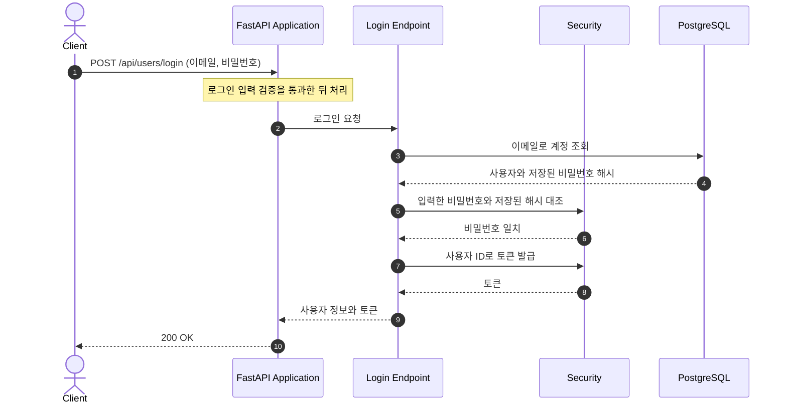

# User Login Flow

이 문서는 기존 사용자가 비밀번호로 로그인하고 JWT를 발급받는 흐름을 설명한다.

## 컴포넌트와 책임

| 컴포넌트 | 책임 | 코드 위치 |
| --- | --- | --- |
| FastAPI Application | 로그인 라우터와 오류 처리기를 연결하고 HTTP 경계를 제공한다. | [`app`](../../../app/main.py) |
| Login Endpoint | `POST /api/users/login`에서 계정을 조회하고 비밀번호를 확인해 응답을 구성한다. | [`login_user()`](../../../app/users/router.py) |
| API Schemas | 로그인 입력을 검증하고 사용자 응답 구조를 정의한다. | [`LoginUserRequest, UserResponse`](../../../app/users/schemas.py) |
| Security | 저장된 해시와 비밀번호를 대조하고 사용자 ID로 JWT를 발급한다. | [`verify_password(), create_access_token()`](../../../app/security.py) |
| Persistence | 요청 범위 Session으로 email에 해당하는 사용자와 비밀번호 해시를 조회한다. | [`SessionDep`](../../../app/database.py), [`User`](../../../app/users/models.py) |
| Error Handling | 입력 검증 실패와 잘못된 로그인 정보를 API 오류 응답으로 변환한다. | [`validation_error_handler(), api_error_handler()`](../../../app/errors.py) |

## 실행 흐름

다이어그램은 정상 처리의 주요 단계를 보여준다.

### 시나리오: 로그인

```mermaid
sequenceDiagram
    autonumber
    actor Client
    participant App as FastAPI Application
    participant Endpoint as Login Endpoint
    participant Security
    participant DB as PostgreSQL

    Client->>App: POST /api/users/login (이메일, 비밀번호)
    Note over App: 로그인 입력 검증을 통과한 뒤 처리
    App->>Endpoint: 로그인 요청
    Endpoint->>DB: 이메일로 계정 조회
    DB-->>Endpoint: 사용자와 저장된 비밀번호 해시
    Endpoint->>Security: 입력한 비밀번호와 저장된 해시 대조
    Security-->>Endpoint: 비밀번호 일치
    Endpoint->>Security: 사용자 ID로 토큰 발급
    Security-->>Endpoint: 토큰
    Endpoint-->>App: 사용자 정보와 토큰
    App-->>Client: 200 OK
```
