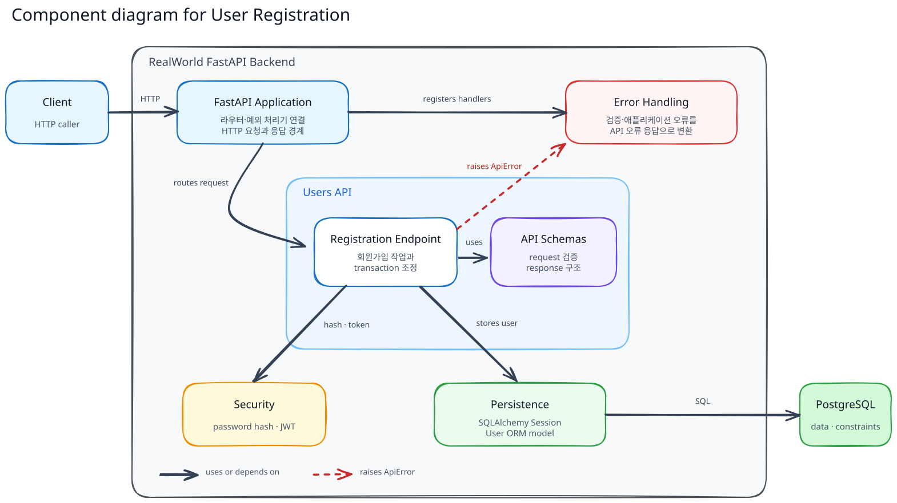
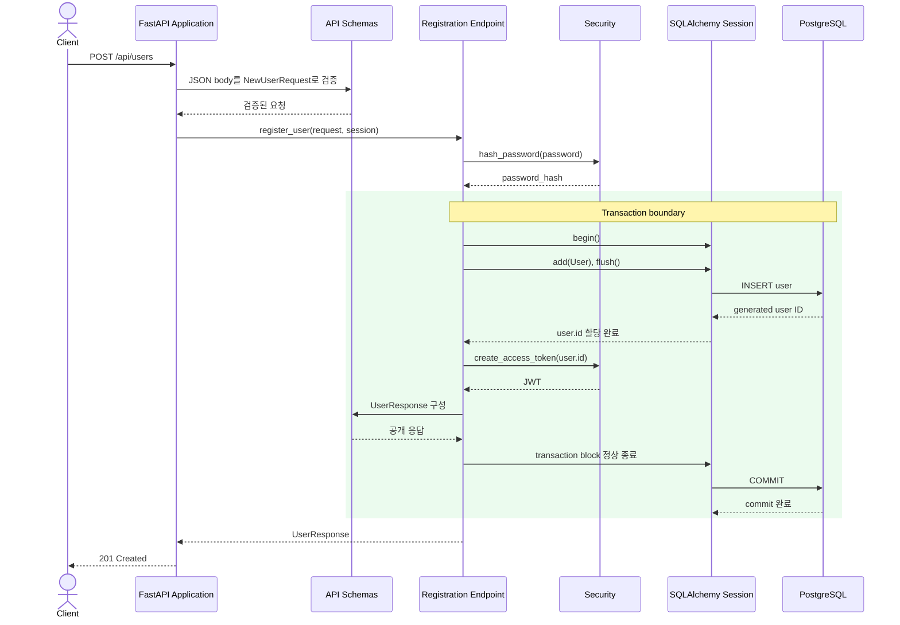

# User Registration Flow

이 문서는 회원가입 요청이 애플리케이션과 PostgreSQL을 거쳐 응답으로 반환되는 전체 흐름을 설명한다.

## Building Block View

회원가입 기능은 FastAPI Application의 Users API와 이를 지원하는 Security, Persistence, Error Handling으로 구성된다. 사용자 데이터는 Persistence를 통해 PostgreSQL에 저장된다.

### Component Responsibilities

| 컴포넌트              | 책임                                                                              | 코드 위치                                                                                                                               |
| --------------------- | --------------------------------------------------------------------------------- | --------------------------------------------------------------------------------------------------------------------------------------- |
| FastAPI Application   | 라우터와 예외 처리기를 연결하고 HTTP 요청과 응답의 경계를 제공한다.               | [`app/main.py::app`](../../../app/main.py)                                                                                             |
| Registration Endpoint | `POST /api/users` 경로를 제공하고 회원가입에 필요한 작업과 트랜잭션을 조정한다. | [`app/users/router.py::router, register_user()`](../../../app/users/router.py)                                                         |
| API Schemas           | 회원가입 요청을 검증하고 외부에 공개할 응답 구조를 정의한다.                      | [`app/users/schemas.py::NewUserRequest, NewUser, UserResponse`](../../../app/users/schemas.py)                                         |
| Security              | 비밀번호 해시와 사용자 ID를 식별하는 JWT를 생성한다.                              | [`app/security.py::hash_password(), create_access_token()`](../../../app/security.py)                                                  |
| Persistence           | 요청 범위 Session을 제공하고 사용자 데이터를 ORM 객체로 PostgreSQL에 저장한다.    | [`app/database.py::SessionDep, get_session()`](../../../app/database.py), [`app/users/models.py::User`](../../../app/users/models.py) |
| Error Handling        | 입력 검증 오류와 애플리케이션 오류를 API 오류 응답으로 변환한다.                  | [`app/errors.py::validation_error_handler(), api_error_handler()`](../../../app/errors.py)                                             |
| PostgreSQL            | 사용자 데이터를 영속화하고 필수값과 고유성 등의 제약 조건을 최종적으로 보장한다.  | [`0001_create_users_table.py`](../../../migrations/versions/0001_create_users_table.py)                                                |

PostgreSQL building block은 최신 Alembic migration이 적용되어 사용자 테이블과 제약 조건이 준비되어 있음을 전제로 한다.

## Runtime View

### 시나리오: User Registration

- 비밀번호는 트랜잭션을 시작하기 전에 해싱하며, `flush()`로 할당된 사용자 ID를 JWT에 사용한다.
- 응답을 구성하는 동안 오류가 발생해도 저장이 확정되지 않도록 `UserResponse`를 트랜잭션 안에서 만들고, commit이 완료된 뒤 반환한다.

## 실패 조건

| 조건                                                | 처리 결과                                                   |
| --------------------------------------------------- | ----------------------------------------------------------- |
| 요청 구조, 필수값, email 또는 공백 문자열 검증 실패 | Endpoint를 실행하지 않고`422` 오류를 반환한다.            |
| PostgreSQL의 username 또는 email 고유성 제약 위반   | 트랜잭션을 rollback하고 해당 필드의`409` 오류로 변환한다. |
| 그 밖의 데이터베이스 쓰기 실패                      | 트랜잭션을 rollback하고 오류를 전파하여`500`을 반환한다.  |

입력 검증은 클라이언트에 빠르고 구체적인 피드백을 제공한다. PostgreSQL 제약 조건은 애플리케이션 검증을 우회하거나 동시에 요청이 들어오는 경우에도 최종 데이터 무결성을 보장한다. 트랜잭션은 작업 전체가 성공했을 때만 변경 사항을 확정한다.

## 데이터와 보안 경계

- 평문 비밀번호는 해싱에만 사용하고, 데이터베이스에는 비밀번호 해시만 저장하며 응답에는 둘 다 포함하지 않는다.
- JWT의 `sub` claim은 PostgreSQL에 저장된 사용자의 ID를 문자열로 식별한다.
