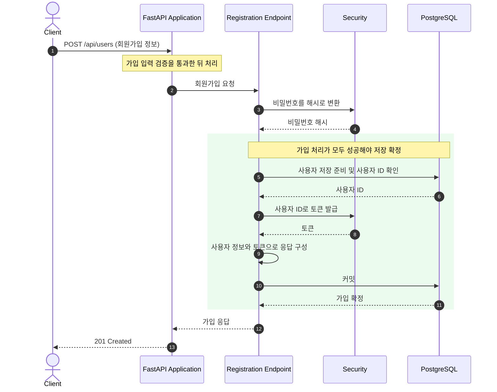

# User Registration Flow

이 문서는 회원가입 요청이 애플리케이션과 PostgreSQL을 거쳐 응답으로 반환되는 전체 흐름을 설명한다.

## 컴포넌트와 책임

| 컴포넌트 | 책임 | 코드 위치 |
| --- | --- | --- |
| FastAPI Application | 라우터와 예외 처리기를 연결하고 HTTP 요청과 응답의 경계를 제공한다. | [`app`](../../../app/main.py) |
| Registration Endpoint | `POST /api/users` 경로를 제공하고 회원가입에 필요한 작업과 트랜잭션을 조정한다. | [`router, register_user()`](../../../app/users/router.py) |
| API Schemas | 회원가입 요청을 검증하고 외부에 공개할 응답 구조를 정의한다. | [`NewUserRequest, NewUser, UserResponse`](../../../app/users/schemas.py) |
| Security | 비밀번호 해시와 사용자 ID를 식별하는 JWT를 생성한다. | [`hash_password(), create_access_token()`](../../../app/security.py) |
| Persistence | 요청 범위 Session을 제공하고 사용자 데이터를 ORM 객체로 PostgreSQL에 저장한다. | [`SessionDep, get_session()`](../../../app/database.py), [`User`](../../../app/users/models.py) |
| Error Handling | 입력 검증 오류와 애플리케이션 오류를 API 오류 응답으로 변환한다. | [`validation_error_handler(), api_error_handler()`](../../../app/errors.py) |
| PostgreSQL | 사용자 데이터를 영속화하고 필수값과 고유성 등의 제약 조건을 최종적으로 보장한다. | [`0001_create_users_table.py`](../../../migrations/versions/0001_create_users_table.py) |

## 실행 흐름

다이어그램은 정상 처리의 주요 단계를 보여준다.

### 시나리오: 회원가입

```mermaid
sequenceDiagram
    autonumber
    actor Client
    participant App as FastAPI Application
    participant Endpoint as Registration Endpoint
    participant Security
    participant DB as PostgreSQL

    Client->>App: POST /api/users (회원가입 정보)
    Note over App: 가입 입력 검증을 통과한 뒤 처리
    App->>Endpoint: 회원가입 요청
    Endpoint->>Security: 비밀번호를 해시로 변환
    Security-->>Endpoint: 비밀번호 해시
    rect rgb(235, 251, 238)
        Note over Endpoint,DB: 가입 처리가 모두 성공해야 저장 확정
        Endpoint->>DB: 사용자 저장 준비 및 사용자 ID 확인
        DB-->>Endpoint: 사용자 ID
        Endpoint->>Security: 사용자 ID로 토큰 발급
        Security-->>Endpoint: 토큰
        Endpoint->>Endpoint: 사용자 정보와 토큰으로 응답 구성
        Endpoint->>DB: 커밋
        DB-->>Endpoint: 가입 확정
    end
    Endpoint-->>App: 가입 응답
    App-->>Client: 201 Created
```

응답을 구성하는 동안 오류가 발생했는데 가입만 저장되는 상황을 막기 위해, 응답 구성까지 성공한 경우에만 사용자 저장을 확정한다.
