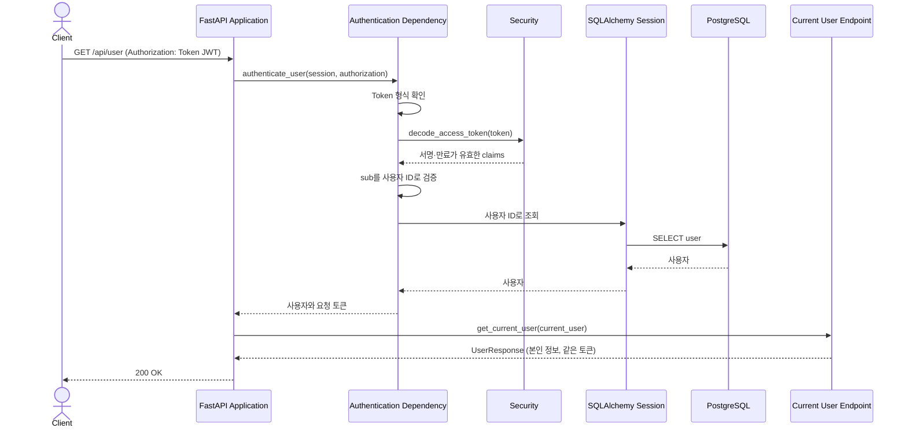

# Current User Retrieval Flow

이 문서는 `GET /api/user`로 본인 정보를 조회하는 흐름을 설명한다.

## Component Responsibilities

| 컴포넌트                  | 책임                                                             | 코드 위치                                                                                                                |
| ------------------------- | ---------------------------------------------------------------- | ------------------------------------------------------------------------------------------------------------------------ |
| FastAPI Application       | 보호된 엔드포인트와 인증 의존성을 연결하고 HTTP 경계를 제공한다. | [`app/main.py::app`](../../../app/main.py)                                                                              |
| Authentication Dependency | 헤더 형식과 JWT의 사용자 ID를 검사하고 DB에서 사용자를 찾는다.   | [`app/users/auth.py::authenticate_user(), CurrentUserDep`](../../../app/users/auth.py)                                  |
| Security                  | JWT의 서명과 만료를 검증한다.                                    | [`app/security.py::decode_access_token()`](../../../app/security.py)                                                    |
| Persistence               | 토큰의`sub`가 가리키는 사용자 계정을 조회한다.                 | [`app/database.py::SessionDep`](../../../app/database.py), [`app/users/models.py::User`](../../../app/users/models.py) |
| Current User Endpoint     | 인증된 사용자 정보와 요청에 사용한 토큰을 반환한다.              | [`app/users/router.py::get_current_user()`](../../../app/users/router.py)                                               |
| Error Handling            | 인증 실패를 API 오류 응답으로 변환한다.                          | [`app/errors.py::api_error_handler()`](../../../app/errors.py)                                                          |

## Runtime View

### 시나리오: 본인 정보 조회

인증은 토큰을 발급한 요청이 회원가입인지 로그인인지 구분하지 않는다. 토큰만으로 계정의 현재 존재를 보장할 수 없으므로 DB에서 사용자를 다시 찾는다. `GET /api/user`는 요청 토큰을 그대로 반환하고 새 토큰을 발급하지 않는다.
