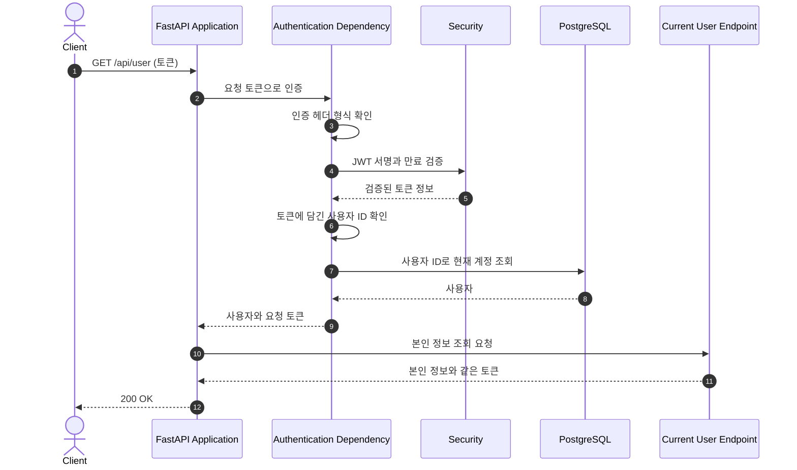

# Current User Retrieval Flow

이 문서는 `GET /api/user`로 본인 정보를 조회하는 흐름을 설명한다.

## 컴포넌트와 책임

| 컴포넌트 | 책임 | 코드 위치 |
| --- | --- | --- |
| FastAPI Application | 보호된 엔드포인트와 인증 의존성을 연결하고 HTTP 경계를 제공한다. | [`app`](../../../app/main.py) |
| Authentication Dependency | 헤더 형식과 JWT의 사용자 ID를 검사하고 DB에서 사용자를 찾는다. | [`authenticate_user(), CurrentUserDep`](../../../app/users/auth.py) |
| Security | JWT의 서명과 만료를 검증한다. | [`decode_access_token()`](../../../app/security.py) |
| Persistence | 토큰의 `sub`가 가리키는 사용자 계정을 조회한다. | [`SessionDep`](../../../app/database.py), [`User`](../../../app/users/models.py) |
| Current User Endpoint | 인증된 사용자 정보와 요청에 사용한 토큰을 반환한다. | [`get_current_user()`](../../../app/users/router.py) |
| Error Handling | 인증 실패를 API 오류 응답으로 변환한다. | [`api_error_handler()`](../../../app/errors.py) |

## 실행 흐름

다이어그램은 정상 처리의 주요 단계를 보여준다.

### 시나리오: 본인 정보 조회

```mermaid
sequenceDiagram
    autonumber
    actor Client
    participant App as FastAPI Application
    participant Auth as Authentication Dependency
    participant Security
    participant DB as PostgreSQL
    participant Endpoint as Current User Endpoint

    Client->>App: GET /api/user (토큰)
    App->>Auth: 요청 토큰으로 인증
    Auth->>Auth: 인증 헤더 형식 확인
    Auth->>Security: JWT 서명과 만료 검증
    Security-->>Auth: 검증된 토큰 정보
    Auth->>Auth: 토큰에 담긴 사용자 ID 확인
    Auth->>DB: 사용자 ID로 현재 계정 조회
    DB-->>Auth: 사용자
    Auth-->>App: 사용자와 요청 토큰
    App->>Endpoint: 본인 정보 조회 요청
    Endpoint-->>App: 본인 정보와 같은 토큰
    App-->>Client: 200 OK
```

인증은 토큰을 발급한 요청이 회원가입인지 로그인인지 구분하지 않는다. 토큰만으로 계정의 현재 존재를 보장할 수 없으므로 DB에서 사용자를 다시 찾는다. `GET /api/user`는 요청 토큰을 그대로 반환하고 새 토큰을 발급하지 않는다.
