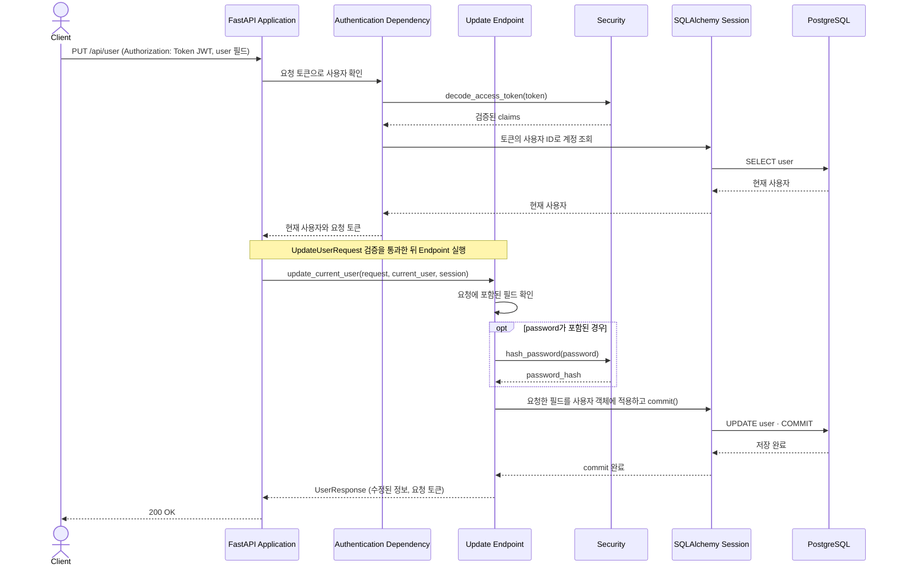

# Current User Update Flow

이 문서는 인증된 사용자가 `PUT /api/user`로 자신의 계정 정보를 수정하는 흐름을 설명한다.

## Component Responsibilities

| 컴포넌트                  | 책임                                                                  | 코드 위치                                                                                                                |
| ------------------------- | --------------------------------------------------------------------- | ------------------------------------------------------------------------------------------------------------------------ |
| FastAPI Application       | 라우터와 오류 처리기를 연결하고 HTTP 경계를 제공한다.                 | [`app/main.py::app`](../../../app/main.py)                                                                              |
| Update Endpoint           | 인증된 사용자에게 요청한 필드만 적용하고 저장·응답을 조정한다.       | [`app/users/router.py::update_current_user()`](../../../app/users/router.py)                                            |
| Authentication Dependency | 요청 토큰으로 실제 사용자를 식별한다.                                 | [`app/users/auth.py::authenticate_user(), CurrentUserDep`](../../../app/users/auth.py)                                  |
| API Schemas               | 수정 요청을 검증하고 반환할 사용자 정보의 구조를 정의한다.            | [`app/users/schemas.py::UpdateUserRequest, UserResponse`](../../../app/users/schemas.py)                                |
| Security                  | 새 비밀번호가 제공된 경우 해시로 변환한다. 토큰 검증의 책임도 맡는다. | [`app/security.py::hash_password(), decode_access_token()`](../../../app/security.py)                                   |
| Persistence               | 사용자 객체의 변경을 DB에 커밋하거나 실패 시 rollback한다.            | [`app/database.py::SessionDep`](../../../app/database.py), [`app/users/models.py::User`](../../../app/users/models.py) |
| Error Handling            | 입력·인증·중복 오류를 API 오류 응답으로 변환한다.                   | [`app/errors.py::validation_error_handler(), api_error_handler()`](../../../app/errors.py)                              |

## Runtime View

### 시나리오: 본인 정보 수정

토큰 형식·서명·만료 시각과 사용자 ID를 확인하는 과정은 [본인 정보 조회](user-retrieval.md)에 자세히 정리되어 있다. 생략한 필드는 변경하지 않는다. 성공 응답은 새 JWT를 발급하지 않고 요청에 사용한 토큰을 그대로 담는다.
