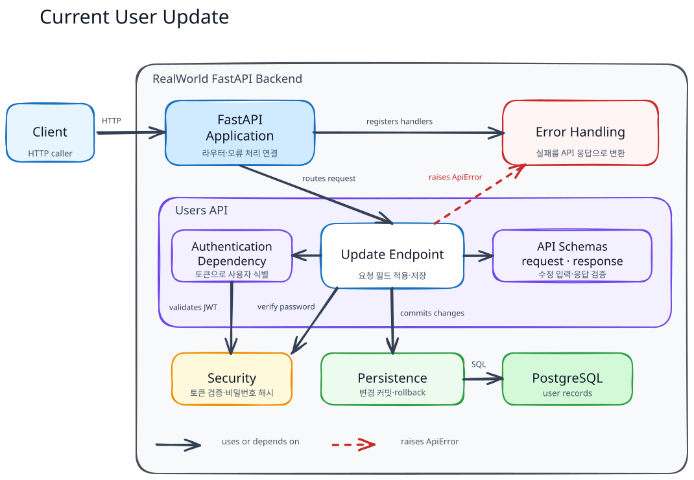
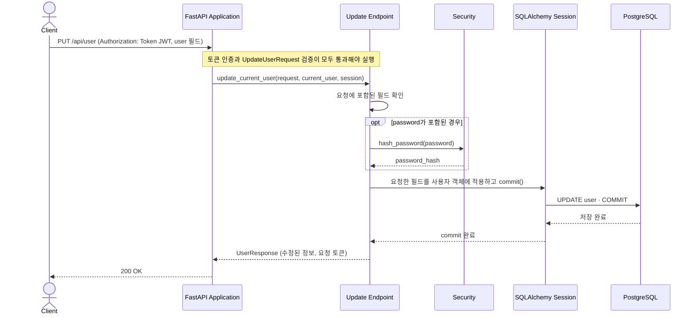
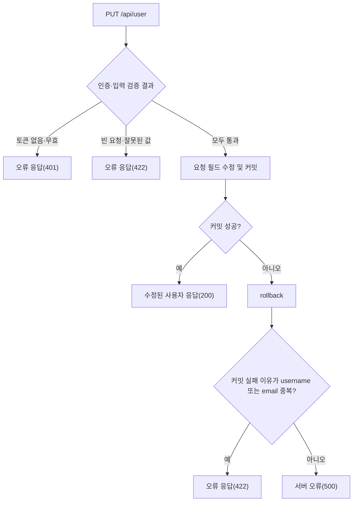

# Current User Update Flow

이 문서는 인증된 사용자가 `PUT /api/user`로 자신의 계정 정보를 수정하는 흐름을 설명한다.

## Building Block View

FastAPI Application은 수정 엔드포인트에 인증 의존성과 요청 스키마를 연결한다. 엔드포인트는 요청한 필드만 적용하며, 비밀번호 해시와 DB 저장을 조정한다.

### Component Responsibilities

| 컴포넌트                  | 책임                                                                  | 코드 위치                                                                                                                |
| ------------------------- | --------------------------------------------------------------------- | ------------------------------------------------------------------------------------------------------------------------ |
| FastAPI Application       | 라우터와 오류 처리기를 연결하고 HTTP 경계를 제공한다.                 | [`app/main.py::app`](../../../app/main.py)                                                                              |
| Update Endpoint           | 인증된 사용자에게 요청한 필드만 적용하고 저장·응답을 조정한다.       | [`app/users/router.py::update_current_user()`](../../../app/users/router.py)                                            |
| Authentication Dependency | 요청 토큰으로 실제 사용자를 식별한다.                                 | [`app/users/auth.py::authenticate_user(), CurrentUserDep`](../../../app/users/auth.py)                                  |
| API Schemas               | 수정 요청을 검증하고 반환할 사용자 정보의 구조를 정의한다.            | [`app/users/schemas.py::UpdateUserRequest, UserResponse`](../../../app/users/schemas.py)                                |
| Security                  | 새 비밀번호가 제공된 경우 해시로 변환한다. 토큰 검증의 책임도 맡는다. | [`app/security.py::hash_password(), decode_access_token()`](../../../app/security.py)                                   |
| Persistence               | 사용자 객체의 변경을 DB에 커밋하거나 실패 시 rollback한다.            | [`app/database.py::SessionDep`](../../../app/database.py), [`app/users/models.py::User`](../../../app/users/models.py) |
| Error Handling            | 입력·인증·중복 오류를 API 오류 응답으로 변환한다.                   | [`app/errors.py::validation_error_handler(), api_error_handler()`](../../../app/errors.py)                              |

## Runtime View

### 시나리오: 본인 정보 수정

생략한 필드는 변경하지 않는다. 성공 응답은 새 JWT를 발급하지 않고 요청에 사용한 토큰을 그대로 담는다.

### 실패 흐름

| 실패 조건                                                                           | 결과                                            |
| ----------------------------------------------------------------------------------- | ----------------------------------------------- |
| 토큰이 없거나 유효하지 않은 경우                                                    | `401` 응답                                    |
| 빈 수정 요청, 잘못된 email, 허용되지 않는`null`·공백, 짧은 비밀번호 등 입력 오류 | `422` 응답                                    |
| 이미 사용 중인 username 또는 email로 변경 요청                                      | rollback 후 해당 필드의`422` 오류를 반환한다. |
| 그 밖의 저장 실패                                                                   | rollback 후 오류가 전파되어`500`을 반환한다.  |

## 필드와 보안 경계

- `username`, `email`, `password`, `bio`, `image` 중 요청에 포함된 필드만 변경한다. `bio`와 `image`는 `null`을 허용하고 빈 문자열은 `null`로 정규화한다.
- `username`, `email`, `password`에 명시적인 `null` 또는 공백 문자열을 전달하면 거부된다. 비밀번호 수정의 최소 길이 8자는 공식 Hurl의 `PUT /user` 사례에도 명시되어 있다.
- 비밀번호 변경 시 평문 대신 새 해시를 저장한다. 비밀번호와 해시는 응답에 포함하지 않는다. 이후 로그인은 새 비밀번호로 성공하고 이전 비밀번호로는 실패한다.
- email 변경 후에는 새 email로 로그인할 수 있고 이전 email로는 로그인할 수 없다. 계정의 사용자 ID는 유지된다.
- email이나 비밀번호를 변경해도 기존 유효 토큰을 회수하거나 갱신하지 않는다. 수정 응답에도 요청 토큰을 그대로 반환한다.
