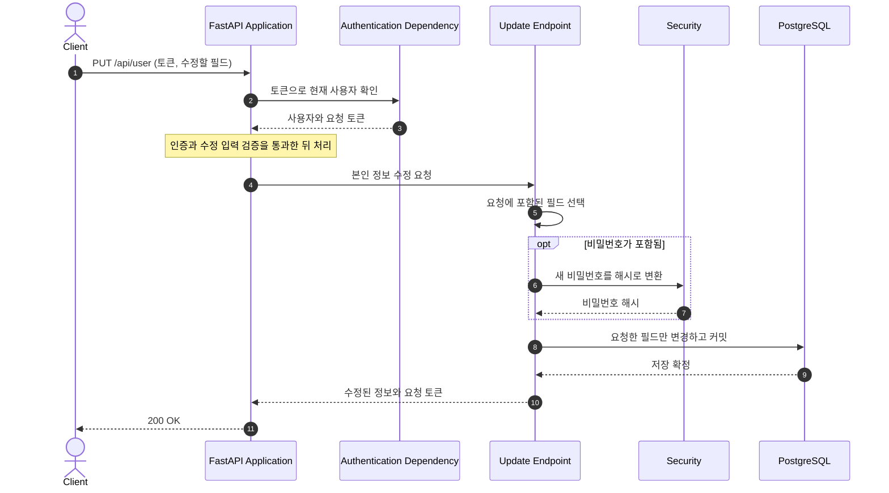

# Current User Update Flow

이 문서는 인증된 사용자가 `PUT /api/user`로 자신의 계정 정보를 수정하는 흐름을 설명한다.

## 컴포넌트와 책임

| 컴포넌트 | 책임 | 코드 위치 |
| --- | --- | --- |
| FastAPI Application | 라우터와 오류 처리기를 연결하고 HTTP 경계를 제공한다. | [`app`](../../../app/main.py) |
| Update Endpoint | 인증된 사용자에게 요청한 필드만 적용하고 저장·응답을 조정한다. | [`update_current_user()`](../../../app/users/router.py) |
| Authentication Dependency | 요청 토큰으로 실제 사용자를 식별한다. | [`authenticate_user(), CurrentUserDep`](../../../app/users/auth.py) |
| API Schemas | 수정 요청을 검증하고 반환할 사용자 정보의 구조를 정의한다. | [`UpdateUserRequest, UserResponse`](../../../app/users/schemas.py) |
| Security | 새 비밀번호가 제공된 경우 해시로 변환한다. | [`hash_password()`](../../../app/security.py) |
| Persistence | 사용자 객체의 변경을 DB에 커밋하거나 실패 시 rollback한다. | [`SessionDep`](../../../app/database.py), [`User`](../../../app/users/models.py) |
| Error Handling | 입력·인증·중복 오류를 API 오류 응답으로 변환한다. | [`validation_error_handler(), api_error_handler()`](../../../app/errors.py) |

## 실행 흐름

다이어그램은 정상 처리의 주요 단계를 보여준다.

### 시나리오: 본인 정보 수정

```mermaid
sequenceDiagram
    autonumber
    actor Client
    participant App as FastAPI Application
    participant Auth as Authentication Dependency
    participant Endpoint as Update Endpoint
    participant Security
    participant DB as PostgreSQL

    Client->>App: PUT /api/user (토큰, 수정할 필드)
    App->>Auth: 토큰으로 현재 사용자 확인
    Auth-->>App: 사용자와 요청 토큰
    Note over App: 인증과 수정 입력 검증을 통과한 뒤 처리
    App->>Endpoint: 본인 정보 수정 요청
    Endpoint->>Endpoint: 요청에 포함된 필드 선택
    opt 비밀번호가 포함됨
        Endpoint->>Security: 새 비밀번호를 해시로 변환
        Security-->>Endpoint: 비밀번호 해시
    end
    Endpoint->>DB: 요청한 필드만 변경하고 커밋
    DB-->>Endpoint: 저장 확정
    Endpoint-->>App: 수정된 정보와 요청 토큰
    App-->>Client: 200 OK
```

인증의 상세 흐름은 [본인 정보 조회 흐름](user-retrieval.md)을 참고한다.

생략한 필드는 변경하지 않는다. 성공 응답은 새 토큰을 발급하지 않고 요청에 사용한 토큰을 그대로 담는다.
