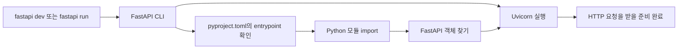

# Python 애플리케이션 구조와 실행 진입점

이 노트는 Python 웹 애플리케이션의 코드가 어떻게 패키지로 구성되고, 웹 서버가 실행할 객체를 어떻게 찾는지 설명한다. 특정 시점의 프로젝트 파일 구성보다 계속 적용되는 개념에 집중한다.

## 한눈에 보는 실행 과정



`FastAPI()`로 만든 객체가 Uvicorn을 직접 실행하는 것은 아니다. `fastapi dev` 또는 `fastapi run` 명령에서는 **FastAPI CLI가 Uvicorn을 구동**하고, Uvicorn에 실행할 FastAPI 객체를 전달한다.

Uvicorn을 직접 실행할 수도 있다.

```shell
uvicorn my_app.main:app --reload
```

## `pyproject.toml`의 역할

`pyproject.toml`은 Python 프로젝트 정보와 여러 개발 도구의 설정을 한곳에 기록하는 표준 파일이다. Python 코드가 아니라 패키지 관리 도구, FastAPI CLI, pytest 같은 도구가 읽는다.

일반적으로 다음과 같은 정보를 담는다.

- 프로젝트 이름과 지원 Python 버전
- 실행 및 개발 의존성
- 빌드 방법
- 도구별 설정

FastAPI 실행 진입점은 다음처럼 지정할 수 있다.

```toml
[tool.fastapi]
entrypoint = "my_app.main:app"
```

이 설정은 FastAPI 객체를 만들거나 일반 객체를 ASGI 애플리케이션으로 변환하지 않는다. 이미 만들어진 객체의 위치를 FastAPI CLI에 알려준다.

## 모듈, import 패키지, 배포 패키지

```text
my_app/
├── __init__.py
└── main.py
```

| 용어          | 예                   | 의미                                                          |
| ------------- | -------------------- | ------------------------------------------------------------- |
| 모듈          | `main.py`          | Python 파일 하나                                              |
| import 패키지 | `my_app/`          | 여러 모듈을 묶고`import my_app`으로 가져올 수 있는 디렉터리 |
| 배포 패키지   | 설치 가능한 프로젝트 | `uv add`나 `pip install`로 환경에 설치하는 배포 단위      |

Import 패키지와 배포 패키지는 같은 뜻이 아니다. 애플리케이션 내부에 import 패키지를 사용하더라도 프로젝트 자체를 별도의 배포 패키지로 만들지 않을 수 있다.

## `__init__.py`를 두는 이유

Python 3.3 이후에는 `__init__.py`가 없는 디렉터리도 특정 조건에서 namespace package로 인식될 수 있다. 그래도 일반적인 애플리케이션 패키지에는 `__init__.py`를 두는 편이 명확하다.

- 해당 디렉터리가 Python 패키지라는 의도를 표시한다.
- 여러 import 경로에 있는 같은 이름의 디렉터리가 의도치 않게 합쳐지는 것을 피한다.
- 개발 도구와 사람이 패키지 경계를 예측하기 쉬워진다.

Python은 패키지를 처음 import할 때 `__init__.py`를 실행한다. 따라서 DB 연결이나 데이터 변경처럼 import만으로 부작용을 일으키는 작업은 이 파일에 넣지 않는다.

## `my_app.main:app`을 읽는 방법

```text
my_app.main : app
───────────   ───
모듈 경로      모듈 안의 객체 이름
```

실질적으로 다음과 같은 import를 뜻한다.

```python
from my_app.main import app
```

모듈 안에는 실행할 FastAPI 객체가 있어야 한다.

```python
from fastapi import FastAPI

app = FastAPI()
```

`entrypoint`는 이 객체의 위치만 알려준다. 실제 객체가 FastAPI 또는 다른 ASGI 호환 객체가 아니면 ASGI 서버가 정상적으로 실행할 수 없다.

## ASGI란 무엇인가

ASGI는 **Asynchronous Server Gateway Interface**의 약자다. Python 웹 서버와 Python 웹 애플리케이션이 요청, 응답, 연결 이벤트를 주고받는 방법을 정의한 호출 규격이다.

ASGI는 HTTP처럼 네트워크를 통해 전달되는 프로토콜이 아니다. 일반적으로 HTTP 클라이언트와 Uvicorn 사이에서는 HTTP를 사용하고, Uvicorn과 FastAPI 객체 사이에서는 Python 호출 규격인 ASGI를 사용한다.


개념적으로 ASGI 애플리케이션은 서버가 다음 형태로 호출할 수 있는 객체다.

```python
await application(scope, receive, send)
```

- `scope`: 요청 방식, 경로, 헤더, 연결 종류 같은 정보
- `receive`: 요청 본문이나 연결 이벤트를 받는 함수
- `send`: 응답이나 연결 이벤트를 보내는 함수

FastAPI 객체가 이 규격을 구현하므로 Uvicorn이 직접 호출할 수 있다.

## 반드시 ASGI를 사용해야 하는가

웹 서버와 애플리케이션이 통신하는 방법은 ASGI만 있는 것이 아니다.

| 방식                             | 특징                                                                                |
| -------------------------------- | ----------------------------------------------------------------------------------- |
| WSGI                             | 동기식 HTTP 요청과 응답을 중심으로 하며 지금도 널리 사용하는 Python 표준 인터페이스 |
| ASGI                             | 비동기 처리와 HTTP 외의 장기 연결을 함께 지원하는 Python 표준 인터페이스            |
| 서버·프레임워크 전용 인터페이스 | 구현할 수 있지만 특정 서버와 프레임워크가 강하게 결합됨                             |
| 소켓 직접 처리                   | 가능하지만 HTTP 해석, 연결 관리와 오류 처리를 애플리케이션이 직접 담당해야 함       |

FastAPI는 ASGI 프레임워크이므로 FastAPI를 선택하면 ASGI 서버를 사용하는 것이 자연스럽다.

## ASGI를 사용하는 이유와 장점

### 서버와 애플리케이션을 분리한다

ASGI라는 공통 규격이 있으므로 웹 서버는 FastAPI의 내부 구현을 알 필요가 없고, FastAPI도 Uvicorn의 내부 구현을 알 필요가 없다. 같은 규격을 구현한 다른 ASGI 서버나 프레임워크로 교체할 수 있다.

### 비동기 I/O를 표현할 수 있다

DB나 외부 API 응답을 기다리는 동안 다른 연결을 처리하는 비동기 실행 모델을 지원한다. 많은 연결이 대기하는 I/O 중심 서비스에서 자원을 효율적으로 사용할 수 있다.

ASGI를 사용한다고 모든 코드가 자동으로 빨라지는 것은 아니다. 동기식 라이브러리를 비동기 함수 안에서 그대로 실행하면 이벤트 루프를 막을 수 있다. 비동기 처리의 이점은 호출하는 코드와 라이브러리도 그 방식에 맞을 때 얻는다.

ASGI를 사용한다고 모든 endpoint를 `async def`로 작성해야 하는 것도 아니다. FastAPI는 일반 `def` endpoint를 thread pool에서 실행해 동기식 코드도 ASGI 애플리케이션 안에서 사용할 수 있게 한다.

### 장기 연결과 실시간 통신을 지원한다

ASGI는 한 번의 요청과 응답으로 끝나지 않는 WebSocket, Server-Sent Events, streaming 같은 통신을 표현할 수 있다. 동기식 HTTP 요청·응답을 중심으로 설계된 WSGI보다 다룰 수 있는 연결 형태가 넓다.

### 공통 생태계를 사용할 수 있다

ASGI 규격을 중심으로 서버, 프레임워크, middleware와 테스트 도구가 같은 호출 경계를 공유한다. 테스트 클라이언트는 실제 네트워크 포트를 열지 않고도 ASGI 객체를 직접 호출할 수 있다.

## Uvicorn과 FastAPI의 관계

| 구성 요소    | 책임                                                                                 |
| ------------ | ------------------------------------------------------------------------------------ |
| Uvicorn      | 네트워크 포트를 열고 HTTP나 WebSocket 연결을 처리한 뒤 ASGI 애플리케이션을 호출한다. |
| ASGI         | Uvicorn과 FastAPI 객체가 통신하는 호출 규격이다.                                     |
| FastAPI 객체 | ASGI 호출을 받아 라우팅, 검증, endpoint 실행과 응답 생성을 담당한다.                 |

가장 정확한 표현은 다음과 같다.

> Uvicorn이 FastAPI 객체를 ASGI 규격에 따라 실행한다.

## 기억할 내용

- 모듈은 Python 파일 하나이고, import 패키지는 여러 모듈을 묶는 디렉터리다.
- `__init__.py`는 일반 패키지라는 의도를 명확히 하고 import 경계를 예측 가능하게 한다.
- `pyproject.toml`은 Python 코드가 아니라 프로젝트 도구들이 읽는 설정 파일이다.
- `my_app.main:app`은 `my_app/main.py` 안의 `app` 객체를 뜻한다.
- FastAPI 객체가 Uvicorn을 실행하는 것이 아니라 FastAPI CLI가 Uvicorn을 실행한다.
- 클라이언트와 Uvicorn은 HTTP나 WebSocket으로, Uvicorn과 FastAPI 객체는 ASGI로 통신한다.
- ASGI는 유일한 선택지는 아니지만 서버와 애플리케이션을 분리하고 비동기 I/O와 장기 연결을 표준 방식으로 지원한다.
