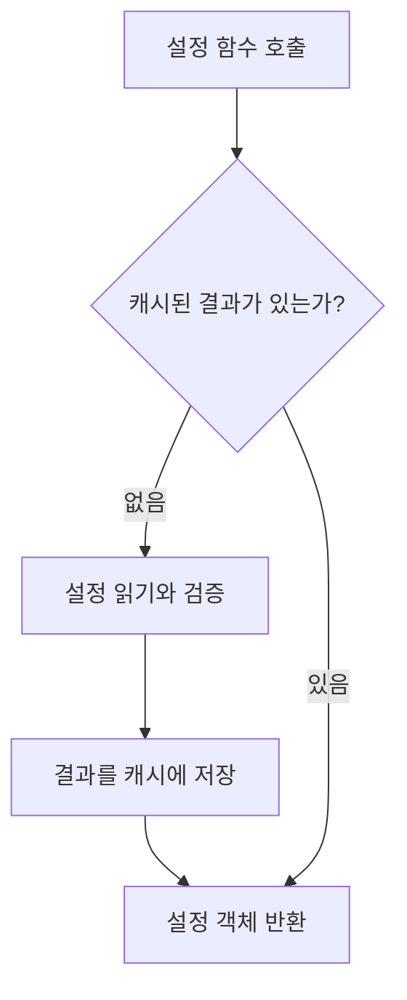

# 애플리케이션 설정과 환경 변수

이 노트는 실행 환경에 따라 달라지는 값을 코드와 분리하고, 애플리케이션이 이를 안전하게 사용하는 방법을 설명한다. 

## 한눈에 보는 설정 흐름


애플리케이션 코드는 환경 변수나 파일을 곳곳에서 직접 읽지 않는다. 설정 모델이 외부 값을 한 번 받아 검증하고, 나머지 코드는 검증된 설정 객체를 사용한다.

## 설정을 코드 밖에서 제공하는 이유

소스 코드는 같아도 개발, 테스트, 운영 환경에서 사용하는 값은 다를 수 있다.

- 데이터베이스 접속 주소
- 외부 서비스 주소
- 인증에 사용하는 비밀값
- 실행 환경별 동작 옵션

이러한 값을 코드에 직접 작성하면 환경이 바뀔 때 코드를 수정해야 하며, 비밀번호 같은 값이 저장소에 포함될 위험도 생긴다. 따라서 코드는 **필요한 설정의 이름과 타입**을 정의하고, 실제 값은 실행 환경에서 제공한다.

## 환경 변수, `.env`, `.env.example`

세 가지는 역할이 다르다.

| 구분               | 역할                                                                                                   |
| ------------------ | ------------------------------------------------------------------------------------------------------ |
| 운영체제 환경 변수 | 실행 환경이 애플리케이션에 실제 값을 전달한다. 컨테이너, CI와 운영 환경에서 주로 사용한다.             |
| `.env`           | 로컬 개발 중 환경 변수를 편리하게 제공한다. 실제 비밀값이 들어갈 수 있으므로 저장소에 커밋하지 않는다. |
| `.env.example`   | 필요한 변수의 이름과 예시를 사람에게 알려준다. 실제 비밀값은 넣지 않는다.                              |

환경 변수와 `.env`에 같은 설정이 있으면 일반적으로 운영체제 환경 변수가 우선한다. 따라서 로컬 기본값은 `.env`에 두면서도 실행 환경에서 값을 덮어쓸 수 있다.

Python이 `.env`를 자동으로 읽는 것은 아니다. 애플리케이션이나 설정 라이브러리가 `.env`를 읽도록 구성해야 한다.

## 문자열을 설정 객체로 바꾸는 이유

환경 변수에서 읽은 값은 기본적으로 문자열이다. 문자열을 그대로 사용하면 값의 누락, 오타와 잘못된 형식을 실제 사용 시점까지 발견하지 못할 수 있다.

`pydantic-settings`의 `BaseSettings`를 사용하면 다음 과정을 하나의 경계에서 처리할 수 있다.

1. 환경 변수나 `.env`에서 값을 읽는다.
2. 선언된 Python 타입으로 변환한다.
3. 필수 값의 누락과 형식을 검증한다.
4. 검증된 설정 객체를 만든다.

예를 들어 다음 선언은 `DATABASE_URL` 값을 읽어 PostgreSQL 접속 주소의 형식인지 확인한다.

```python
from pydantic import PostgresDsn
from pydantic_settings import BaseSettings


class Settings(BaseSettings):
    database_url: PostgresDsn
```

`PostgresDsn`은 주소의 구조를 검증하지만 실제 데이터베이스에 접속하지는 않는다. **값의 형식 검증**과 **외부 서비스 연결 확인**은 서로 다른 단계다.

## 설정 모듈의 책임

설정 모듈은 외부 값과 애플리케이션 코드 사이의 경계다. 책임은 다음과 같이 제한하는 것이 좋다.

- 필요한 설정과 타입을 선언한다.
- 설정을 어디에서 읽을지 정한다.
- 검증된 설정 객체를 제공한다.

데이터베이스 연결이나 비즈니스 로직까지 설정 모듈에서 실행하지 않는다. 설정은 다른 코드가 사용할 값을 제공하는 데 집중한다.

## 설정 객체를 캐싱하는 이유

설정 객체를 요청할 때마다 새로 만들면 외부 값을 반복해서 읽고 검증하게 된다. 설정이 실행 중에 변하지 않는다는 전제라면 최초 한 번만 만들고 같은 객체를 재사용할 수 있다.



캐시는 FastAPI가 아니라 Python 표준 라이브러리 `functools`가 제공할 수 있다.

```python
from functools import cache


@cache
def get_settings() -> Settings:
    return Settings()
```

데코레이터가 원래 함수를 감싼 함수인 **래퍼 함수**를 만들고, 그 래퍼가 호출 결과를 프로세스 메모리에 보관한다. 캐시된 객체는 `get_settings.cache_clear()`를 호출하거나 프로세스가 종료될 때까지 유지된다.

## `cache`와 `lru_cache`

둘 다 `functools`가 제공하는 일반 Python 데코레이터다.

| 데코레이터    | 의미                                                                                 |
| ------------- | ------------------------------------------------------------------------------------ |
| `cache`     | 함수 인자별 결과를 개수 제한 없이 저장한다.                                          |
| `lru_cache` | 저장 개수를 제한할 수 있고, 한도를 넘으면 가장 오래 사용하지 않은 결과부터 제거한다. |

LRU는 **Least Recently Used**, 즉 가장 오랫동안 사용되지 않았다는 뜻이다.

인자가 없는 설정 함수에는 가능한 호출 형태가 하나뿐이므로 캐시되는 결과도 하나다. 이 경우 `cache`와 `lru_cache`는 실질적으로 같은 목적으로 사용할 수 있다.

캐시는 설정 변경을 자동으로 감지하지 않는다. 캐시를 사용하는 동안에는 설정 객체를 실행 중에 바꾸기보다, 설정이 변경되면 캐시를 비우거나 애플리케이션을 다시 시작하는 방식이 예측하기 쉽다.

## 기억할 내용

- 실행 환경마다 달라지는 값은 코드 밖에서 제공한다.
- `.env`는 로컬 값을 제공하고, `.env.example`은 필요한 변수의 목록을 공유한다.
- 설정 모델은 외부 문자열을 타입이 명확하고 검증된 객체로 바꾸는 경계다.
- 주소 형식이 올바르다는 것과 실제 서비스에 연결할 수 있다는 것은 다르다.
- 설정 객체 캐시는 반복적인 읽기와 검증을 피하고 같은 객체를 재사용하게 한다.
- `cache`와 `lru_cache`는 FastAPI 기능이 아니라 Python 표준 라이브러리의 데코레이터다.
