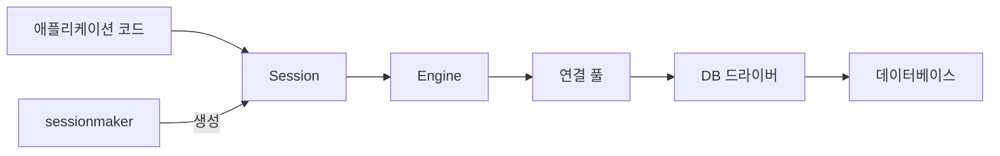
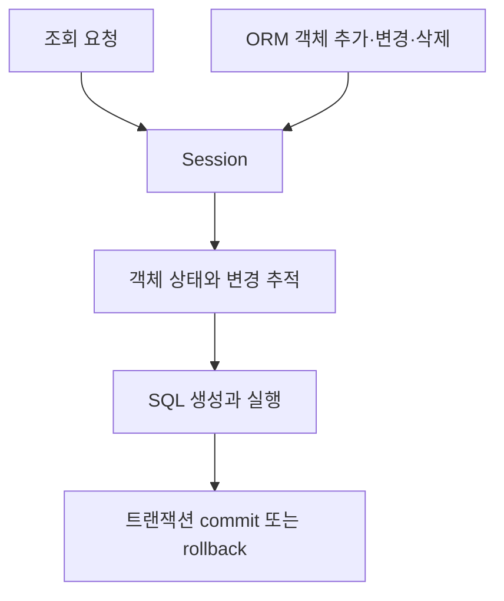

# 데이터베이스 Engine과 Session

이 노트는 SQLAlchemy가 데이터베이스 연결, ORM 객체와 트랜잭션을 나누어 관리하는 방식을 설명한다. 특정 시점의 모델이나 함수 이름보다 계속 적용되는 역할과 수명에 집중한다.

## 데이터베이스 작업의 구성 요소



| 구성 요소        | 역할                                                 | 일반적인 수명            |
| ---------------- | ---------------------------------------------------- | ------------------------ |
| Engine           | 데이터베이스 사용 방법과 연결 풀을 관리한다.         | 애플리케이션 동안 재사용 |
| 연결 풀          | 데이터베이스 연결을 빌려주고 돌려받아 재사용한다.    | Engine과 함께 유지       |
| `sessionmaker` | 공통 설정으로 Session을 만드는 팩토리다.             | 애플리케이션 동안 재사용 |
| Session          | ORM 객체의 상태, SQL 실행과 트랜잭션을 관리한다.     | 요청이나 작업 하나       |
| DB 드라이버      | Python과 데이터베이스 사이에서 실제 통신을 담당한다. | 연결에 따라 관리         |

Engine은 하나의 데이터베이스 연결이 아니다. 필요한 시점에 연결 풀에서 연결을 빌려 SQL을 실행할 수 있도록 기반을 제공하는 장기 객체다.

연결 풀은 사용이 끝난 연결을 바로 끊지 않고 보관했다가 다른 작업에 빌려준다. 새로운 연결을 만들고 인증하는 비용을 매번 지불하지 않게 한다.

`sessionmaker`는 Session 자체가 아니라 동일한 Engine과 공통 옵션으로 Session을 만드는 팩토리다.

## Session은 무엇을 추상화하는가

Session을 SQL query를 보내는 객체로 이해할 수 있지만 책임은 그보다 넓다.



Session은 하나의 작업 단위에서 다음을 관리한다.

- 조회 결과를 ORM 객체로 표현한다.
- 새 객체와 변경·삭제된 객체를 추적한다.
- 필요한 SQL을 실행한다.
- 트랜잭션을 commit하거나 rollback한다.
- 사용한 연결을 연결 풀에 반환한다.

Session은 여러 요청이 동시에 공유하는 장기 객체가 아니다. 서로 다른 작업의 객체 상태와 트랜잭션이 섞이지 않도록 요청이나 작업마다 만들고 닫는다.

## ORM 객체

ORM은 **Object-Relational Mapping**의 약자다. 데이터베이스 구조를 Python 코드에 다음과 같이 대응시킨다.

```text
데이터베이스               Python
─────────────────────────────────────
테이블              ↔       모델 클래스
테이블의 한 행       ↔       모델 객체
열                  ↔       객체 속성
```

ORM 객체는 SQL을 실행하거나 연결을 관리하는 객체가 아니다. 데이터베이스의 행을 Python 객체로 표현하며, Session이 그 객체의 변화를 추적해 SQL로 반영한다.

Pydantic 객체와도 역할이 다르다.

- Pydantic 객체: API 요청과 응답의 검증·변환
- ORM 객체: 데이터베이스 행의 조회·변경·저장

## Engine과 Session의 수명

```text
애플리케이션 실행
│
├─ Engine 생성 ───────────────────────────┐
│                                         │ 장기간 재사용
├─ 작업 A: Session 생성 → 작업 → 닫기      │
├─ 작업 B: Session 생성 → 작업 → 닫기      │
├─ 작업 C: Session 생성 → 작업 → 닫기      │
│                                         │
└─ 애플리케이션 종료 ──────────────────────┘
```

Engine은 연결 풀을 재사용하기 위해 오래 유지한다. Session은 작업 사이의 상태와 트랜잭션을 격리하기 위해 짧게 유지한다.

## 트랜잭션과 Session 종료

Session을 닫는 것과 변경 내용을 저장하는 것은 다르다.

| 동작         | 의미                                                                                                                                    |
| ------------ | --------------------------------------------------------------------------------------------------------------------------------------- |
| `flush`    | 변경 내용을 현재 트랜잭션 안에서 데이터베이스에 전달한다. 따라서`rollback`이 실행될 경우, `flush`로 갱신된 데이터베이스도 취소된다. |
| `commit`   | 트랜잭션을 확정하여 변경 내용을 저장한다.                                                                                               |
| `rollback` | 현재 트랜잭션의 변경 내용을 취소한다.                                                                                                   |
| `close`    | Session의 자원을 정리하고 연결을 풀에 반환한다.                                                                                         |

Session을 닫는다고 자동으로 commit되지는 않는다. 저장할 변경은 성공 시점에 명시적으로 commit하고, 작업이 끝나면 성공 여부와 관계없이 Session을 닫아야 한다.

## FastAPI에서 Session 수명 관리하기

FastAPI는 `yield`가 있는 의존성을 자원을 준비하고 정리하는 경계로 사용할 수 있다.

```python
def get_session():
    with session_factory() as session:
        yield session
```

```text
의존성 실행
    ↓
Session 생성
    ↓
yield로 endpoint에 전달하고 의존성 일시 정지
    ↓
endpoint 처리
    ↓
의존성 재개
    ↓
Session 닫기
```

여기서 `yield`는 Session을 비동기로 만들지 않는다. Session을 전달한 뒤 요청이 끝났을 때 정리 코드를 이어서 실행하기 위해 사용한다.

## 동기식 Session과 `async def`

동기식 Session은 데이터베이스 응답을 기다리는 동안 현재 Python 실행 흐름을 붙잡는다. 이를 비동기 endpoint 안에서 직접 사용하면 그 endpoint를 실행하는 이벤트 루프가 기다리는 동안 다른 비동기 작업을 처리하지 못할 수 있다.

```python
async def bad_endpoint():
    return synchronous_session_operation()
```

`async def`라는 선언이 내부의 동기 함수를 자동으로 비동기화하거나 별도 thread에서 실행해 주지는 않는다.

동기식 SQLAlchemy Session을 사용하는 endpoint와 의존성은 일반 `def`로 작성하는 것이 기본 원칙이다. FastAPI는 일반 `def` 호출을 thread pool에서 실행하여 동기식 대기가 이벤트 루프를 직접 막지 않게 한다.

```python
def endpoint():
    return synchronous_session_operation()
```

반대로 비동기 Session과 비동기 DB 드라이버를 선택했다면 `async def`와 `await`를 일관되게 사용해야 한다. 동기·비동기 중 어느 한쪽이 항상 우월한 것이 아니라, 사용하는 데이터베이스 스택과 endpoint 실행 방식이 서로 맞아야 한다.

이벤트 루프와 `await`의 일반적인 동작은 [Python 비동기 실행](004-python-async-execution.md)에서 다룬다.

## 기억할 내용

- Engine은 연결 방법과 연결 풀을 관리하는 장기 객체다.
- `sessionmaker`는 공통 설정으로 Session을 만드는 팩토리다.
- Session은 한 작업의 ORM 상태와 트랜잭션을 관리하는 짧은 작업 단위다.
- ORM 객체는 데이터베이스의 행을 Python 객체로 표현하며 Session이 변화를 추적한다.
- Session을 닫는 것과 변경 내용을 commit하는 것은 다르다.
- FastAPI의 `yield` 의존성은 Session 제공과 정리의 경계를 만든다.
- 동기식 Session을 `async def`에서 직접 사용하면 이벤트 루프를 막을 수 있다.
