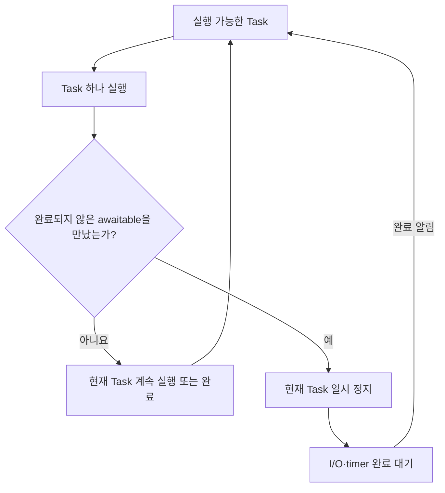
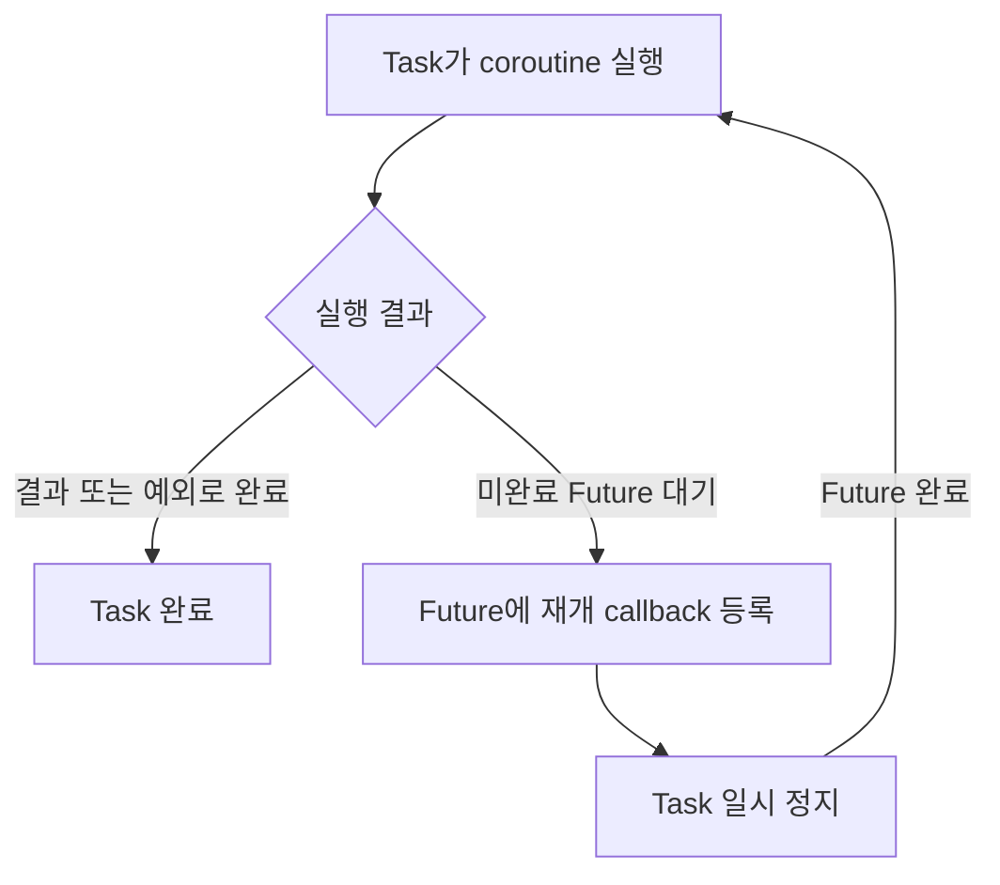
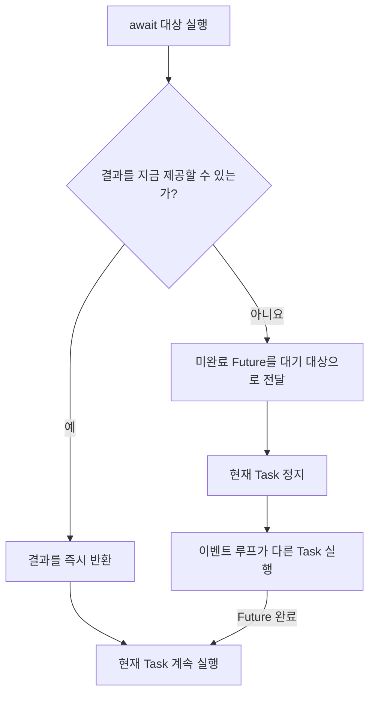

# Python 비동기 실행

이 노트는 Python에서 여러 비동기 작업이 실행되고 중단·재개되는 원리를 설명한다. 특정 웹 프레임워크나 외부 서비스보다 coroutine, 이벤트 루프와 awaitable 규약에 집중한다.

## 이벤트 루프와 협력적 스케줄링

이벤트 루프는 실행 가능한 Task, timer와 I/O 완료 대기를 관리하는 스케줄러다.



Python `asyncio`의 Task는 일반적으로 time slice가 끝나면 강제로 교체되는 방식이 아니다. Task가 완료되거나 미완료 awaitable을 만날 때까지 실행되는 **협력적 스케줄링**을 사용한다.

따라서 `async def` 안에서 오래 걸리는 동기 함수를 실행하면 이벤트 루프가 그 작업을 강제로 중단하지 못한다.

```python
async def bad():
    result = slow_synchronous_call()
    return result
```

비동기는 모든 작업을 별도 thread에서 병렬로 실행한다는 뜻이 아니다. 하나의 이벤트 루프가 여러 Task를 중단 가능한 지점에서 번갈아 진행하여 동시성을 만든다.

## 비동기 함수와 coroutine

`async def`로 정의한 것은 coroutine function이며, 이를 호출하면 한 번의 실행 상태를 나타내는 coroutine 객체가 만들어진다.

```python
async def foo():
    return 10


coroutine = foo()
```

```text
async def foo()       coroutine function
       │ 호출
       ▼
foo()                 coroutine 객체
       │ await 또는 Task로 등록
       ▼
실행                   결과 또는 예외
```

Coroutine 객체는 실행할 코드, 현재 실행 위치와 지역 변수를 보존하므로 중간에 정지했다가 다시 실행할 수 있다. 비동기 함수를 호출해 coroutine 객체만 만드는 것으로는 본문이 실행되지 않는다.

하나의 coroutine 객체는 기본적으로 한 번만 실행할 수 있다. 같은 coroutine function을 다시 호출하면 새로운 coroutine 객체가 만들어진다.

## Awaitable, Future와 Task

Awaitable은 `await`할 수 있다는 Python 규약을 따르는 객체다.

```text
Awaitable
├─ Coroutine 객체
├─ Future
├─ Task
└─ __await__()을 구현한 객체
```

| 개념 | 역할 |
| --- | --- |
| Awaitable | `await`로 기다릴 수 있는 객체의 공통 규약 |
| Coroutine | 비동기 함수 호출 한 번의 중단·재개 가능한 실행 상태 |
| Future | 나중에 제공될 결과나 예외를 표현하는 객체 |
| Task | Coroutine을 이벤트 루프에서 실행하고 최종 결과를 Future처럼 제공하는 객체 |

Python은 `__await__()`이라는 awaitable 규약을 정의한다. 개발자가 이를 직접 구현할 수도 있지만, 일반 애플리케이션에서는 coroutine, Task와 Future를 사용하는 것으로 충분한 경우가 많다.

## Future의 상태

Future는 항상 미완료 상태인 객체가 아니다. 대기 중, 완료 또는 취소 상태일 수 있다.

```text
PENDING
   ├─ 결과 또는 예외 설정 → FINISHED
   └─ 취소              → CANCELLED
```

완료된 Future를 await하면 저장된 결과나 예외를 즉시 전달할 수 있다. 미완료 Future를 await하면 현재 Task가 Future의 완료를 기다린다.

Future 객체가 존재한다는 사실만으로 미완료라는 뜻은 아니다. 다만 `asyncio.Future`가 `await` 과정에서 Task에 대기 대상으로 자신을 전달했다면, 아직 완료되지 않아 기다려야 한다는 의미다.

## Task의 역할

Task는 coroutine을 실행해 보고 다음 두 경우를 처리한다.



Task가 코드의 의미나 예상 실행 시간을 분석하는 것은 아니다. Coroutine을 실제로 진행해 즉시 완료되는지, 미완료 Future를 기다려야 하는지를 확인한다.

Task 자체도 awaitable이다. 다른 coroutine에서 Task를 await하면 해당 Task가 끝날 때까지 현재 Task가 기다린다.

## `await`가 실행 흐름을 반환하는 조건

`await`는 이벤트 루프가 코드의 종류를 보고 네트워크나 I/O라고 추측하게 하는 키워드가 아니다. Awaitable 규약을 통해 대상의 현재 완료 상태를 확인하는 **중단 가능 지점**이다.



같은 awaitable도 실행 시점의 상태에 따라 다르게 동작할 수 있다. 예를 들어 비동기 Queue에 값이 이미 있으면 `await queue.get()`이 즉시 완료될 수 있고, Queue가 비어 있으면 값이 들어올 때까지 Task가 정지한다.

따라서 `await`를 사용했다고 무조건 다른 Task로 전환되는 것은 아니다.

## `await foo()`의 실행 흐름

```python
result = await foo()
```

이 코드는 다음 순서로 동작한다.

1. `foo()`를 호출해 coroutine 객체를 만든다.
2. 현재 Task가 `foo()` coroutine 안으로 들어가 실행한다.
3. `foo()`가 대기 없이 끝나면 결과를 받고 현재 Task를 계속 실행한다.
4. `foo()` 또는 그 내부 호출이 미완료 awaitable을 만나면 현재 Task 전체가 정지한다.
5. 대기하던 Future가 완료되면 중단된 위치부터 다시 실행한다.

`await foo()`는 `foo`를 별도의 독립적인 Task로 만들지 않는다. 현재 Task 안에서 `foo`를 실행하고 완료를 기다린다.

```python
task = asyncio.create_task(foo())
```

`create_task()`는 coroutine을 별도 Task로 등록한다. 현재 Task가 정지한 뒤 다음에 무엇을 실행할지는 `await` 표현식이 아니라 이벤트 루프가 가진 실행 가능한 Task들의 상태에 따라 결정된다.

## I/O와 timer가 연결되는 방식

비동기 네트워크 라이브러리는 운영체제에 소켓 작업을 등록하고, 그 결과를 나타내는 Future를 사용한다.

```text
소켓에서 데이터 읽기 요청
        ↓
지금 읽을 데이터가 없음
        ↓
미완료 Future를 기다림
        ↓
현재 Task 정지, 다른 Task 실행
        ↓
운영체제가 데이터 도착을 알림
        ↓
Future 완료, Task 재개 가능
```

Timer도 같은 원리다. `asyncio.sleep()`은 일정 시간이 지난 뒤 완료되는 awaitable을 제공한다. 인터프리터가 함수 이름을 보고 특별히 처리하는 것이 아니라, 해당 라이브러리가 이벤트 루프와 연결되는 awaitable을 구현한 결과다.

## `yield`와 `await`

두 키워드는 모두 실행을 일시 정지할 수 있지만 목적이 다르다.

| 키워드 | 목적 |
| --- | --- |
| `await` | Awaitable이 완료될 때까지 현재 coroutine을 기다리게 한다. 미완료라면 이벤트 루프에 실행 제어권을 돌려준다. |
| `yield` | 값을 소비자에게 전달하고 generator의 상태를 보존한다. |
| `return` | 결과를 반환하고 함수를 종료한다. |

`yield`는 이벤트 루프에 실행 제어권을 돌려주기 위한 키워드가 아니다.

## 동기 generator와 async generator

```python
def values():
    yield 1


async def async_values():
    yield 1
```

| 구분 | 동기 generator | Async generator |
| --- | --- | --- |
| 선언 | `def` + `yield` | `async def` + `yield` |
| 소비 | `for`, `next()` | `async for`, `await anext()` |
| 내부에서 `await` | 불가능 | 가능 |

Async generator의 `yield` 자체가 비동기 I/O를 만들지는 않는다. 이벤트 루프에서 기다리려면 내부에서 실제 awaitable을 `await`해야 한다.

`async for`와 `async with`는 내부적으로 awaitable을 기다릴 수 있으므로 잠재적인 비동기 중단 지점이다.

## 기억할 내용

- Python 비동기는 기본적으로 time slice가 아니라 `await` 지점에서 협력적으로 전환한다.
- 비동기 함수를 호출하면 coroutine 객체가 만들어지고, 이를 await하거나 Task로 등록해야 실행된다.
- Awaitable은 `await`할 수 있는 객체의 공통 규약이다.
- Future는 나중의 결과를 표현하며 이미 완료된 상태일 수도 있다.
- Task는 coroutine을 실행하고 미완료 Future가 나타나면 완료 callback을 등록한 뒤 정지한다.
- `await` 대상이 즉시 완료되면 현재 Task를 계속 실행하고, 미완료면 이벤트 루프에 실행 제어권을 돌려준다.
- `await foo()`는 `foo`를 별도 Task로 만들지 않는다.
- `await`는 비동기 대기를, `yield`는 값 전달과 generator의 일시 정지를 표현한다.
