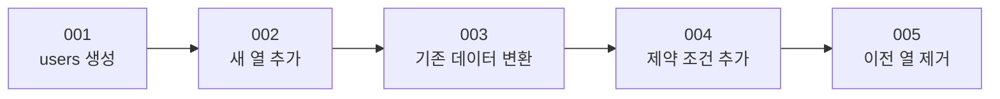
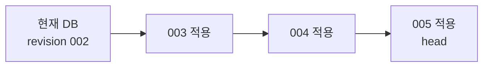
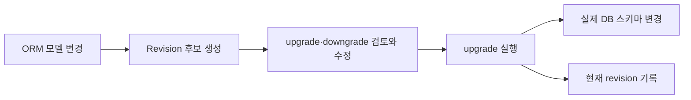

# 데이터베이스 스키마 마이그레이션

이 노트는 데이터베이스 구조가 바뀔 때 변경 이력을 남기고, 여러 데이터베이스에 같은 순서로 적용하는 방법을 설명한다. 이 프로젝트에서는 SQLAlchemy와 연동되는 Alembic을 사용한다.

## 마이그레이션이 필요한 이유

스키마를 직접 수정하고 ORM 모델을 같은 구조로 바꾸는 것도 가능하다.

```text
DB에서 ALTER TABLE 실행
        +
ORM 모델 수정
```

한 개의 로컬 DB에서는 동작할 수 있지만, DB에서 실행한 변경이 코드에 실행 가능한 이력으로 남지 않으면 다른 환경에서 같은 상태를 재현하기 어렵다.

```text
개발 DB A        변경 적용
개발 DB B        적용 여부 불명
운영 DB          적용 순서와 담당자 확인 필요
```

Alembic은 스키마 변경 자체를 가능하게 하는 도구라기보다 다음 정보를 관리하는 도구다.

- 어떤 변경이 있었는가
- 변경을 어떤 순서로 적용하는가
- 각 DB가 어디까지 적용했는가
- 새 DB를 어떻게 최신 상태로 만드는가

직접 작성한 SQL 파일을 순서대로 관리하는 것도 마이그레이션 방식이다. 중요한 것은 Alembic이라는 이름보다 **스키마 변경을 순서가 있는 실행 가능한 이력으로 관리하는 것**이다.

## ORM 모델과 마이그레이션의 차이

ORM 모델은 애플리케이션이 기대하는 현재 스키마를 표현한다. 마이그레이션은 기존 스키마가 그 상태에 도달하는 과정을 표현한다.

```text
ORM 모델
└─ 최종적으로 원하는 구조

마이그레이션
└─ 기존 구조에서 원하는 구조로 이동하는 단계
```

예를 들어 모델에서 `username`이 사라지고 `display_name`이 생겼다는 사실만으로는 다음 의도 중 무엇인지 알 수 없다.

- 열 이름을 바꾼다.
- 기존 열을 삭제하고 새 열을 만든다.
- 기존 값을 변환해 새 열로 옮긴다.
- 두 열을 일정 기간 함께 유지한다.

ORM 모델은 결과를 보여주고, 마이그레이션은 기존 데이터와 구조를 어떻게 바꿀지 기록한다.

## Revision과 변경 순서

Alembic은 스키마 변경 하나를 revision 파일로 기록한다.

```python
revision = "002"
down_revision = "001"


def upgrade() -> None:
    op.add_column("users", sa.Column("bio", sa.Text(), nullable=True))


def downgrade() -> None:
    op.drop_column("users", "bio")
```

- `revision`: 현재 변경의 고유 ID
- `down_revision`: 바로 앞 변경의 ID
- `upgrade()`: 앞으로 적용할 변경
- `downgrade()`: 이전 상태로 되돌릴 변경

Revision들은 `down_revision`으로 연결되어 순서를 만든다.



가장 최신 revision을 `head`라고 부른다.

## 이전 스키마에서 최신 스키마로 이동하기

각 DB에는 현재 적용된 revision이 기록된다. 오래된 DB를 최신 상태로 올리면 Alembic은 현재 위치 이후의 revision을 순서대로 실행한다.



중간 단계를 사용하면 데이터를 보존하며 구조를 변경할 수 있다. 예를 들어 하나의 이름 열을 두 개로 나누려면 다음과 같이 진행할 수 있다.

1. 새 열 두 개를 추가한다.
2. 기존 값을 읽어 새 열에 분리해 저장한다.
3. 모든 데이터가 변환됐는지 검증한다.
4. 새 열을 사용하는 애플리케이션을 배포한다.
5. 더 이상 사용하지 않는 이전 열을 제거한다.

Alembic이 데이터를 자동으로 안전하게 보존하는 것은 아니다. 개발자가 각 revision의 변경 순서와 데이터 변환을 안전하게 작성해야 한다. 열 삭제와 같은 파괴적인 변경은 잘못 작성하면 그대로 데이터 손실로 이어진다.

## DB는 현재 revision을 어떻게 아는가

Alembic은 일반적으로 DB 안의 `alembic_version` 테이블에 현재 적용된 revision을 기록한다.

```text
alembic_version
└─ version_num: 003
```

이 값을 기준으로 아직 적용하지 않은 revision만 실행한다.

```text
DB A: revision 005 → 실행할 변경 없음
DB B: revision 003 → 004, 005 실행
새 DB: revision 없음 → 처음부터 005까지 실행
```

## Revision 생성과 DB 반영은 별도 단계다



Revision 생성 명령은 변경 파일을 만들지만 DB 스키마를 수정하지 않는다.

```shell
uv run alembic revision --autogenerate -m "add user bio"
```

실제 DB 반영은 별도의 upgrade 명령으로 수행한다.

```shell
uv run alembic upgrade head
```

| 명령 | Revision 파일 생성 | 실제 DB 변경 |
| --- | ---: | ---: |
| `revision -m "..."` | 예 | 아니요 |
| `revision --autogenerate` | 예 | 아니요 |
| `upgrade head` | 아니요 | 예 |
| `downgrade -1` | 아니요 | 예 |
| `current` | 아니요 | 아니요 |
| `history` | 아니요 | 아니요 |

Alembic이 설정되어 있다는 사실만으로 애플리케이션 시작 시 migration이 자동 적용되지는 않는다. 개발이나 배포 절차에서 upgrade를 명시적으로 실행해야 한다.

## Autogenerate의 역할과 한계

Autogenerate는 SQLAlchemy metadata와 현재 DB 스키마를 비교하여 revision 후보를 만든다.

```text
SQLAlchemy ORM 모델
        ↓ metadata
Alembic 비교
        ↑
현재 DB 스키마
```

그러나 개발자의 의도까지 판단하지는 못한다. 열 이름 변경을 기존 열 삭제와 새 열 추가로 해석할 수 있으며, 기존 데이터를 어떻게 변환할지도 자동으로 결정할 수 없다.

따라서 autogenerate 결과는 완성본이 아니라 검토해야 할 후보이다.

```text
ORM 모델 변경
    ↓
Revision 후보 생성
    ↓
upgrade와 downgrade 검토·수정
    ↓
변경 경로 검증
    ↓
저장소에 commit
```

## Online과 offline 실행

Online mode는 실제 DB에 연결해 migration SQL을 실행한다. 일반적인 `upgrade head`가 이 방식이다.

Offline mode는 실제 DB에 적용하지 않고 실행할 SQL을 생성한다.

```shell
uv run alembic upgrade head --sql
```

운영 환경에서 SQL을 먼저 검토하거나 DB 변경 권한이 분리되어 있을 때 사용할 수 있다.

## 기억할 내용

- ORM 모델은 목표 스키마이고, migration은 그 상태까지 이동하는 변경 이력이다.
- 직접 DB와 ORM을 함께 수정할 수는 있지만 다른 DB에 같은 변경을 재현하기 어렵다.
- Revision은 `down_revision`으로 연결되어 적용 순서를 만든다.
- 오래된 DB는 현재 revision 이후의 변경을 차례로 적용해 최신 상태로 이동한다.
- 중간 migration을 올바르게 작성하면 기존 데이터를 보존하며 구조를 바꿀 수 있다.
- Revision 생성과 실제 DB 적용은 별도 단계이며, `upgrade`가 실제 스키마를 변경한다.
- Autogenerate 결과는 개발자의 의도를 모두 알지 못하므로 반드시 검토해야 한다.
- Migration 파일은 코드와 함께 저장소에 보관한다.
