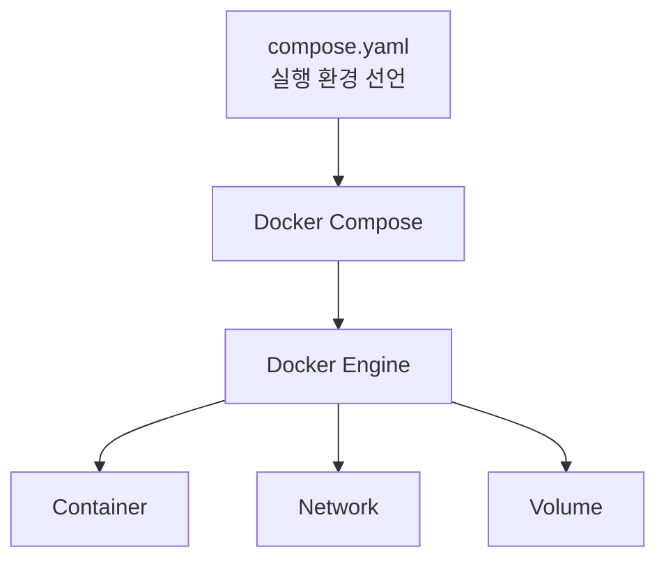
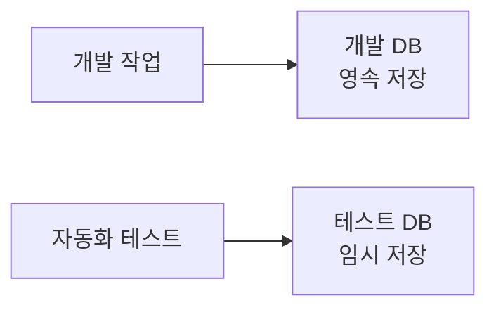

# Docker Compose와 PostgreSQL 실행 환경

이 노트는 Docker와 Docker Compose의 역할, PostgreSQL을 컨테이너로 실행하는 이유와 개발·테스트 환경을 분리하는 방법을 설명한다. 특정 버전이나 현재 service 이름보다 계속 적용되는 개념에 집중한다.

## Docker와 Docker Compose

Docker는 image를 바탕으로 container를 만들고 실행하는 기반이다. Docker Compose는 관련된 container, network와 volume의 구성을 파일로 선언하고 함께 관리하는 도구다.



Compose가 Docker를 대체하는 것은 아니다. Compose는 설정 파일을 해석해 Docker Engine에 필요한 자원의 생성과 실행을 요청한다.

Docker CLI로도 여러 container를 직접 실행할 수 있다. Compose의 장점은 긴 실행 옵션과 자원 관계를 `compose.yaml`에 남겨 같은 환경을 반복해서 만들 수 있다는 것이다.

```text
Docker
└─ container와 관련 자원을 실제로 실행

Docker Compose
└─ 여러 Docker 자원의 실행 구성을 파일로 관리
```

현대적인 Docker 환경에서는 일반적으로 `docker compose` 명령을 사용한다. 과거의 `docker-compose`는 별도 실행 파일 형식의 도구였다.

## Image, container와 service

| 용어 | 의미 |
| --- | --- |
| Image | Container를 만들기 위한 읽기 전용 실행 환경과 파일의 원본 |
| Container | Image를 바탕으로 실제 실행되는 격리된 프로세스와 파일 시스템 |
| Compose service | 어떤 image와 설정으로 container를 실행할지 정의한 단위 |

```text
PostgreSQL image
        ↓ 설정을 더해 생성
PostgreSQL container
        ↑
Compose service가 생성 방법을 정의
```

Service 이름은 Compose 파일 안의 논리적 이름이다. 실제 container 이름에는 Compose 프로젝트 이름과 인스턴스 번호 등이 붙을 수 있다. Compose 안의 다른 service는 생성된 container 이름보다 service 이름을 네트워크 주소로 사용한다.

## PostgreSQL만 컨테이너로 실행하기

애플리케이션과 데이터베이스를 모두 컨테이너로 실행해야 하는 것은 아니다. 로컬에서는 애플리케이션을 호스트에서 실행하고 PostgreSQL만 Docker로 격리할 수 있다.

```text
호스트
├─ 애플리케이션과 개발 도구
└─ Docker Engine
   └─ PostgreSQL container
```

이 방식은 애플리케이션의 실행과 디버깅은 호스트에서 단순하게 유지하면서 다음 PostgreSQL 설정을 팀이 공유하게 한다.

- PostgreSQL image와 주요 실행 설정
- 사용자와 데이터베이스 초기화 방식
- 포트 연결 방식
- 데이터 저장 위치
- 준비 상태 확인 방법

운영 환경의 애플리케이션 배포 방식과 로컬 DB 실행 방식은 서로 같을 필요가 없다. 애플리케이션은 환경에서 제공한 접속 주소를 사용하므로 로컬 Compose DB와 운영 DB를 교체할 수 있다.

## Port mapping

Container는 기본적으로 격리된 network 안에서 실행된다. 호스트에서 container의 PostgreSQL에 접속하려면 port mapping을 선언한다.

```text
호스트 주소 : 호스트 port : container port
```


같은 container port를 사용하는 PostgreSQL service가 여러 개여도 서로 다른 호스트 port로 연결하면 호스트에서 구분할 수 있다.

호스트 주소를 loopback 주소로 제한하면 같은 컴퓨터에서는 접속할 수 있지만 로컬 네트워크의 다른 컴퓨터에 DB port를 직접 공개하지 않는다.

## 데이터는 container와 분리한다

Container의 쓰기 가능한 파일 시스템은 container의 수명에 연결된다. DB container를 교체해도 데이터를 유지하려면 저장 공간의 수명을 별도로 관리해야 한다.

### Named volume

Named volume은 Docker가 관리하는 영속 저장 공간이다.

```text
PostgreSQL container A ──┐
                        ├─ named volume의 DB 데이터
PostgreSQL container B ──┘
```

기존 container를 제거하고 같은 volume을 연결한 새 container를 만들면 데이터를 다시 사용할 수 있다. 일반적으로 개발 중 보존해야 하는 DB 데이터에 적합하다.

Compose 파일의 volume 이름과 Docker가 표시하는 실제 이름은 다를 수 있다. 실제 이름에는 Compose 프로젝트 이름이 접두사로 붙는 경우가 많다.

`docker compose down`은 일반적으로 service container와 network를 정리하지만 named volume은 유지한다. Volume까지 제거하는 옵션을 사용하면 DB 데이터도 삭제되므로 구분해야 한다.

### tmpfs

`tmpfs`는 container의 임시 메모리 파일 시스템이다. Container가 중지되거나 제거되면 그 안의 데이터도 유지되지 않는다.

```text
Container 실행
    ↓
tmpfs에 임시 데이터 저장
    ↓
Container 종료
    ↓
데이터 폐기
```

다음 실행까지 보존할 필요가 없는 일시적인 DB 환경에 적합하다.

| 저장 방식 | Container 교체 후 데이터 | 일반적인 용도 |
| --- | --- | --- |
| Named volume | 유지 | 개발 데이터처럼 지속해야 하는 상태 |
| tmpfs | 폐기 | 실행마다 새로 준비하는 임시 상태 |

## 개발 DB와 테스트 DB를 분리하는 이유

테스트는 데이터 생성, 실제 commit과 정리 작업을 반복할 수 있다. 개발 DB를 테스트에 함께 사용하면 개발 중인 데이터를 수정하거나 삭제할 위험이 있다.



별도 service를 사용하면 다음 경계를 독립적으로 관리할 수 있다.

- 접속 주소와 port
- 데이터베이스와 사용자
- Container 시작과 종료
- 저장 공간의 수명
- 초기화와 정리 작업

하나의 PostgreSQL instance 안에 개발 DB와 테스트 DB를 따로 만들 수도 있다. 별도 service는 저장 공간과 실행 수명까지 분리하여 테스트 환경을 더 명확하게 격리한다.

## Compose profile

모든 service를 항상 실행할 필요는 없다. Compose profile은 특정 목적에서만 필요한 service를 선택적으로 포함한다.

```text
일반 실행
└─ 기본 service만 실행

특정 profile 활성화
├─ 기본 service
└─ 해당 profile의 service
```

평소에는 개발 DB만 실행하고 테스트할 때 임시 DB service를 추가하는 것처럼 사용할 수 있다. Profile은 설정을 별도 파일로 복제하지 않고 실행 대상을 구분하게 한다.

## Container 실행과 DB 준비는 다르다

Container 프로세스가 시작됐다고 PostgreSQL이 즉시 연결을 받을 수 있는 것은 아니다.

```text
Container 시작
    ↓
PostgreSQL 프로세스 시작
    ↓
데이터 디렉터리와 초기 사용자 준비
    ↓
연결을 받을 수 있는 상태
```

초기화 중에 애플리케이션이 접속하면 실패할 수 있다. Healthcheck는 container 내부에서 준비 상태를 검사해 Docker에 알린다.

```text
starting
   ↓ 준비 상태 검사 성공
healthy
```

Healthcheck는 container가 살아 있는지만 보는 것이 아니라 서비스가 실제 요청을 받을 준비가 되었는지 확인해야 한다.

다만 healthcheck가 존재한다는 사실만으로 호스트에서 실행하는 모든 명령이 자동으로 기다리는 것은 아니다. DB를 사용하는 실행 절차가 `healthy` 상태를 확인하거나 준비를 기다려야 한다.

## 로컬 Compose DB와 운영 DB

Compose의 PostgreSQL은 로컬 개발과 테스트 환경을 재현하는 방법이다. 운영에서는 관리형 PostgreSQL이나 별도로 운영하는 DB 서버를 사용할 수 있다.

```text
로컬 환경
애플리케이션 ── 접속 주소 ── Compose PostgreSQL

운영 환경
애플리케이션 ── 접속 주소 ── 운영 PostgreSQL 서비스
```

애플리케이션이 접속 정보를 환경 설정으로 받으면 DB 실행 위치가 달라져도 동일한 데이터베이스 접근 코드를 사용할 수 있다.

## 기억할 내용

- Docker는 container와 관련 자원을 실제로 실행하는 기반이다.
- Docker Compose는 여러 Docker 자원의 구성을 파일로 선언하고 함께 관리한다.
- Image는 원본이고, container는 실행 인스턴스이며, service는 실행 방법의 정의다.
- Port mapping은 호스트의 접속을 container 내부 서비스로 전달한다.
- Named volume은 지속할 데이터를, tmpfs는 폐기할 임시 데이터를 저장한다.
- 개발 DB와 테스트 DB를 분리하면 데이터와 실행 수명을 독립적으로 관리할 수 있다.
- Compose profile은 특정 목적에서만 필요한 service를 선택적으로 실행한다.
- Healthcheck는 container 실행 여부와 서비스 준비 상태를 구분한다.
- 로컬 Compose DB와 운영 DB는 위치가 달라도 환경별 접속 주소로 교체할 수 있다.
