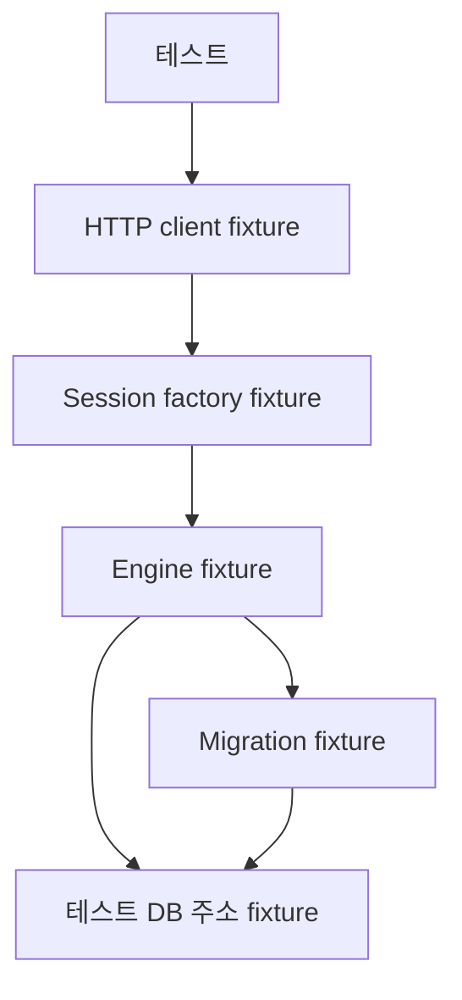
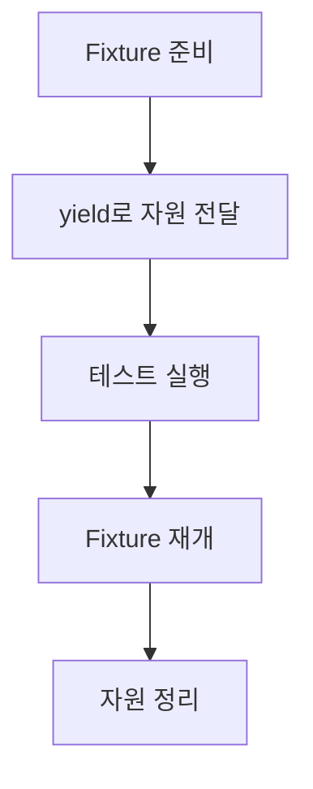
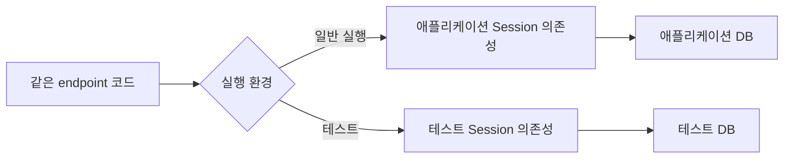
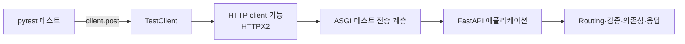

# pytest Fixture와 FastAPI 테스트 환경

이 노트는 pytest fixture로 테스트 자원의 수명을 관리하고, FastAPI가 테스트 전용 데이터베이스를 사용하도록 의존성을 교체하는 방법을 설명한다.

## Fixture란 무엇인가

Fixture는 테스트에 필요한 값이나 자원을 준비하고, 필요한 경우 테스트 후 정리하는 pytest 함수다.

```python
@pytest.fixture
def user():
    return User(name="alice")


def test_user_name(user):
    assert user.name == "alice"
```

테스트 함수의 매개변수 이름과 fixture 이름이 같으면 pytest가 fixture를 찾아 실행하고 결과를 전달한다.

```text
테스트가 fixture를 요청
        ↓
pytest가 fixture를 찾음
        ↓
값 또는 자원 준비
        ↓
테스트 함수에 전달
```

Fixture는 단순한 예시 데이터뿐 아니라 DB Engine, Session, HTTP client와 임시 파일처럼 수명 관리가 필요한 자원을 제공할 수 있다.

## `conftest.py`의 역할

`conftest.py`에는 같은 테스트 범위에서 공유할 fixture와 pytest 설정을 둔다.

```text
tests/
├─ conftest.py
├─ test_users.py
└─ test_articles.py
```

하위 테스트 파일은 `conftest.py`를 직접 import하지 않아도 fixture를 사용할 수 있다. Pytest가 디렉터리 구조를 따라 자동으로 발견한다.

일반 애플리케이션 코드가 테스트 설정을 알게 하지 않고, 테스트를 준비하는 책임을 테스트 디렉터리에 모을 수 있다.

## Fixture dependency

Fixture도 다른 fixture를 매개변수로 받을 수 있다.

```python
@pytest.fixture
def engine(database_url):
    return create_engine(database_url)


@pytest.fixture
def session(engine):
    return Session(engine)
```

Pytest는 테스트가 요청한 fixture부터 의존 관계를 따라 필요한 fixture를 준비한다.



Fixture 매개변수를 사용하지만 반환값 자체가 필요 없는 경우도 있다. 다른 fixture를 먼저 실행해야 한다는 순서만 표현할 수 있다.

예를 들어 migration fixture는 테스트에 값을 제공하지 않고 DB 스키마를 준비한다.

```python
@pytest.fixture(scope="session")
def migrate_database(test_database_url: str) -> None:
    command.upgrade(alembic_config, "head")


@pytest.fixture(scope="session")
def engine(
    test_database_url: str,
    migrate_database: None,
) -> Engine:
    return create_engine(test_database_url)
```

Engine fixture 안에서 `migrate_database`의 반환값인 `None`을 사용하지는 않는다. 그러나 매개변수로 선언했으므로 pytest는 이를 fixture dependency로 해석한다.

```text
테스트가 Engine 요청
    ↓
테스트 DB 주소 준비
    ↓
Migration 실행과 완료
    ↓
Engine 생성
    ↓
테스트 실행
```

이 의존성이 없다면 테스트가 Engine만 요청했을 때 migration fixture는 실행되지 않는다. 따라서 이 선언은 다음 전제 조건을 만든다.

> Engine fixture가 제공되는 시점에는 테스트 DB의 migration이 이미 완료되어 있다.

## Fixture scope

Scope는 fixture를 어느 범위에서 한 번 만들고 재사용할지 결정한다.

| Scope        | 수명                            |
| ------------ | ------------------------------- |
| `function` | 테스트 함수마다 새로 생성       |
| `class`    | 테스트 클래스마다 생성          |
| `module`   | 테스트 파일마다 생성            |
| `session`  | pytest 실행 전체에서 한 번 생성 |

비용이 크고 안전하게 공유할 수 있는 자원은 넓은 scope를 사용하고, 상태가 테스트 사이에 섞일 수 있는 자원은 좁은 scope를 사용한다.

```text
pytest 실행 전체
├─ 테스트 DB 주소
├─ Migration 적용
├─ Engine
└─ Session factory

각 테스트 함수
├─ Session
└─ HTTP client
```

Scope는 단순한 성능 옵션이 아니다. 어떤 상태를 공유하고 어떤 상태를 매번 새로 만드는지 표현하는 테스트 격리 설계다.

## `yield` fixture와 정리

Fixture에서 `yield` 앞은 준비 단계이고, 뒤는 정리 단계다.

```python
@pytest.fixture
def resource():
    value = create_resource()
    try:
        yield value
    finally:
        value.close()
```



테스트가 성공하거나 예외로 실패해도 정리가 실행되도록 `try`와 `finally` 또는 context manager를 사용할 수 있다.

여러 fixture가 연결되어 있으면 준비의 반대 순서로 정리된다.

```text
준비: DB 주소 → migration → Engine → factory → client
정리: client → Engine
```

## 테스트 DB를 확인하는 경계

테스트는 데이터를 생성·수정·삭제할 수 있으므로 개발 DB와 다른 접속 주소를 사용해야 한다.

```text
애플리케이션 설정 ──→ 개발 DB
테스트 설정       ──→ 테스트 DB
```

테스트 DB 주소를 별도의 설정으로 읽고 예상한 테스트 DB를 가리키는지 검사하면 잘못된 DB에 파괴적인 테스트가 실행될 위험을 줄일 수 있다.

DB 이름만 확인하는 검사는 하나의 안전장치일 뿐이다. 호스트, port, 사용자 권한과 실행 환경도 함께 통제해야 한다.

## Migration과 테스트 Engine의 준비 순서

테스트가 사용하는 스키마는 애플리케이션이 실제로 배포할 migration 이력으로 준비한다.


ORM의 현재 metadata만으로 테이블을 바로 만드는 방식보다 migration을 적용하면 애플리케이션이 기대하는 배포 경로와 동일한 스키마를 사용하게 된다.

Engine과 Session factory는 여러 테스트가 공유할 수 있지만 Session은 하나의 작업 단위이므로 테스트마다 새로 만드는 것이 일반적이다. Pytest 실행이 끝나면 Engine을 dispose해 연결 풀을 정리한다.

## FastAPI dependency override

일반 실행에서 endpoint는 애플리케이션용 의존성을 통해 Session을 받는다.

```text
Endpoint → Session dependency → 애플리케이션 DB
```

테스트에서는 FastAPI의 dependency override를 사용해 동일한 의존성 경계를 테스트용 함수로 교체한다.

```python
app.dependency_overrides[get_session] = get_test_session
```



Endpoint와 서비스 코드를 테스트용으로 바꾸는 것이 아니라, 외부 자원을 제공하는 의존성 경계만 교체한다.

Override의 key는 endpoint가 의존하는 원래 함수 객체다. 이름이 같은 새 함수를 만드는 것만으로는 교체되지 않는다.

테스트가 끝나면 override를 제거해야 한다. 전역 애플리케이션 객체에 override가 남으면 이후 테스트가 예상하지 않은 테스트용 의존성을 사용할 수 있다.

## TestClient의 역할

TestClient는 테스트 코드가 HTTP client처럼 FastAPI 애플리케이션을 호출하게 한다. FastAPI는 개발자가 편하게 import할 수 있도록 TestClient를 제공하지만, 실제 구현은 Starlette의 TestClient다.

```python
response = client.post(
    "/items",
    json={"name": "example"},
)
```

별도의 Uvicorn 프로세스나 실제 network port를 열지 않고 ASGI 호출 경계를 통해 애플리케이션을 직접 실행한다.

### 요청이 처리되는 흐름



요청은 왼쪽에서 오른쪽으로 전달되고, 애플리케이션이 만든 ASGI 응답은 반대 방향으로 돌아와 테스트가 사용하는 Response 객체가 된다.

### Network가 없는데 HTTP client가 필요한 이유

HTTP client는 network 연결만 담당하지 않는다. 다음과 같이 HTTP 요청과 응답을 다루는 기능도 제공한다.

- URL과 query parameter 구성
- JSON, form과 file body 변환
- Header와 cookie 처리
- Redirect 처리
- 응답 body와 JSON 해석

TestClient는 이 기능을 직접 다시 만들지 않고 HTTPX2의 client 기능을 사용한다. 대신 일반적인 TCP 전송 계층을 ASGI 애플리케이션을 직접 호출하는 테스트 전송 계층으로 바꾼다.

> HTTPX2는 요청과 응답을 다루고, TestClient는 그 요청이 network가 아니라 ASGI 애플리케이션으로 향하게 한다.

HTTPX2는 HTTP client library의 이름이다. 이름에 `2`가 들어가지만, TestClient가 HTTP/2 protocol을 검증하기 위해 사용하는 library라는 뜻은 아니다. HTTP/2 지원 여부는 별도의 protocol 선택이다.

### 동기 테스트와 비동기 ASGI 애플리케이션

테스트는 일반 동기 함수와 동기 client 호출로 작성할 수 있다.

```python
def test_create_item(client: TestClient) -> None:
    response = client.post("/items", json={"name": "example"})
```

FastAPI 애플리케이션은 비동기 ASGI 규약으로 호출된다. TestClient는 내부에 비동기 실행 환경과 event loop를 준비하고, 동기적인 `client.post()` 호출이 비동기 ASGI 애플리케이션의 실행이 끝날 때까지 기다리게 한다. 따라서 이 형태의 테스트는 직접 `await`을 사용하지 않는다.

Context manager로 TestClient를 사용하면 애플리케이션의 시작과 종료 lifespan도 테스트 경계에 맞춰 처리할 수 있다.

### 검증하는 경계

TestClient를 통한 요청은 다음 애플리케이션 동작을 함께 통과한다.

- URL routing
- 요청 데이터 검증
- Dependency와 dependency override
- Middleware와 exception handler
- Endpoint 동작
- 응답 변환과 직렬화

반면 Uvicorn의 실행 설정, 실제 TCP·TLS 통신, reverse proxy와 운영 network 구성은 통과하지 않는다. TestClient가 network를 사용하지 않는다는 말은 FastAPI 호출 경계에 관한 것이다. 애플리케이션이 별도의 PostgreSQL에 연결한다면 그 데이터베이스 통신은 실제로 발생한다.

따라서 TestClient는 endpoint 함수를 직접 호출하는 테스트보다 HTTP 애플리케이션의 경계를 더 넓게 검증하지만, 실제 배포 network까지 검증하지는 않는다.

## 개발 DB 분리와 테스트 간 격리

개발 DB와 테스트 DB를 분리하는 것과 테스트끼리 데이터를 격리하는 것은 다른 문제다.

```text
개발 DB와 테스트 DB 분리
└─ 테스트가 개발 데이터를 건드리지 않게 함

테스트 A와 테스트 B 격리
└─ 한 테스트의 데이터가 다른 테스트 결과에 영향을 주지 않게 함
```

테스트마다 새로운 Session을 만들어도 이전 테스트가 commit한 행은 같은 DB에 남을 수 있다. Test DB container의 저장 공간이 임시여도 container 실행 중에는 여러 테스트가 데이터를 공유한다.

따라서 데이터 변경 테스트에는 별도의 격리 전략이 필요하다.

- 테스트 전후로 관련 테이블을 정리한다.
- 테스트별로 고유한 데이터를 사용한다.
- Transaction과 savepoint를 이용해 변경을 되돌린다.
- DB나 schema를 테스트 단위로 분리한다.

선택한 방식은 검증하려는 계약과 맞아야 한다. 예를 들어 실제 commit 이후의 동작이 중요하다면 모든 변경을 외부 transaction rollback으로 숨기는 방식은 해당 계약을 충분히 검증하지 못할 수 있다.

## 기억할 내용

- Fixture는 테스트 자원의 준비, 제공과 정리를 관리한다.
- `conftest.py`의 fixture는 하위 테스트에서 import 없이 사용할 수 있다.
- Fixture 매개변수는 다른 fixture에 대한 의존성과 실행 순서를 표현한다.
- Scope는 자원의 재사용 범위이자 테스트 상태 공유의 경계다.
- `yield` fixture는 준비와 정리 단계를 하나의 함수에 표현한다.
- 테스트 DB에 migration을 적용한 뒤 Engine과 Session factory를 제공한다.
- FastAPI dependency override는 애플리케이션 코드를 바꾸지 않고 테스트 자원을 주입한다.
- TestClient는 HTTP client 기능과 ASGI 직접 호출을 결합해 실제 network 서버 없이 애플리케이션의 HTTP 경계를 검증한다.
- HTTPX2는 TestClient의 요청과 응답 처리를 담당하는 HTTP client library이며, 그 이름이 HTTP/2 검증을 의미하지는 않는다.
- TestClient는 애플리케이션 동작을 검증하지만 Uvicorn과 실제 배포 network는 검증하지 않는다.
- 개발 DB 분리와 테스트 간 데이터 격리는 별도로 설계해야 한다.
