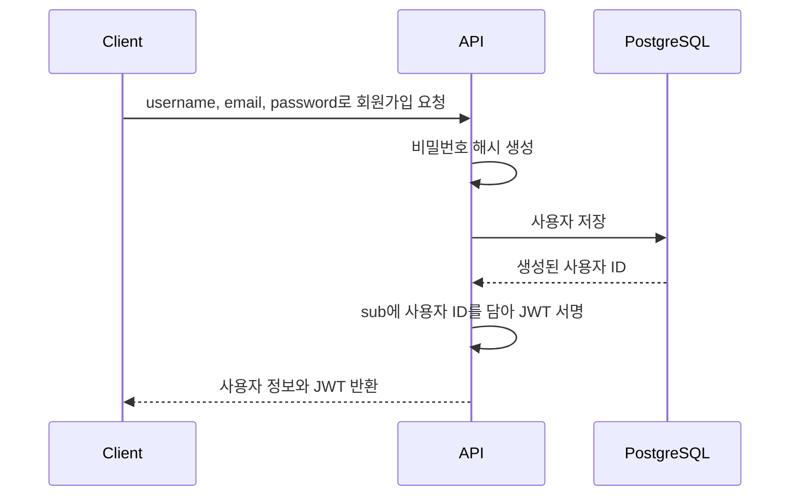
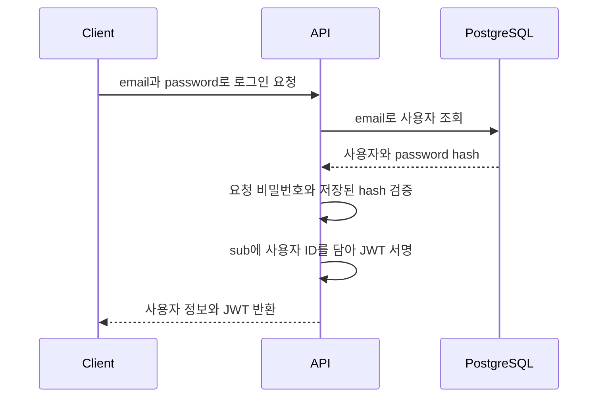
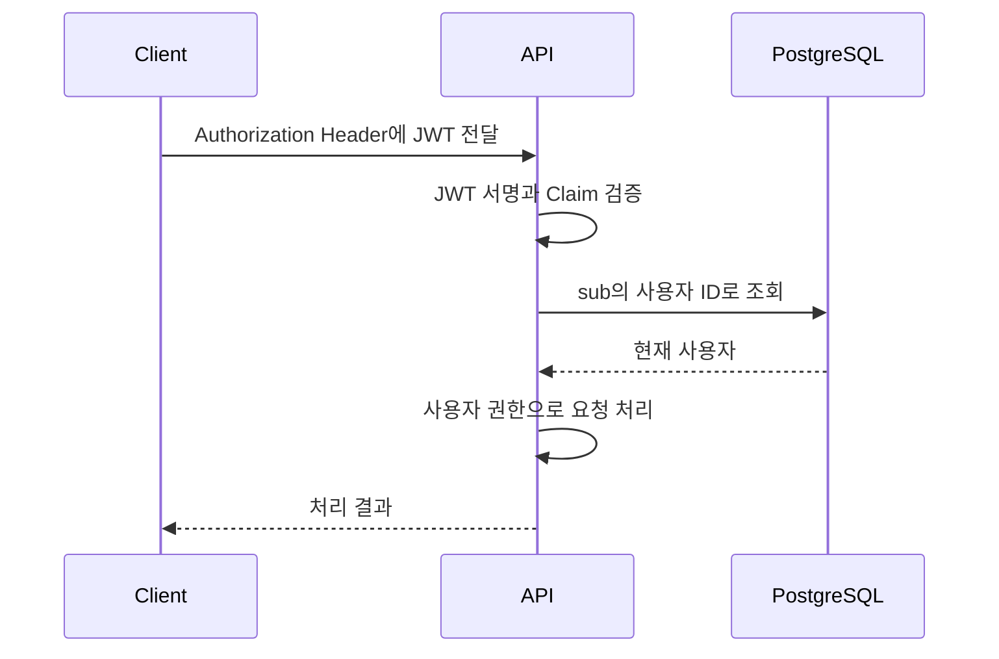

# JWT와 사용자 인증

이 노트는 JWT가 무엇을 증명하고, 회원가입·로그인·인증 요청에서 어떤 역할을 하는지 설명한다. JWT 형식 자체보다 사용자의 신원을 확인한 결과가 이후 요청으로 전달되는 흐름에 집중한다.

## 인증과 JWT의 역할

사용자 인증은 요청을 보낸 사람이 누구인지 확인하는 과정이다. 비밀번호와 JWT는 이 과정에서 서로 다른 역할을 맡는다.

```text
비밀번호: 사용자가 본인임을 처음 확인하는 수단
JWT:      확인된 사용자 정보를 이후 요청에 전달하는 수단
```

회원가입이나 로그인에서 서버는 사용자의 신원을 확인한 뒤 JWT를 발급한다. 클라이언트는 인증이 필요한 요청마다 이 토큰을 보내고, 서버는 토큰을 검증해 사용자를 식별한다.

JWT가 비밀번호를 대신 저장하거나 비밀번호를 암호화하는 것은 아니다. 비밀번호는 해시로 데이터베이스에 저장하고, JWT에는 사용자를 식별하는 데 필요한 최소한의 정보만 담는다.

## JWT의 구조

JWT는 점으로 구분된 세 부분으로 구성된다.

```text
Header.Payload.Signature
```

- Header는 토큰 유형과 서명 알고리즘을 나타낸다.
- Payload는 사용자 식별자와 같은 Claim을 담는다.
- Signature는 토큰이 서버가 발급한 것이며 발급 후 변경되지 않았는지 검증하는 데 사용한다.

Header와 Payload는 Base64 URL 형식으로 인코딩될 뿐 암호화되지 않는다. 토큰을 가진 사람은 그 내용을 읽을 수 있으므로 비밀번호, 비밀키와 같은 민감한 정보를 Payload에 넣으면 안 된다.

## 서명과 검증

현재 프로젝트는 `HS256` 알고리즘을 사용한다. 서버는 `JWT_SECRET_KEY`와 Header·Payload를 이용해 Signature를 만들고, 토큰을 받을 때 같은 비밀키로 서명을 검증한다.

```text
토큰 발급
Header + Payload + JWT_SECRET_KEY → Signature

토큰 검증
Header + Payload + JWT_SECRET_KEY → 계산한 Signature
계산한 Signature == 전달받은 Signature
```

Payload가 변경되면 서명이 일치하지 않는다. 비밀키를 모르는 클라이언트는 서버가 유효하다고 판단할 서명을 새로 만들 수 없다.

서명은 Payload의 기밀성을 보장하지 않는다. 또한 서명이 유효하다는 사실만으로 현재도 허용된 사용자인지, 토큰이 만료되지 않았는지까지 자동으로 결정되지는 않는다. 필요한 정책은 Claim과 서버의 인증 처리로 별도로 정의해야 한다.

## Claim과 사용자 식별

Claim은 JWT Payload에 담는 정보다. 현재 프로젝트는 `sub` Claim에 사용자 ID를 문자열로 저장한다.

```json
{
  "sub": "42"
}
```

`sub`는 subject의 약자로 토큰이 나타내는 대상을 식별한다. 서버는 서명을 검증한 뒤 `sub`를 읽어 데이터베이스에서 사용자를 조회할 수 있다.

JWT에서 자주 사용하는 다른 Claim에는 다음이 있다.

- `iat`: 토큰이 발급된 시각
- `exp`: 토큰이 만료되는 시각
- `iss`: 토큰 발급자
- `aud`: 토큰을 사용할 대상

현재 프로젝트의 토큰에는 `sub`만 있고 `iat`와 `exp`는 없다. 만료 정책이 필요해지면 토큰 발급과 검증 양쪽에서 함께 설계해야 한다.

## 회원가입에서의 흐름

회원가입에 성공하면 서버는 저장된 사용자의 ID로 JWT를 만들고 응답에 포함한다. 따라서 클라이언트는 회원가입 직후 별도의 로그인 요청 없이 인증된 상태를 시작할 수 있다.



JWT를 만들려면 사용자 ID가 필요하므로 사용자를 데이터베이스에 반영해 ID를 얻은 다음 토큰을 생성한다. 비밀번호와 비밀번호 해시는 응답이나 JWT에 포함하지 않는다.

## 로그인에서의 흐름

로그인은 새 사용자를 만들지 않고 기존 사용자의 자격 증명을 확인한다. 서버는 이메일로 사용자를 찾고, 요청으로 받은 비밀번호가 저장된 해시와 일치하는지 검증한다. 검증에 성공하면 해당 사용자 ID로 JWT를 발급한다.



회원가입과 로그인은 사용자를 확인하는 방법이 다르지만, 성공 후 사용자 ID를 담은 JWT를 반환한다는 점은 같다.

## 인증이 필요한 요청의 흐름

클라이언트는 서버가 발급한 JWT를 인증 Header에 담아 보낸다.

```http
Authorization: Token <JWT>
```

서버는 토큰을 디코딩하면서 서명을 검증하고, 검증된 Payload의 `sub`로 현재 사용자를 조회한다.



서명 검증에 실패하거나 사용자를 찾지 못하면 인증된 요청으로 처리하지 않는다. JWT는 사용자 조회를 완전히 없애는 장치가 아니라, 요청과 사용자 ID를 신뢰할 수 있게 연결하는 수단으로 사용할 수 있다.

## 현재 프로젝트의 구현 범위

현재 회원가입 endpoint는 사용자를 저장한 뒤 [`create_access_token`](../../app/security.py)으로 JWT를 생성하고 응답의 `user.token`에 포함한다. 토큰 생성에는 환경 변수로 제공된 `JWT_SECRET_KEY`와 `HS256` 알고리즘을 사용한다.

[`decode_access_token`](../../app/security.py)은 토큰의 서명을 검증하고 Payload를 읽을 수 있도록 준비되어 있다. 그러나 현재는 로그인 endpoint와 인증 Header에서 토큰을 읽어 현재 사용자를 제공하는 처리가 아직 연결되어 있지 않다.

```text
현재 구현됨
└─ 회원가입 성공 → 사용자 ID를 담은 JWT 발급

향후 필요한 흐름
├─ 로그인 성공 → JWT 발급
└─ 인증 요청 → JWT 검증 → 현재 사용자 식별
```

회원가입의 전체 처리 흐름과 관련 코드 위치는 [User Registration Flow](../architecture/flows/user-registration.md)에서 확인할 수 있다.

## 기억할 내용

- 비밀번호는 사용자의 신원을 확인하고, JWT는 확인된 사용자 정보를 이후 요청에 전달한다.
- JWT는 Header, Payload, Signature로 구성된다.
- Payload는 암호화되지 않으므로 민감한 정보를 넣지 않는다.
- Signature는 토큰의 발급자와 무결성을 검증하지만 기밀성을 제공하지 않는다.
- 현재 프로젝트는 `sub`에 사용자 ID를 저장하고 `HS256`과 `JWT_SECRET_KEY`로 서명한다.
- 회원가입과 로그인 모두 성공 후 JWT를 반환할 수 있다.
- 인증 요청에서는 JWT 검증 후 `sub`의 사용자 ID로 현재 사용자를 식별한다.
- 현재 구현 범위는 회원가입 시 JWT 발급까지이며 로그인과 인증 요청 처리는 아직 구현되지 않았다.
