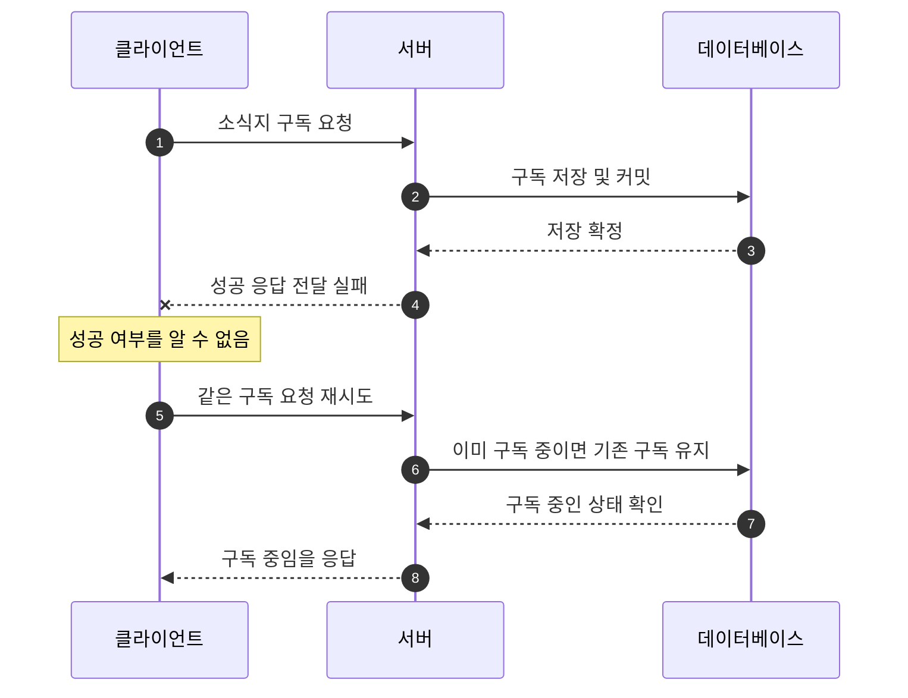
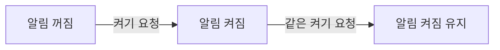

# 멱등성과 반복 요청 처리(Idempotency and Repeated Requests)

이 노트는 같은 요청이 다시 도착했을 때 어떤 효과를 보장해야 하는지 설명한다. 알림 설정과 구독 예제로 기본 원리를 살펴본 뒤, 프로젝트의 팔로우·즐겨찾기에 연결한다. **요청을 한 번 더 실행해도 되는지**, **반복 후 어떤 상태를 확인해야 하는지**를 판단하는 것이 목적이다.

## 같은 요청이 다시 도착하는 이유

클라이언트(Client)는 응답을 받지 못하면 요청이 성공했는지 알기 어렵다. 서버(Server)가 작업을 수행하기 전에 연결이 끊겼을 수도 있고, 저장은 끝났지만 응답 전달 중에 연결이 끊겼을 수도 있다. 타임아웃(Timeout)은 정해진 시간 안에 응답을 받지 못했다는 뜻이며, 서버가 작업을 취소했다는 증거는 아니다.

다음은 사용자가 소식지 구독을 요청했지만 첫 응답을 받지 못한 상황이다.



재시도(Retry)는 응답 유실이나 일시적인 실패 후 작업을 다시 요청하는 것이다. 이 예제에서는 재시도가 구독을 하나 더 만드는 대신, **구독 중인 상태를 유지**한다. 이 성질을 멱등성으로 설명할 수 있다.

## 멱등성은 무엇을 보장하는가

### 한 번 실행한 효과와 반복 실행한 효과

멱등성(Idempotency)은 **같은 요청을 여러 번 수행한 의도된 효과가 한 번 수행한 효과와 같은 성질**이다. [HTTP 표준 RFC 9110의 정의](https://www.rfc-editor.org/rfc/rfc9110.html#section-9.2.2)는 서버에 대한 요청의 의도된 효과(Intended Effect)를 기준으로 삼는다.

다른 변경이 끼어들지 않는 상황에서, 구독 추가 요청을 비교해 보자.

| 실행 횟수 | 구독 중인 상태로 만든다 | 실행할 때마다 새 구독을 만든다 |
| --- | --- | --- |
| 실행 전 | 구독 없음 | 구독 없음 |
| 한 번 실행 | 구독 하나 | 구독 하나 |
| 같은 요청을 두 번 실행 | 구독 하나 | 구독 두 개 |
| 같은 요청을 세 번 실행 | 구독 하나 | 구독 세 개 |

첫 번째 작업은 반복해도 의도한 구독이 하나로 유지된다. 두 번째 작업은 실행 횟수만큼 구독이 늘어나므로 멱등적이지 않다.

### 상태의 유지와 응답의 동일성은 다르다

멱등성은 상태 코드(Status Code)나 응답 본문(Response Body)이 매번 같다는 뜻이 아니다. 다음은 이미 삭제된 문서에 `404`를 응답하도록 정한 **가상의 API**다.

| 요청 | 응답 | 처리 후 문서 상태 |
| --- | --- | --- |
| 첫 번째 삭제 | `204 No Content` | 없음 |
| 두 번째 삭제 | `404 Not Found` | 없음 |

응답은 달라도 “그 문서가 없는 상태”라는 효과는 같다. 반복 삭제를 계속 성공으로 응답하는 API도 가능하다. **어떤 응답을 보장할지는 개별 API의 계약(Contract)**으로 정한다. 요청별 로그(Log)가 각각 기록되는 것도 요청한 효과의 멱등성과는 구분한다. [RFC 9110 §9.2.2](https://www.rfc-editor.org/rfc/rfc9110.html#section-9.2.2)

## 상태 지정과 토글의 차이

상태(State)를 지정하는 작업과 토글(Toggle), 즉 현재 상태를 반전하는 작업은 반복했을 때 다르게 동작한다. 다음 두 그림은 알림이 꺼져 있는 상태에서 시작한다.

**상태 지정: “알림을 켠다”**



**토글: “알림 상태를 반전한다”**


켜기 요청은 이미 켜져 있어도 켜진 상태를 유지한다. 토글은 두 번째 실행에서 첫 번째 변경을 뒤집는다. 클라이언트가 응답을 못 받아 토글을 재시도하면, 사용자가 원했던 상태와 달라질 수 있다.

| 요청의 의미 | 같은 요청을 반복한 결과 | 이 작업의 멱등성 |
| --- | --- | --- |
| 알림을 켠다 | 켜짐 유지 | 있음 |
| 알림을 끈다 | 꺼짐 유지 | 있음 |
| 알림 상태를 반전한다 | 실행할 때마다 상태가 바뀜 | 없음 |
| 수량을 `3`으로 설정한다 | 수량 `3` 유지 | 있음 |
| 수량을 `1`만큼 늘린다 | 실행할 때마다 수량이 늘어남 | 없음 |

따라서 API를 설계할 때는 **원하는 최종 상태를 지정하는 요청인지, 현재 상태에 변화를 더하는 요청인지** 먼저 구분한다. 토글이나 증가 작업도 별도의 중복 실행 방지 장치를 둘 수 있지만, 그 연산 자체가 멱등적인 것은 아니다.

## HTTP 메서드와 멱등성

HTTP 메서드(HTTP Method)는 요청의 의미를 표현한다. 안전한 메서드(Safe Method)는 클라이언트가 서버 상태의 변경을 요청하지 않는 메서드다. 여기서 ‘안전’은 인증이나 보안 취약점이 없다는 뜻과 다르다.

| 메서드 | 안전한 메서드인가? | 표준에서 멱등성이 보장되는가? |
| --- | --- | --- |
| `GET`, `HEAD`, `OPTIONS`, `TRACE` | 예 | 예 |
| `PUT`, `DELETE` | 아니요 | 예 |
| `POST` | 아니요 | 일반적으로 보장되지 않음 |

`PUT`·`DELETE`는 상태를 변경할 수 있어도 반복한 효과는 같도록 정의된다. `GET` 응답이 다른 사용자의 수정 때문에 달라지는 것은 조회 요청 자체의 멱등성을 깨뜨리지 않는다. 이 구분은 [RFC 9110의 안전한 메서드와 멱등 메서드](https://www.rfc-editor.org/rfc/rfc9110.html#section-9.2)에 따른다.

표준은 클라이언트가 기대할 의미를 정하며, 서버 구현도 이를 지켜야 한다. 메서드 이름을 붙였다는 사실만으로 코드가 올바르게 구현됐다는 증거가 되지는 않는다.

`POST`로 구현한 특정 작업이 멱등적일 수는 있다. 다만 `POST`라는 이름만 보고 재시도 가능한 것으로 판단해서는 안 된다. 작업의 계약과 구현을 확인해야 한다. 통신 실패 후 재시도할 수 있는 근거도 [RFC 9110 §9.2.2](https://www.rfc-editor.org/rfc/rfc9110.html#section-9.2.2)에서 구분한다.

## 반복 요청을 처리하는 방법

### 먼저 같은 대상을 식별한다

사용자 한 명이 소식지 하나를 구독하는 예제를 계속 사용한다. `subscriptions`의 한 행은 한 사용자의 한 소식지 구독을 나타낸다. 아래 SQL은 사용자·소식지의 존재를 검사하는 외래 키를 생략하고, **구독의 중복과 반복 처리**에 집중한 예제다.

```sql
CREATE TABLE subscriptions (
    user_id INTEGER NOT NULL,
    newsletter_id INTEGER NOT NULL,
    PRIMARY KEY (user_id, newsletter_id)
);
```

복합 기본 키(Composite Primary Key)인 `(user_id, newsletter_id)`로 구독을 식별한다. `(1, 10)`을 두 번 저장하려는 것은 같은 구독의 중복이고, `(2, 10)`이나 `(1, 20)`은 다른 구독이다. 관계의 식별과 제약은 [관계형 데이터 모델링과 참조 무결성](009-relational-data-modeling-and-referential-integrity.md)에서 다룬다.

### 이미 있으면 유지하는 추가

고유 제약(Unique Constraint)이나 기본 키의 고유성은 중복 저장을 막지만, 일반 삽입을 반복하면 제약 위반 오류가 발생할 수 있다. **중복을 막는 규칙과 중복 요청을 처리하는 정책은 별개**다.

PostgreSQL의 충돌 처리(Conflict Handling)를 사용해 이미 있는 구독은 유지하도록 할 수 있다.

```sql
INSERT INTO subscriptions (user_id, newsletter_id)
VALUES (1, 10)
ON CONFLICT (user_id, newsletter_id) DO NOTHING;
```

`ON CONFLICT ... DO NOTHING`은 지정한 고유성 충돌이 발생한 행의 삽입을 생략한다. 모든 오류를 무시한다는 뜻은 아니다. 여기서는 `(1, 10)` 구독이 없으면 추가하고, 이미 있으면 기존 구독을 유지한다. [PostgreSQL의 `INSERT` 설명](https://www.postgresql.org/docs/18/sql-insert.html#SQL-ON-CONFLICT)

### 이미 없으면 없는 상태를 유지하는 해제

```sql
DELETE FROM subscriptions
WHERE user_id = 1 AND newsletter_id = 10;
```

조건에 맞는 구독만 삭제한다. 이미 없다면 삭제되는 행이 없으며, 다른 구독은 그대로다. 삭제 대상이 없어도 그 이유만으로 SQL 오류가 발생하지는 않는다. API에서 성공 또는 오류로 응답할지는 별도로 정한다. [PostgreSQL의 `DELETE` 설명](https://www.postgresql.org/docs/18/sql-delete.html)

다른 구독이나 변경이 없는 상태에서 위 두 작업을 반복하면 다음과 같다.

| 작업 | 작업 전 `(1, 10)` 구독 개수 | 작업 후 개수 | 같은 작업을 다시 한 뒤 개수 |
| --- | --- | --- | --- |
| 구독 추가 | 0 | 1 | 1 |
| 구독 추가 | 1 | 1 | 1 |
| 구독 해제 | 1 | 0 | 0 |
| 구독 해제 | 0 | 0 | 0 |

위 SQL은 데이터 변경만 보여준다. API에서는 입력과 권한을 확인하고, 필요한 변경을 커밋(Commit)한 뒤 계약에 맞는 응답을 반환해야 한다.

## 멱등성과 원자성·동시성의 관계

세 성질은 서로 다른 질문에 답한다.

| 개념 | 판단할 질문 | 구독 예제 |
| --- | --- | --- |
| 멱등성(Idempotency) | 같은 요청을 반복해도 의도한 효과가 같은가? | 반복 추가 후에도 해당 구독은 하나다. |
| 원자성(Atomicity) | 한 작업의 변경이 전부 확정되거나 전부 취소되는가? | 구독과 함께 저장해야 하는 데이터가 일부만 남지 않는다. |
| 동시성 제어(Concurrency Control) | 여러 작업이 겹쳐도 정한 규칙이 지켜지는가? | 동시에 구독을 추가해도 중복 저장되지 않는다. |

순차적으로 반복 요청을 처리했다고 동시에 도착한 요청까지 검증한 것은 아니다. “조회해서 없으면 삽입한다”는 코드에는 두 요청이 모두 ‘없음’을 읽는 경쟁 조건(Race Condition)이 생길 수 있다. 데이터베이스 제약과 충돌 처리, 필요한 잠금(Lock)의 책임을 함께 판단해야 한다. 자세한 원리는 [트랜잭션의 원자성과 동시성](011-transaction-atomicity-and-concurrency.md)에서 다룬다.

### 다른 작업이 끼어들면 요청의 순서도 중요하다

멱등성은 반대 작업이 끼어든 뒤 오래된 요청을 다시 실행해도 최신 의도가 보존된다는 뜻은 아니다.

| 실행 순서 | 처리 후 구독 상태 |
| --- | --- |
| 구독 추가 | 구독 중 |
| 사용자가 구독 해제를 요청 | 구독 없음 |
| 오래된 구독 추가 요청이 다시 실행 | 다시 구독 중 |

추가와 해제는 각각 멱등적이어도 실행 순서는 결과에 영향을 준다. 다른 변경과의 순서까지 보호해야 한다면 버전 확인이나 조건부 요청(Conditional Request) 같은 별도의 계약이 필요하다. 이 노트의 반복 예제는 **같은 대상에 반대 작업이 끼어들지 않는 상황**을 기준으로 한다.

## 프로젝트 사례: 팔로우와 즐겨찾기

### 두 기능 모두 원하는 상태를 지정한다

프로젝트의 추가 요청은 ‘현재 상태를 반전한다’가 아니라 ‘팔로우 또는 즐겨찾기한 상태로 만든다’는 의미다. 해제 요청은 해당 상태를 없앤다. 아래는 인증이 유효하고 대상이 존재하며, 팔로우 대상이 자기 자신이 아닌 정상 요청을 기준으로 한다.

| 작업 | 요청 | 반복 후 해당 사용자의 대상 상태 |
| --- | --- | --- |
| 팔로우 추가 | `POST /api/profiles/{username}/follow` | 팔로우 중, `following: true` |
| 팔로우 해제 | `DELETE /api/profiles/{username}/follow` | 팔로우하지 않음, `following: false` |
| 즐겨찾기 추가 | `POST /api/articles/{slug}/favorite` | 즐겨찾기 중, `favorited: true` |
| 즐겨찾기 해제 | `DELETE /api/articles/{slug}/favorite` | 즐겨찾기하지 않음, `favorited: false` |

현재 구현은 최초·반복 요청 모두 `200`으로 응답한다. `POST` 추가 요청도 이 작업의 의미와 구현에 따라 멱등적으로 처리한다. 이는 모든 `POST` API가 같은 성질을 갖는다는 뜻은 아니다.

### 식별·중복 방지·반복 처리를 연결하기

| 구분 | 팔로우 | 즐겨찾기 |
| --- | --- | --- |
| 같은 대상 상태를 식별하는 키 | `(follower_id, followed_id)` | `(user_id, article_id)` |
| 중복 저장 방지 | 두 열의 복합 기본 키 | 두 열의 복합 기본 키 |
| 반복 추가 처리 | 지정한 키의 충돌이면 삽입 생략 | 지정한 키의 충돌이면 삽입 생략 |
| 반복 해제 처리 | 지정한 두 ID와 일치하는 행만 삭제 | 지정한 두 ID와 일치하는 행만 삭제 |

[`_set_following`](../../app/users/router.py)과 [`_set_favorited`](../../app/articles/router.py)는 PostgreSQL 삽입의 `on_conflict_do_nothing()`을 사용하고, 해제에는 두 ID를 함께 조건으로 지정한다. SQLAlchemy에서 이 충돌 처리를 표현하는 방법은 [공식 문서](https://docs.sqlalchemy.org/en/20/dialects/postgresql.html#skipping-rows-with-do-nothing)에서 확인할 수 있다.

즐겨찾기 응답의 `favoritesCount`는 해당 게시글을 즐겨찾기한 **모든 사용자의 수**다. 요청자 한 명의 반복 추가가 개수를 계속 늘리지는 않지만, 다른 사용자의 추가·해제 때문에 값이 달라질 수 있다. 같은 응답 값이 영구히 유지되는 것을 멱등성으로 판단하면 안 된다.

상세 처리 흐름은 [팔로우 추가·해제](../architecture/flows/follow.md)와 [즐겨찾기 추가·해제](../architecture/flows/favorite.md), 저장 제약은 [`UserFollow`](../../app/users/models.py)와 [`ArticleFavorite`](../../app/articles/models.py)에서 확인할 수 있다.

## 검증할 동작과 기억할 내용

### 반복 요청의 효과와 응답 계약을 따로 확인한다

구독 예제라면 다음 상태를 준비하고, 요청 후 저장 상태를 재조회한다. 응답의 성공 여부와 본문은 API가 정한 계약을 기준으로 확인한다.

| 준비한 상태와 행동 | 저장 상태에서 확인할 것 | 발견하려는 오류 |
| --- | --- | --- |
| 구독 없이 추가하고 같은 추가를 반복 | 해당 구독이 하나로 유지됨 | 요청마다 새 구독을 저장함 |
| 이미 구독 중인 상태에서 추가 | 기존 구독이 하나로 유지됨 | 기존 상태를 반전하거나 중복 저장함 |
| 구독을 해제하고 같은 해제를 반복 | 해당 구독이 없는 상태로 유지됨 | 반복 해제로 다시 구독이 생김 |
| 처음부터 구독이 없는 상태에서 해제 | 계속 구독 없음 | 없는 구독을 잘못 생성함 |
| 다른 사용자·대상의 구독도 함께 준비 | 요청한 구독 외에는 변화 없음 | 삭제 조건이 넓어 다른 구독도 삭제함 |

마지막 항목은 멱등성과 별개로 **변경 대상의 범위**를 확인한다. 반복 후 상태가 같더라도 잘못된 대상까지 변경했다면 올바른 구현이 아니다. 모든 항목을 한 테스트에 묶기보다, 검증하려는 계약에 따라 구분한다.

프로젝트의 기존 반복 검증은 다음 코드에서 확인할 수 있다.

- [`test_repeated_follow_and_unfollow_preserve_relationship_state`](../../tests/integration/test_follows.py): 반복 요청의 `following`과 별도 DB 세션에서 해당 팔로우의 저장 개수를 확인한다.
- [`test_repeated_favorite_and_unfavorite_preserve_relationship_and_count`](../../tests/integration/test_favorites.py): 최초부터 없는 상태의 해제와 반복 추가·해제, 응답·재조회·저장 상태를 확인한다.

이 테스트들은 순차적인 반복을 검증한다. 응답 유실을 실제로 재현하거나 동시 요청의 모든 실행 순서를 검증하는 테스트는 아니다. 검증 경계와 계약을 정하는 방법은 [계약을 기준으로 한 테스트 설계](012-contract-based-test-design.md)에서 다룬다.

### 기억할 내용

- 멱등성은 반복한 요청의 의도된 효과를 비교한다. 응답 전체의 동일성을 뜻하지 않는다.
- 상태 지정과 토글은 반복했을 때 다른 결과를 만든다.
- 기본 키·고유 제약은 중복 저장을 막고, 충돌 처리는 반복 추가를 어떻게 처리할지 정한다.
- 이미 없는 대상의 삭제와 그때 반환할 API 응답은 구분한다.
- 멱등성, 원자성, 동시성 제어는 각각 별도로 판단하고 검증한다.
- 재시도 전에 같은 요청을 식별할 대상과 작업 의미, 다른 변경이 끼어드는 경우를 확인한다.
